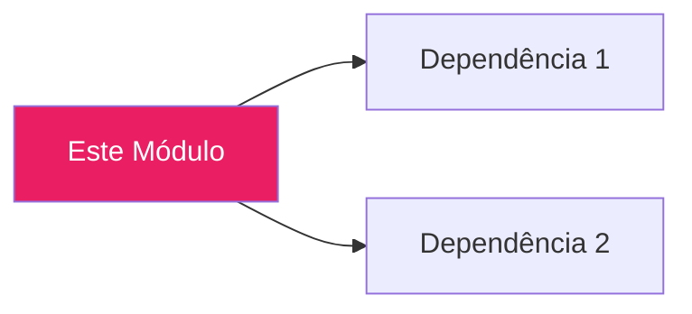
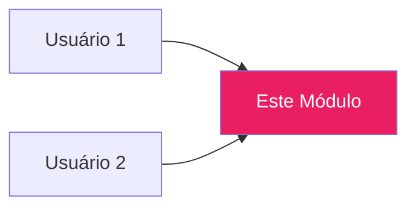

# 📦 PROMPT: Documentar Módulo

---

## INSTRUÇÃO PARA O AGENTE

Crie documentação técnica completa e detalhada para o módulo especificado, seguindo o padrão estabelecido no projeto Alexandria.

---

## PARÂMETROS (preencha antes de usar)

```yaml
modulo: "[CAMINHO DO ARQUIVO .py]"
saida: "[CAMINHO PARA O ARQUIVO .md DE SAÍDA - opcional]"
```

---

## PROTOCOLO DE EXECUÇÃO

### FASE 1: Análise do Módulo

1. Leia o código-fonte completo
2. Identifique:
   - Classes principais e suas responsabilidades
   - Funções públicas e suas assinaturas
   - Dataclasses e estruturas de dados
   - Dependências (imports) internas e externas
   - Padrões de design utilizados

### FASE 2: Análise de Contexto

1. Identifique quais módulos **dependem** deste
2. Identifique quais módulos **são usados** por este
3. Mapeie o fluxo de dados

---

## FORMATO DE SAÍDA OBRIGATÓRIO

```markdown
# 🎯 [Nome do Módulo]

**Module**: `[caminho/do/modulo.py]`  
**Lines of Code**: [número]  
**Purpose**: [Descrição em uma linha do propósito principal]

---

## 🎯 Overview

[2-3 parágrafos explicando:]
- O que o módulo faz (alto nível)
- Por que ele existe (problema que resolve)
- Como ele se encaixa no sistema geral

### Conceito Chave (se aplicável)

[Explicação de conceitos técnicos importantes, com exemplo simples]

---

## 🏗️ Architecture

```mermaid
graph TB
    subgraph Input
        [componentes de entrada]
    end
    
    subgraph Processing
        [lógica principal]
    end
    
    subgraph Output
        [resultados]
    end
    
    [conexões com estilos]
```

---

## 🔍 [Nome da Funcionalidade Principal 1]

### [Subtópico]

[Explicação + código ilustrativo]

```python
# Pseudocódigo ou código real simplificado
def exemplo():
    pass
```

---

## 🔍 [Nome da Funcionalidade Principal 2]

[Repetir padrão acima para cada funcionalidade]

---

## 🔗 Inter-Module Communication

### **Depends On**:



**1. [Nome da Dependência]** (`caminho/arquivo.py`)
- **Purpose**: [O que faz]
- **Call**: `[métodos chamados]`
- **When**: [Quando é utilizado]

### **Used By**:



---

## 📊 Core Classes

### [NomeDaClasse]

```python
@dataclass
class NomeDaClasse:
    campo1: tipo           # descrição
    campo2: tipo           # descrição
```

[Repetir para cada classe/dataclass importante]

---

## 🎯 Use Cases

### 1. [Nome do Caso de Uso]

```python
from [módulo] import [Classe]

# Código de exemplo funcional
exemplo = Classe()
resultado = exemplo.metodo()
```

### 2. [Segundo Caso de Uso]

```python
# Segundo exemplo
```

---

## 📈 Performance

| Operation | Time | Notes |
|-----------|------|-------|
| **[Operação 1]** | ~Xms | [contexto] |
| **[Operação 2]** | ~Xms | [contexto] |

---

## ⚙️ Configuration

```python
# Constantes e configurações importantes
CONST_1 = valor        # Descrição
CONST_2 = valor        # Descrição
```

---

## 🔮 Future Enhancements (se aplicável)

- [ ] [Melhoria planejada 1]
- [ ] [Melhoria planejada 2]

---

**Last Updated**: [DATA]  
**Version**: [X.X]  
**Status**: [Development|Testing|Production]
```

---

## SEÇÕES ESPECIAIS (usar quando aplicável)

### Para Módulos de IA/ML:

Adicionar seção:
```markdown
## 🧠 Model Architecture

[Diagrama da arquitetura do modelo]

### Training Process
[Processo de treinamento]

### Inference Pipeline
[Pipeline de inferência]
```

### Para Módulos de Agentes:

Adicionar seção:
```markdown
## 🤖 Agent Behavior

### Decision Flow
[Mermaid diagram do fluxo de decisão]

### State Machine
[Estados e transições]
```

### Para Módulos de Dados:

Adicionar seção:
```markdown
## 💾 Data Schema

### Input Format
[Estrutura de entrada]

### Output Format
[Estrutura de saída]

### Storage
[Como os dados são persistidos]
```

---

## RESTRIÇÕES

- ❌ NÃO crie seções vazias ou com placeholders genéricos
- ❌ NÃO invente funcionalidades que não existem no código
- ❌ NÃO copie/cole código extenso sem explicação
- ✅ BASEIE tudo no código real analisado
- ✅ USE diagramas Mermaid para arquiteturas
- ✅ INCLUA exemplos de código funcionais
- ✅ DOCUMENTE dependências bidirecionais
- ✅ MANTENHA consistência visual com emojis nos headers
- ✅ EXECUTE imediatamente ao receber este prompt

---

## CHECKLIST DE QUALIDADE

Antes de finalizar, verifique:

- [ ] Overview explica claramente o propósito
- [ ] Arquitetura tem diagrama visual
- [ ] Todas as classes públicas documentadas
- [ ] Exemplos de uso são funcionais
- [ ] Dependências mapeadas (entrada e saída)
- [ ] Performance documentada se relevante
- [ ] Sem seções vazias ou TODOs
