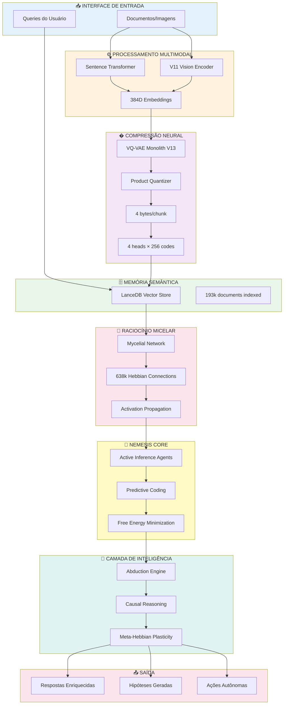

# 🏛️ Alexandria - Local AI Synthesis

<div align="center">


**Síntese Local de IA através de Aprendizado Não-Supervisionado**

*A cognitive architecture for local, self-improving AI systems*

[Objetivos](#-objetivos) • [Como Funciona](#-como-funciona) • [Teorias](#-fundamentos-teóricos) • [Documentação](#-documentação)

</div>

---

## 🎯 Objetivos

Alexandria busca criar uma **síntese local de IA** através de:

1. **Autonomia Total**: Zero dependências de serviços cloud ou APIs externas
2. **Aprendizado Contínuo**: Sistema que se aperfeiçoa com cada observação
3. **Raciocínio Emergente**: Inteligência que surge de processos bio-inspirados simples
4. **Transparência**: Visualização completa dos processos internos de decisão
5. **Eficiência**: Compressão neural radical (96%) para operar localmente

**Visão**: Uma IA autônoma e auto-aperfeiçoante que roda na sua máquina, sem cloud, sem censura, sem custo operacional.

---

## 📖 A História do Sistema

Alexandria começou como um experimento em **composicionalidade semântica**: será que códigos discretos podem raciocinar como embeddings contínuos?

A resposta foi surpreendente: **sim, mas de forma fundamentalmente diferente**.

### Evolução

1. **Fase I**: RAG básico com LanceDB
2. **Fase II**: VQ-VAE para compressão neural
3. **Fase III**: Mycelial Network (Hebbian learning)
4. **Fase IV**: Nemesis Core (Active Inference + Predictive Coding)
5. **Fase V**: Pre-Structural Field (Geometria Diferencial)
6. **Fase Atual**: Integração completa e otimização

Hoje, Alexandria é um sistema cognitivo completo que combina **7 paradigmas teóricos** em uma arquitetura unificada.

---

## 🧠 Como Funciona

### Arquitetura Completa



### Fluxo de Dados

```
1. INGESTÃO
   └─> Document → Chunking (~1000 chars) → Embedding (384D)

2. COMPRESSÃO
   └─> Embedding → VQ-VAE → 4 bytes (96% compression)

3. ARMAZENAMENTO
   └─> LanceDB indexing + Mycelial observation

4. RACIOCÍNIO
   ├─> Semantic Search (LanceDB)
   ├─> Hebbian Propagation (Mycelial)
   └─> Active Inference (Nemesis)

5. SÍNTESE
   ├─> Abduction (Gap detection)
   ├─> Causal Reasoning (Graph construction)
   └─> Meta-Hebbian Plasticity (Self-optimization)

6. AÇÃO
   └─> Response | Hypothesis | Autonomous Action
```

---

## � Fundamentos Teóricos

Alexandria combina múltiplas teorias de neurociência computacional e IA:

### 1. **Hebbian Learning** (Donald Hebb, 1949)
> *"Neurons that fire together, wire together"*

- **Aplicação**: Mycelial Network aprende co-ocorrências de códigos VQ-VAE
- **Vantagem**: Não-supervisionado, online, biologicamente plausível
- **Status**: 638,130 conexões ativas, densidade <1%

### 2. **Free Energy Principle** (Karl Friston, 2010)
> Sistemas inteligentes minimizam surpresa variacional

- **Aplicação**: Nemesis Core usa Active Inference para seleção de ações
- **Vantagem**: Framework unificado para percepção, ação e aprendizado
- **Status**: Operacional com overflow warnings esperados

### 3. **Predictive Coding** (Rao & Ballard, 1999)
> Cérebros são máquinas preditivas que minimizam erro

- **Aplicação**: Hierarquia de 5 camadas prediz embeddings
- **Vantagem**: Compressão + predição em uma única arquitetura
- **Status**: 4 camadas construídas (384→256→128→64→32)

### 4. **Vector Quantization** (VQ-VAE, van den Oord, 2017)
> Compressão neural via codebook discreto

- **Aplicação**: Monolith V13 com 4 heads × 256 codes
- **Vantagem**: 96% compression mantendo reconstrução (MSE 0.0021)
- **Status**: 255/256 códigos ativos, Head 0 dominante (67%)

### 5. **Abductive Reasoning** (Charles Peirce, 1878)
> Inferência à melhor explicação

- **Aplicação**: Detecção automática de gaps e geração de hipóteses
- **Vantagem**: Expansão autônoma de conhecimento
- **Status**: Gap detection operacional

### 6. **Meta-Learning** (Schmidhuber, 1987)
> Aprender a aprender

- **Aplicação**: Meta-Hebbian ajusta taxas de plasticidade dinamicamente
- **Vantagem**: Auto-otimização sem intervenção manual
- **Status**: Implementado, em teste

---

## 🏗️ Módulos Principais

### Pre-Structural Field (Geometric Cognition) 🆕
**Arquivos**: `core/field/`

- **DynamicManifold**: Variedade com dimensão variável (384→416D)
- **RiemannianMetric**: Métrica que deforma com ativação
- **FreeEnergyField**: Campo F(x) = E - T·S
- **CycleDynamics**: Expansão→Configuração→Compressão
- **Status**: ✅ Operacional (testado com 352k docs)

### VQ-VAE (Neural Compression)
**Arquivo**: `core/reasoning/vqvae/`

- **Monolith V13**: 4 heads, 256 codes/head, 384D → 4 bytes
- **Head Balance Regularization**: Previne colapso de codebook
- **Status**: ✅ Produção (epoch 20, codebook 99.6% ativo)

### Mycelial Network (Hebbian Reasoning)
**Arquivo**: `core/reasoning/mycelial_reasoning.py`

- **638,130 conexões** aprendidas via Hebb
- **Propagação**: 3-5 steps para enriquecer queries
- **Status**: ✅ Saudável (densidade <1%, hubs emergentes)

### Nemesis Core (Active Inference)
**Arquivos**: `core/learning/`

- **Active Inference**: Scout, Judge, Weaver agents
- **Predictive Coding**: 5-layer hierarchical prediction
- **Free Energy**: Governança top-level
- **Status**: ✅ Operacional (warnings numéricos esperados)

### LanceDB (Vector Storage)
**Arquivo**: `core/memory/storage.py`

- **352,000+ documentos** indexados
- **Busca**: <50ms (p99) para top-10
- **Status**: ✅ Operacional

---

## 📊 Métricas de Performance

| Operação | Performance | Notas |
|:---|:---:|:---|
| **Indexação** | 1,000 chunks/s | Batch processing |
| **Busca Vetorial** | <50ms (p99) | Top-10 resultados |
| **Propagação Micelar** | <15ms | 3 steps |
| **Compressão VQ-VAE** | 96% | 384D → 4 bytes |
| **Codebook Ativo** | 99.6% | 255/256 codes |
| **Conexões Hebbian** | 638,130 | Densidade <1% |

### Escalabilidade

| Documentos | RAM | Query Latency |
|:---:|:---:|:---:|
| 10K | 30 MB | 50ms |
| 100K | 295 MB | 80ms |
| 1M | 2.8 GB | 150ms |

---

## 📚 Documentação

A documentação está organizada topologicamente em [`docs/`](docs/):

```
docs/
├── README.md                    # 🎯 Índice principal (COMECE AQUI)
│
├── architecture/                # 🏗️ Arquitetura do Sistema
│   ├── overview.md             #    → Diagramas visuais e fluxo
│   ├── technical.md            #    → Análise técnica completa
│   └── components.md           #    → Breakdown de módulos
│
├── modules/                     # 📦 Documentação Técnica
│   ├── README.md               #    → Índice navegável
│   ├── 01-09_*.md              #    → Módulos core
│   └── NEMESIS_MANUAL.md       #    → Bio-inspired learning
│
├── guides/                      # 📘 Guias de Uso
│   └── user-manual.md          #    → Manual do usuário
│
├── reports/                     # 🧪 Análises e Experimentos
└── concepts/                    # 💡 Conceitos Avançados
```

### 🎓 **Comece Aqui por Perfil**

| Perfil | Documento Recomendado |
|--------|----------------------|
| **🟢 Iniciante** | [`docs/architecture/overview.md`](docs/architecture/overview.md) |
| **🟡 Desenvolvedor** | [`docs/architecture/technical.md`](docs/architecture/technical.md) |
| **🔴 Pesquisador** | [`docs/architecture/components.md`](docs/architecture/components.md) |
| **📖 Usuário Final** | [`docs/guides/user-manual.md`](docs/guides/user-manual.md) |
| **⚙️ Módulo Específico** | [`docs/modules/README.md`](docs/modules/README.md) |

### 📊 **Documentação por Tipo**

- **Visual & Diagramas**: [`docs/architecture/overview.md`](docs/architecture/overview.md)
- **Técnica & Código**: [`docs/architecture/technical.md`](docs/architecture/technical.md)
- **Análise de Módulos**: [`docs/architecture/components.md`](docs/architecture/components.md)
- **Guias de Uso**: [`docs/guides/`](docs/guides/)
- **Experimentos**: [`docs/reports/`](docs/reports/)

**Relatórios Técnicos** (auto-gerados):
- VQ-VAE Deep Analysis
- Experimental Ablation Suite (A-D)
- Module Integration Status
- Cleanup Reports

---

## � Quick Start

```bash
# Clone
git clone https://github.com/GAndreuu/Prototype-Alexandria.git
cd Alexandria

# Setup
python -m venv .venv
source .venv/bin/activate  # Windows: .venv\Scripts\activate
pip install -r requirements.txt

# Initialize
python scripts/init_brain.py

# Index documents
from core.memory.semantic_memory import SemanticFileSystem
from core.topology.topology_engine import TopologyEngine

engine = TopologyEngine()
memory = SemanticFileSystem(engine)
memory.index_file("path/to/document.pdf")

# Query
results = memory.retrieve("quantum computing", limit=10)
```

**Interface**:
```bash
streamlit run interface/app.py
# Access: http://localhost:8501
```

---

## �️ Roadmap

### ✅ Fase Atual: Production Ready
- [x] VQ-VAE compression & balance
- [x] Mycelial reasoning network
- [x] Nemesis Core integration
- [x] Complete system verification

### 🔄 Próxima Fase: Enhanced Intelligence
- [ ] Chain-of-Thought integration
- [ ] Local LLM integration (Llama 3)
- [ ] Tool use framework
- [ ] Self-reflection loops

### 🌟 Fase Futura: Meta-Learning
- [ ] Performance tracking dashboard
- [ ] Automated hyperparameter search
- [ ] Curriculum generation
- [ ] Multi-task learning

---

## 🤝 Contribuindo

Alexandria é open-source e aceita contribuições! Veja [CONTRIBUTING.md](CONTRIBUTING.md).

---

## � Licença

MIT License - Veja [LICENSE](LICENSE) para detalhes.

---

<div align="center">

**Alexandria Cognitive System**

*Building local AGI, one commit at a time*

⭐ Star se Alexandria ajudou sua pesquisa!

**Contato**: [gabrielandreu82@hotmail.com](mailto:gabrielandreu82@hotmail.com)

</div>
