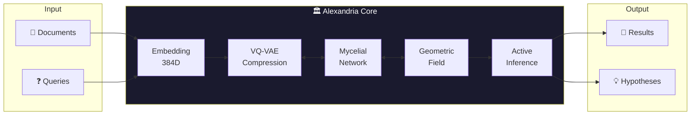
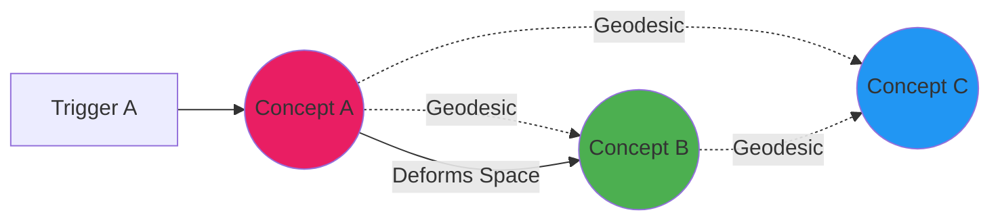

# 🏛️ Alexandria

<div align="center">


**Self-Evolving Knowledge System with Geometric Active Inference**

*Combining VQ-VAE compression, Riemannian geometry, and Active Inference for autonomous knowledge discovery.*

[Architecture](#-architecture) • [Features](#-key-features) • [Quick Start](#-quick-start) • [Documentation](#-documentation)

</div>

---

## 🎯 What is Alexandria?

Alexandria is an **autonomous knowledge system** that goes beyond traditional RAG. It implements:

- **Neural Compression** via VQ-VAE (384D → 4 bytes)
- **Geometric Reasoning** on Riemannian manifolds
- **Active Inference** for autonomous exploration
- **Self-Feeding Loop** for continuous learning



---

## 🏗️ Architecture

```mermaid
graph TB
    subgraph Core["🧠 Core Layer"]
        direction TB
        Field["<b>Field Layer</b><br>━━━━━━━━━━<br>• Manifold (384D)<br>• Riemannian Metric<br>• Geodesic Flow<br>• Free Energy Field"]
        
        Learning["<b>Learning Layer</b><br>━━━━━━━━━━<br>• Active Inference<br>• Predictive Coding<br>• Meta-Hebbian<br>• Free Energy"]
        
        Reasoning["<b>Reasoning Layer</b><br>━━━━━━━━━━<br>• VQ-VAE<br>• Mycelial Network<br>• Abduction Engine<br>• Symbol Grounding"]
        
        Loop["<b>Loop Layer</b><br>━━━━━━━━━━<br>• Self-Feeding Loop<br>• Hypothesis Executor<br>• Feedback Collector<br>• Action Selection"]
    end
    
    subgraph Integration["🔗 Integration"]
        Unified[AlexandriaCore]
    end
    
    subgraph Storage["💾 Storage"]
        Lance[LanceDB<br>20k+ vectors]
        Myc[Mycelial State<br>600k+ connections]
    end
    
    Field <--> Learning
    Learning <--> Reasoning
    Reasoning <--> Loop
    
    Unified --> Field
    Unified --> Learning
    Unified --> Reasoning
    Unified --> Loop
    
    Reasoning --> Lance
    Reasoning --> Myc
    
    style Core fill:#1e3a5f
    style Integration fill:#2e5a1f
    style Storage fill:#5a1f1f
```



---

## ⚡ Key Features

### 1. 🧬 VQ-VAE Neural Compression

Compresses 384D embeddings to 4 discrete codes (4 bytes):

```
Input:   [0.23, -0.15, 0.89, ...] (384 floats = 1.5KB)
Output:  [42, 187, 3, 251]        (4 bytes = 99.7% compression)
```

### 2. 🌌 Geometric Cognition

Knowledge lives on a **Riemannian manifold** where:
- **Triggered concepts** deform the metric
- **Geodesics** (shortest paths) connect related ideas
- **Curvature** indicates knowledge density



### 3. 🍄 Mycelial Hebbian Network

Sparse graph of **600k+ connections** learning co-activation patterns:

```python
# Hebbian: "Cells that fire together, wire together"
connection[A, B] += learning_rate * activation[A] * activation[B]
connection[A, B] *= decay_rate  # Forgetting
```

### 4. 🔄 Self-Feeding Loop

Autonomous cycle of knowledge expansion:

```mermaid
graph TB
    subgraph Loop["🔄 Self-Feeding Cycle"]
        Detect[1. Detect Gaps]
        Generate[2. Generate Hypotheses]
        Execute[3. Execute Actions]
        Learn[4. Update Beliefs]
    end
    
    Detect --> Generate --> Execute --> Learn --> Detect
    
    style Loop fill:#1a1a2e
```



---

## 📊 System Status

| Component | Status | Lines | Description |
|-----------|:------:|------:|-------------|
| **VQ-VAE** | ✅ | 266 | Product Quantizer with 4 heads × 256 codes |
| **Mycelial Network** | ✅ | 568 | Sparse Hebbian graph with propagation |
| **Active Inference** | ✅ | 1,486 | EFE-based action selection |
| **Geodesic Flow** | ✅ | 265 | Shooting method for BVP |
| **Self-Feeding Loop** | ✅ | 502 | Autonomous cycle orchestrator |
| **Unit Tests** | ✅ | 293 | 100% passing |

---

## 🚀 Quick Start

### Installation

```bash
git clone https://github.com/GAndreuu/Prototype-Alexandria.git
cd Alexandria
python -m venv venv
source venv/bin/activate  # Windows: venv\Scripts\activate
pip install -r requirements.txt
```

### Ingest Documents

```bash
# Ingest ArXiv papers
python scripts/ingestion/mass_arxiv_ingest.py --max-papers 100
```

### Run System

```bash
# Start autonomous loop + API
python scripts/system_runner_v2.py
```

### Run Tests

```bash
# All unit tests
python -m pytest tests/unit/core/ -v
```

---

## 📁 Project Structure

```
Alexandria/
├── core/                      # 🧠 Core modules (69 files)
│   ├── field/                 # Geometric cognition (manifold, metric, geodesic)
│   ├── learning/              # Active Inference, Predictive Coding
│   ├── reasoning/             # VQ-VAE, Mycelial Network
│   ├── loop/                  # Self-Feeding Loop
│   ├── memory/                # LanceDB storage
│   ├── agents/                # Action agents
│   └── integrations/          # AlexandriaCore unified interface
│
├── docs/                      # 📚 Documentation (60+ files)
│   ├── concepts/              # Theoretical foundations
│   └── core/                  # Module documentation
│
├── tests/                     # 🧪 Test suite (293 tests)
│   └── unit/core/             # Unit tests for each module
│
├── scripts/                   # 🛠️ Utilities
│   ├── ingestion/             # Data ingestion
│   └── analysis/              # Diagnostics
│
└── interface/                 # 🖥️ Streamlit UI
    └── app.py                 # Control deck
```

---

## 📚 Documentation

| Topic | Path |
|-------|------|
| **Cognitive Resilience** | [docs/concepts/cognitive_resilience.md](docs/concepts/cognitive_resilience.md) |
| **Geometric Cognition** | [docs/concepts/geometric_cognition.md](docs/concepts/geometric_cognition.md) |
| **Active Autonomy** | [docs/concepts/active_autonomy.md](docs/concepts/active_autonomy.md) |
| **Module Docs** | [docs/core/](docs/core/) |

---

## 🔬 Technical Details

### Free Energy Principle

Alexandria is built on Friston's **Free Energy Principle**:

```
F = E[log Q(s)] - E[log P(o,s)]
  = Complexity - Accuracy
  = KL[Q(s) || P(s)] - E[log P(o|s)]
```

The system minimizes F through:
1. **Perception**: Update beliefs Q(s)
2. **Action**: Change observations o
3. **Learning**: Improve model P(o,s)

### Expected Free Energy (Action Selection)

```
G(π) = Risk + Ambiguity
     = D_KL[Q(o|π) || P(o)] + E[H(o|s,π)]
```

Actions that minimize G balance:
- **Exploitation**: Reach preferred states (low Risk)
- **Exploration**: Reduce uncertainty (low Ambiguity)

---

## 🤝 Contributing

```bash
# Create new feature
/criar-feature          # Auto-scaffolds module + tests + docs

# Code review
/review-completo        # Pre-merge audit

# Run tests
python -m pytest tests/ -v
```

---

<div align="center">

**Alexandria System** | *Self-Evolving Knowledge Architecture*

Built with ❤️ using PyTorch, LanceDB, and Active Inference

</div>
