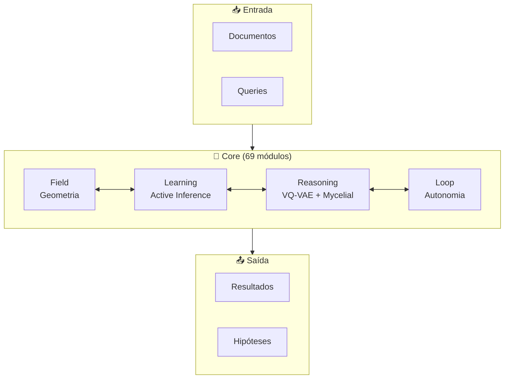
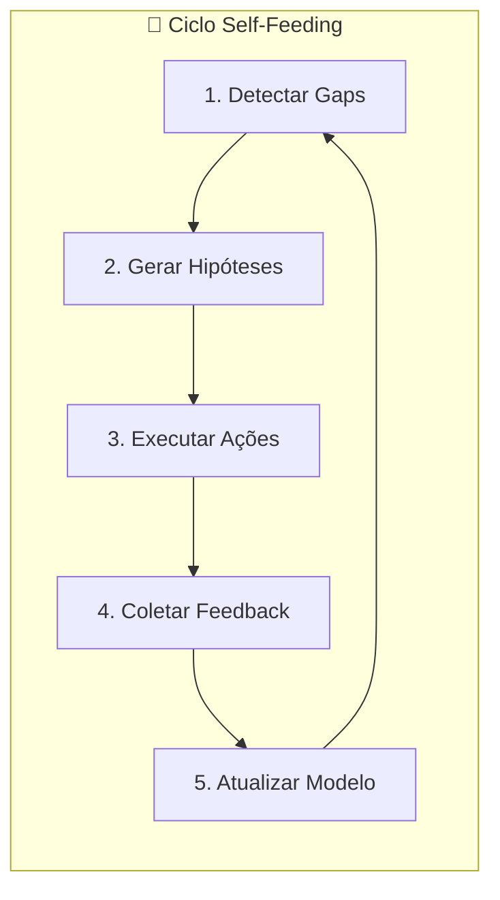

# 📚 ALEXANDRIA: RESUMO DO SISTEMA

> **Versão**: 2.0 | **Última Atualização**: 2025-12-13

## 🎯 Visão Geral

Alexandria é um **Sistema de Conhecimento Auto-Evolutivo** que combina:
- **Compressão Neural** (VQ-VAE: 384D → 4 bytes)
- **Geometria Riemanniana** (manifold dinâmico com geodésicas)
- **Active Inference** (exploração autônoma baseada em Free Energy)
- **Rede Hebbiana** (600k+ conexões persistentes)



---

## 🏗️ Arquitetura em Camadas

### 1. 🌌 Field Layer (Cognição Geométrica)
| Módulo | Linhas | Função |
|--------|-------:|--------|
| `manifold.py` | 402 | Espaço vetorial dinâmico com expansão/contração |
| `metric.py` | 612 | Métrica Riemanniana com deformação local |
| `geodesic_flow.py` | 265 | Integração de geodésicas (shooting method) |
| `free_energy_field.py` | 500 | Campo F(x) = E(x) - T·S(x) |

### 2. 🎓 Learning Layer (Inferência Ativa)
| Módulo | Linhas | Função |
|--------|-------:|--------|
| `active_inference.py` | 1,486 | Agente EFE com 8 tipos de ação |
| `free_energy.py` | 1,257 | Variational + Expected Free Energy |
| `predictive_coding.py` | 981 | Hierarquia preditiva com precisão |
| `meta_hebbian.py` | 784 | Plasticidade ABCD evolutiva |

### 3. 🔬 Reasoning Layer (VQ-VAE + Mycelial)
| Módulo | Linhas | Função |
|--------|-------:|--------|
| `vqvae/layers.py` | 170 | Product Quantizer (4 heads × 256 codes) |
| `vqvae/model.py` | 96 | MonolithV13 encoder/decoder |
| `mycelial_reasoning.py` | 568 | Grafo Hebbiano esparso |
| `abduction_engine.py` | ~300 | Detecção de gaps e geração de hipóteses |

### 4. 🔄 Loop Layer (Autonomia)
| Módulo | Linhas | Função |
|--------|-------:|--------|
| `self_feeding_loop.py` | 502 | Orquestrador do ciclo autônomo |
| `hypothesis_executor.py` | ~250 | Execução de ações |
| `feedback_collector.py` | ~200 | Coleta de feedback |
| `action_selection.py` | ~300 | Seleção via softmax sobre -EFE |

### 5. 💾 Memory Layer (Persistência)
| Módulo | Linhas | Função |
|--------|-------:|--------|
| `storage.py` | 160 | LanceDB wrapper (20k+ vetores) |
| `semantic_memory.py` | ~400 | Sistema de indexação multimodal |

### 6. 🔗 Integration Layer (Unificação)
| Módulo | Linhas | Função |
|--------|-------:|--------|
| `alexandria_unified.py` | 718 | AlexandriaCore - fachada unificada |
| `geodesic_bridge_integration.py` | ~300 | Integração geodésica-manifold |
| `learning_field_integration.py` | ~350 | Unificação PC + AI + campo |

---

## 📊 Estatísticas

| Métrica | Valor |
|---------|------:|
| **Módulos Python** | 69 |
| **Documentação** | 60+ arquivos |
| **Testes Unitários** | 293 (100% passing) |
| **Conexões Mycelial** | 600k+ |
| **Vetores LanceDB** | 20k+ |

---

## ⚡ Ciclo Cognitivo



**Fórmula Central (Expected Free Energy):**
```
G(π) = Risk + Ambiguity
     = D_KL[Q(o|π) || P(o)] + E[H(o|s,π)]
```

---

## 🚀 Quick Reference

| Tarefa | Comando |
|--------|---------|
| Instalar | `pip install -r requirements.txt` |
| Ingerir | `python scripts/ingestion/mass_arxiv_ingest.py` |
| Executar | `python scripts/system_runner_v2.py` |
| Testar | `python -m pytest tests/unit/core/ -v` |
| Interface | `streamlit run interface/app.py` |

---

## 📁 Estrutura Principal

```
Alexandria/
├── core/           # 69 módulos (field, learning, reasoning, loop, memory, agents, integrations)
├── tests/          # 293 testes unitários
├── docs/           # 60+ arquivos de documentação
├── scripts/        # Ferramentas operacionais
├── interface/      # UI Streamlit
└── data/           # Persistência (LanceDB, mycelial_state, modelos)
```
