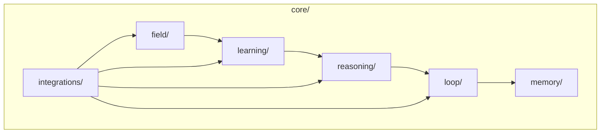

# 🗺️ Alexandria - Estrutura do Projeto

> **Versão**: 2.0 | **Atualizado**: 2025-12-13

---

## 📊 Estatísticas

| Métrica | Valor |
|---------|------:|
| Módulos Python | 69 |
| Testes Unitários | 293 |
| Documentação | 60+ |
| Linhas de Código | ~15k |

---

## 🏗️ Árvore de Diretórios

```
Alexandria/
│
├── 📂 core/                          # 🧠 NÚCLEO (69 módulos)
│   │
│   ├── field/                        # Cognição Geométrica
│   │   ├── manifold.py              # Espaço vetorial dinâmico (402 linhas)
│   │   ├── metric.py                # Métrica Riemanniana (612 linhas)
│   │   ├── geodesic_flow.py         # Fluxo geodésico (265 linhas)
│   │   ├── free_energy_field.py     # Campo F(x) = E - TS (500 linhas)
│   │   ├── cycle_dynamics.py        # Ciclo expansão/compressão
│   │   ├── dim_reduction.py         # Redução dimensional
│   │   ├── compositional_reasoning.py
│   │   ├── pre_structural_field.py  # Wrapper principal
│   │   └── vqvae_manifold_bridge.py # Ponte VQ-VAE ↔ Manifold
│   │
│   ├── learning/                     # Active Inference
│   │   ├── active_inference.py      # Agente EFE (1,486 linhas)
│   │   ├── free_energy.py           # VFE + EFE (1,257 linhas)
│   │   ├── predictive_coding.py     # Hierarquia preditiva (981 linhas)
│   │   ├── meta_hebbian.py          # Plasticidade ABCD (784 linhas)
│   │   ├── integration_layer.py     # Glue code
│   │   └── profiles.py              # Resource profiles
│   │
│   ├── reasoning/                    # VQ-VAE + Mycelial
│   │   ├── vqvae/                   # Compressão Neural
│   │   │   ├── layers.py            # Product Quantizer (170 linhas)
│   │   │   ├── model.py             # MonolithV13 (96 linhas)
│   │   │   ├── model_wiki.py        # MonolithWiki
│   │   │   └── loss.py              # VQ-VAE losses
│   │   ├── mycelial_reasoning.py    # Rede Hebbiana (568 linhas)
│   │   ├── abduction_engine.py      # Detecção de gaps
│   │   ├── causal_reasoning.py      # Inferência causal
│   │   ├── symbol_grounding.py      # Text → Códigos VQ-VAE
│   │   └── neural_learner.py        # Aprendizado neural
│   │
│   ├── loop/                         # Autonomia
│   │   ├── self_feeding_loop.py     # Orquestrador (502 linhas)
│   │   ├── hypothesis_executor.py   # Execução de ações
│   │   ├── feedback_collector.py    # Coleta de feedback
│   │   ├── action_selection.py      # Seleção via EFE
│   │   ├── active_inference_adapter.py
│   │   ├── incremental_learner.py
│   │   ├── loop_metrics.py
│   │   └── nemesis_integration.py
│   │
│   ├── memory/                       # Persistência
│   │   ├── storage.py               # LanceDB wrapper (160 linhas)
│   │   ├── semantic_memory.py       # Indexação multimodal
│   │   └── v11_vision_encoder.py    # Encoder visual hierárquico
│   │
│   ├── agents/                       # Agentes
│   │   ├── action/                  # Agentes de ação (10 arquivos)
│   │   │   ├── agent.py
│   │   │   ├── types.py
│   │   │   ├── execution/           # Executores especializados
│   │   │   └── ...
│   │   ├── action_agent.py
│   │   ├── bridge_agent.py          # Agente metacognitivo
│   │   ├── critic_agent.py          # Avaliador de hipóteses
│   │   └── oracle.py                # Sintetizador híbrido
│   │
│   ├── integrations/                 # Integrações Unificadas
│   │   ├── alexandria_unified.py    # AlexandriaCore (718 linhas)
│   │   ├── geodesic_bridge_integration.py
│   │   ├── nemesis_bridge_integration.py
│   │   ├── learning_field_integration.py
│   │   ├── abduction_compositional_integration.py
│   │   ├── agents_compositional_integration.py
│   │   └── loop_compositional_integration.py
│   │
│   ├── topology/                     # Gestão de Espaço
│   │   └── topology_engine.py       # Clustering + UMAP
│   │
│   └── utils/                        # Utilitários
│       ├── harvester.py             # Scraper ArXiv
│       ├── local_llm.py             # TinyLlama local
│       └── logger.py                # Loguru estruturado
│
├── 📂 tests/                         # 🧪 TESTES (293 passando)
│   ├── unit/
│   │   └── core/                    # Testes por módulo
│   │       ├── field/
│   │       ├── learning/
│   │       ├── reasoning/
│   │       ├── loop/
│   │       ├── memory/
│   │       └── ...
│   └── conftest.py                  # Fixtures pytest
│
├── 📂 scripts/                       # 🛠️ FERRAMENTAS
│   ├── system_runner_v2.py          # Executor principal
│   ├── ingestion/                   # Ingestão de dados
│   │   ├── mass_arxiv_ingest.py
│   │   └── ingest_incremental.py
│   ├── analysis/                    # Diagnósticos (~25 scripts)
│   ├── maintenance/                 # Saúde e limpeza
│   └── testing/                     # Validação
│
├── 📂 interface/                     # 🖥️ UI STREAMLIT
│   ├── app.py                       # Entrada principal
│   └── pages/                       # Páginas multipage
│
├── 📂 docs/                          # 📚 DOCUMENTAÇÃO (60+ arquivos)
│
├── 📂 .agent/                        # 🤖 WORKFLOWS
│   └── workflows/                   # /slash-commands
│
├── 📂 data/                          # 💾 PERSISTÊNCIA
│   ├── lancedb_store/               # Vetores (20k+)
│   ├── mycelial_state.pkl           # Grafo (600k+ conexões)
│   └── monolith_*.pth               # Modelos treinados
│
├── config/                           # Configurações
├── requirements.txt                  # Dependências
├── README.md                         # Documentação principal
├── RESUMO_SISTEMA.md                 # Resumo técnico
└── STRUCTURE.md                      # Este arquivo
```

---

## 🔍 Referência Rápida

| Eu quero... | Vá para... |
|-------------|------------|
| Iniciar o sistema | `python scripts/system_runner_v2.py` |
| Ingerir dados | `python scripts/ingestion/mass_arxiv_ingest.py` |
| Rodar testes | `python -m pytest tests/unit/core/ -v` |
| Interface gráfica | `streamlit run interface/app.py` |
| Criar feature | `/criar-feature` |
| Debug profundo | `/debug-profundo` |

---

## 🏛️ Camadas do Core



| Camada | Módulos | Responsabilidade |
|--------|--------:|------------------|
| `field/` | 9 | Geometria Riemanniana, geodésicas |
| `learning/` | 6 | Active Inference, Free Energy |
| `reasoning/` | 11 | VQ-VAE, Mycelial, Abduction |
| `loop/` | 9 | Autonomia, self-feeding |
| `memory/` | 3 | LanceDB, indexação |
| `agents/` | 16 | Agentes especializados |
| `integrations/` | 8 | Unificação |
| `topology/` | 2 | Clustering, UMAP |
| `utils/` | 3 | Harvester, Logger, LLM |
