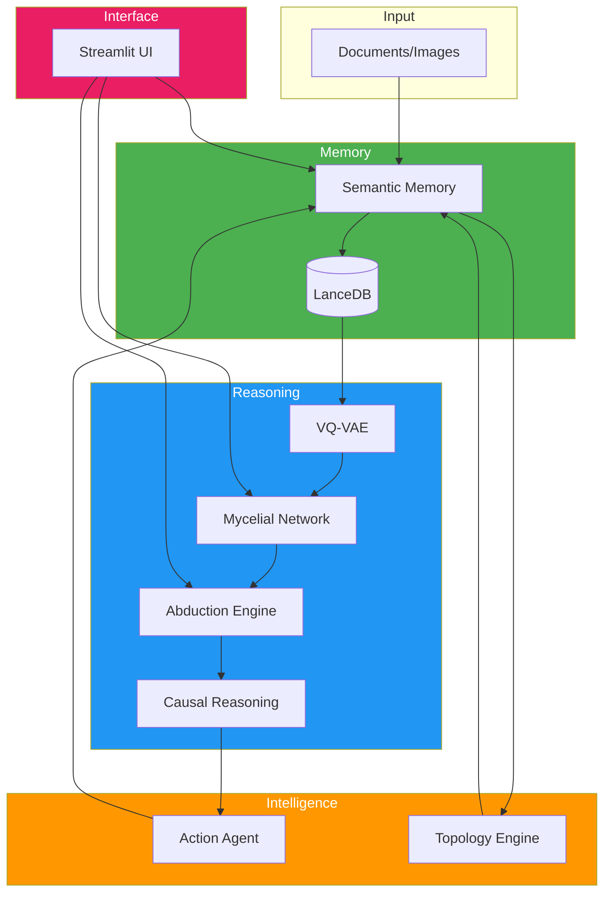

# 📑 Module Documentation Index

Alexandria system documentation - organized by module.

---

## 🗂️ Core Modules

### Memory Layer
1. **[Semantic Memory](./modules/01_semantic_memory.md)** 📚 ✅
   - Multi-modal document indexing
   - LanceDB vector storage
   - Text & image processing
   - **488 lines** | Production

### Reasoning Layer  
2. **[Mycelial Reasoning](./modules/02_mycelial_reasoning.md)** 🍄 ✅
   - Hebbian learning network
   - Code activation propagation
   - Semantic bridges
   - **800 lines** | Production

3. **[VQ-VAE Compression](./modules/03_vqvae.md)** 🧬 ✅
   - Product quantization
   - Modified Wiki Training (V3.1)
   - 384D → 4 bytes compression
   - **~200 lines** | Production

4. **[Abduction Engine](./modules/04_abduction_engine.md)** 🔮 ✅
   - Knowledge gap detection
   - Hypothesis generation
   - Self-validation pipeline
   - **999 lines** | Production

5. **[Causal Reasoning](./modules/05_causal_reasoning.md)** 🕸️ ✅
   - Causal graph construction
   - Latent variable discovery
   - Path finding
   - **428 lines** | Production

### Intelligence Layer
6. **[Action Agent](./modules/06_action_agent.md)** ⚡ ✅
   - Action execution & validation
   - Evidence registration
   - External API integration
   - **498 lines** | Production

7. **[Topology Engine](./modules/07_topology_engine.md)** 🗺️ ✅
   - Semantic space management
   - Clustering & dimensionality reduction
   - Embedding generation
   - **502 lines** | Production

---

## 📊 Module Communication Map



---

## 🔄 Data Flow Summary

```
User Document
    ↓
Semantic Memory (chunk, embed, store)
    ↓
LanceDB (vector storage)
    ↓
VQ-VAE (compress to 4 bytes)
    ↓
Mycelial Network (learn patterns)
    ↓
Abduction Engine (detect gaps)
    ↓
Causal Reasoning (build relationships)
    ↓
Action Agent (validate & consolidate)
    ↓
Enhanced Knowledge Base
```

---

## 📈 System Statistics

| Module | LOC | Status | Dependencies |
|--------|-----|--------|--------------|
| Semantic Memory | 488 | ✅ Production | Topology, LanceDB |
| Mycelial Reasoning | 800 | ✅ Production | VQ-VAE |
| VQ-VAE | ~200 | ✅ Production | PyTorch |
| Abduction Engine | 999 | ✅ Production | Causal, Action |
| Causal Reasoning | 428 | ✅ Production | Topology |
| Action Agent | 498 | ✅ Production | Semantic Memory |
| Topology Engine | 502 | ✅ Production | SentenceTransformers |

**Total Core Code**: ~4,000 lines

---

## 🎯 How to Read This Documentation

### For New Users
1. Start with **Semantic Memory** (foundation)
2. Understand **VQ-VAE** (compression)
3. Learn **Mycelial Reasoning** (the magic!)
4. Explore **Abduction Engine** (self-learning)

### For Developers
- Each module doc includes:
  - Architecture diagrams
  - Inter-module communication
  - API reference
  - Use case examples
  - Performance metrics

### For Researchers
- Focus on:
  - Mycelial Reasoning (Hebbian learning)
  - Abduction Engine (hypothesis generation)
  - Causal Reasoning (graph construction)

---

## 📝 Documentation Standards

Each module document includes:

- ✅ **Overview**: What it does, why it exists
- ✅ **Architecture**: Visual diagrams (Mermaid)
- ✅ **Data Flow**: Sequence diagrams
- ✅ **Inter-Module Communication**: Dependency graphs
- ✅ **API Reference**: Methods, parameters, returns
- ✅ **Use Cases**: Practical examples
- ✅ **Performance Metrics**: Benchmarks
- ✅ **Limitations**: Known issues
- ✅ **Future Enhancements**: Roadmap

---

**Last Updated**: 2025-12-04
**Project**: Alexandria v3.1
**Status**: Production-ready cognitive AI system
