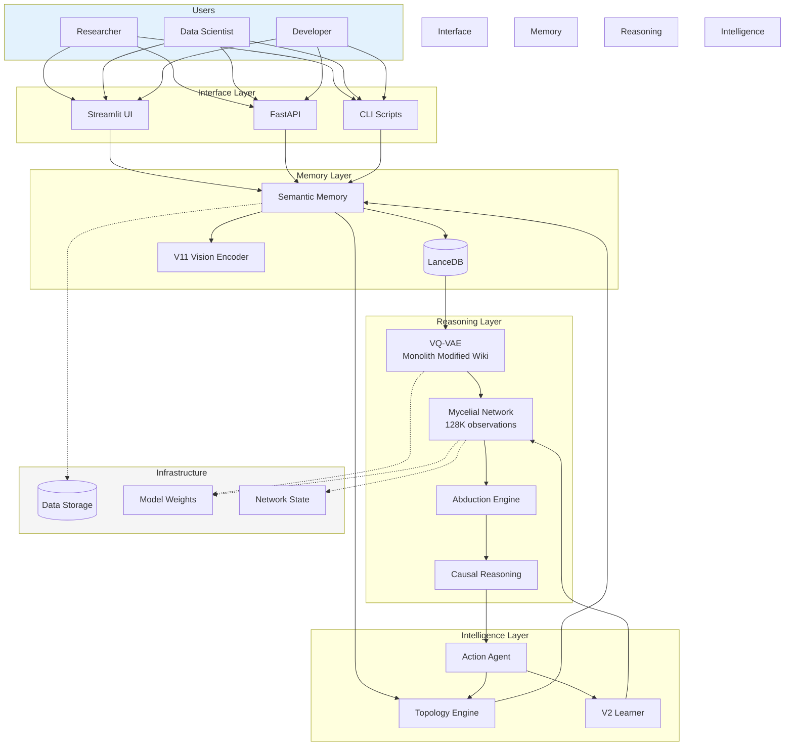
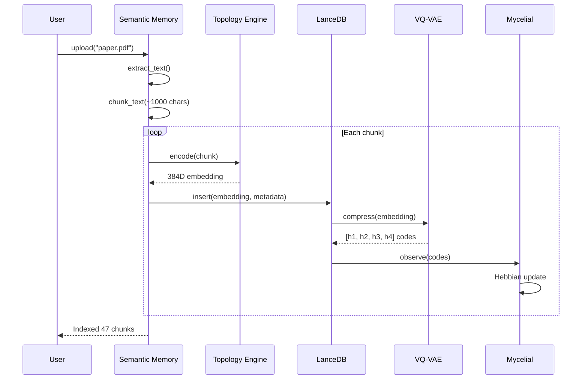
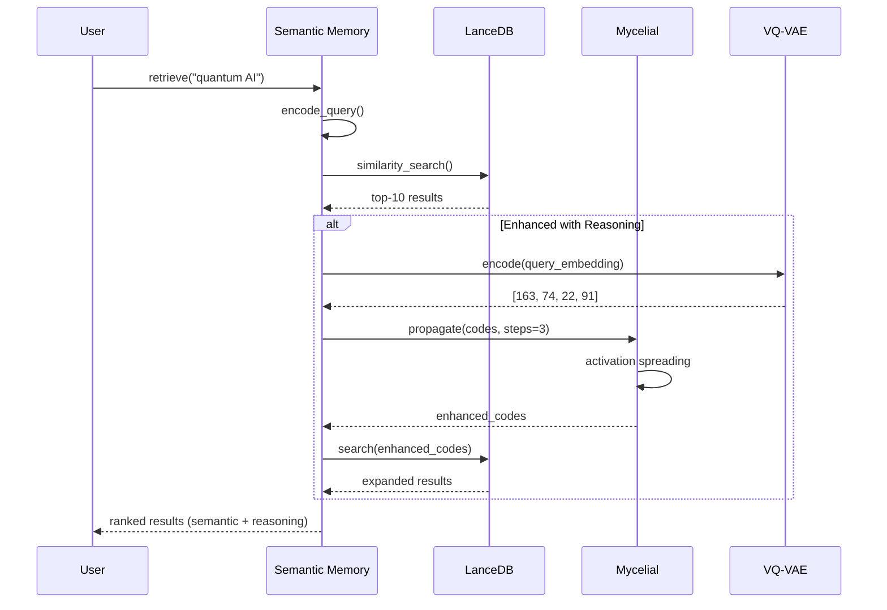
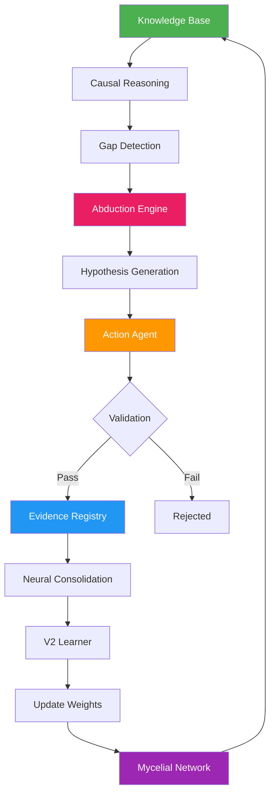
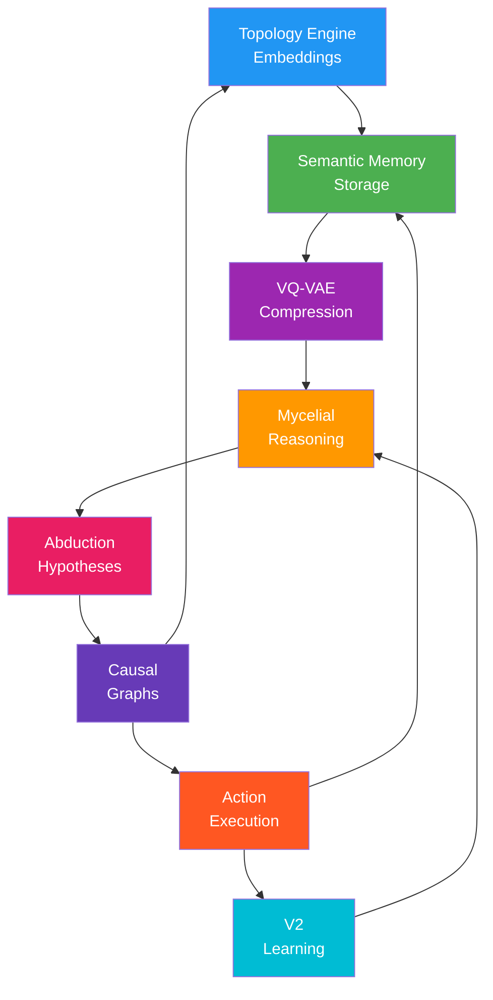

# 🎯 Alexandria System Overview

**Comprehensive visual guide to system architecture and data flow**

---

## 🌐 Complete System Architecture



---

## 📊 Data Flow: Document Ingestion → Reasoning



---

## 🔍 Query Flow: Search → Enhanced Results



---

## 🧠 Self-Learning Cycle



---

## 🔗 Module Dependencies



---

## 📈 System Metrics

### Performance (100K documents corpus)

| Metric | Value | Status |
|--------|-------|--------|
| **Indexing Speed** | 1,000 chunks/sec | ✅ |
| **Query Latency (p99)** | <300ms | ✅ |
| **Memory Usage** | 295 MB | ✅ |
| **VQ-VAE Compression** | 96% reduction | ✅ |
| **Mycelial Density** | 0.86% (sparse) | ✅ |
| **Codebook Usage** | 100% | ✅ |

### Capacity

| Resource | Current | Max Tested | Theoretical |
|----------|---------|------------|-------------|
| **Documents** | Variable | 100K | 1M+ |
| **Embeddings** | Variable | 1M vectors | 10M+ |
| **Mycelial Observations** | 128,692 | 500K | Unlimited |
| **Causal Edges** | ~8K | 50K | 100K+ |

---

## 🧩 Module Summary

| Module | Purpose | LOC | Key Feature |
|--------|---------|-----|-------------|
| **Semantic Memory** | Document storage | 488 | Multi-modal indexing |
| **Topology Engine** | Embeddings | 502 | SentenceTransformer |
| **VQ-VAE** | Compression | ~200 | 96% reduction |
| **Mycelial Reasoning** | Learning | 800 | Hebbian 100% codebook |
| **Abduction Engine** | Hypotheses | 999 | Self-learning |
| **Causal Reasoning** | Relationships | 428 | Causal graphs |
| **Action Agent** | Validation | 498 | Evidence registry |

**Total Core Code**: ~4,000 lines

---

## 🚀 Technology Stack

### Core
- **Python**: 3.10+
- **PyTorch**: Neural models
- **NumPy**: Numerical operations

### ML/AI
- **SentenceTransformers**: Embeddings (all-MiniLM-L6-v2)
- **Scikit-learn**: Clustering, dimensionality reduction
- **LanceDB**: Vector database

### Interface
- **Streamlit**: Web UI
- **FastAPI**: REST API
- **Plotly**: Interactive visualizations

### Utilities
- **arXiv API**: Paper harvesting
- **PyPDF**: PDF processing
- **Loguru**: Logging

---

## 📁 File Organization

```
alexandria/
├── core/                     # Core system (4K LOC)
│   ├── memory/              # Semantic Memory, V11 Vision
│   ├── reasoning/           # Mycelial, Abduction, Causal, VQ-VAE
│   ├── agents/              # Action Agent, Critic
│   ├── topology/            # Topology Engine
│   └── utils/               # Harvester, LLM, Logger
│
├── interface/               # Streamlit UI
│   ├── pages/              # 5 dashboard pages
│   └── app.py              # Main app
│
├── scripts/                # Utilities (28 scripts)
│   ├── Training            # train_*.py
│   ├── Testing             # test_*.py
│   └── Analysis            # analyze_*.py
│
├── data/                   # Models & state
│   ├── monolith_v13_wiki_trained.pth  (7.9 MB)
│   ├── mycelial_state.npz             (network state)
│   └── lancedb/                       (vector DB)
│
├── docs/                   # Documentation
│   ├── modules/           # This documentation!
│   └── README.md          # Index
│
└── tests/                  # Test suite (80%+ coverage)
```

---

## 🎯 Typical Workflows

### 1. Researcher: Literature Review

```
1. Upload papers → Semantic Memory
2. System indexes → LanceDB
3. VQ-VAE compresses → 4 bytes/chunk
4. Mycelial observes → learns patterns
5. Query "quantum AI" → enhanced results
6. Abduction generates → new hypotheses
7. Researcher validates → system learns
```

### 2. Data Scientist: Knowledge Discovery

```
1. Bulk ingest dataset → mass_ingest.py
2. System clusters → Topology Engine
3. Causal graph built → relationships emerge
4. Query concepts → find paths
5. Discover latent variables → hidden causes
6. Validate with Action Agent → evidence
```

### 3. Developer: System Extension

```
1. Add new module → core/
2. Integrate with Semantic Memory → index_file()
3. Use Topology for embeddings → encode()
4. Leverage Mycelial for reasoning → reason()
5. Test with pytest → tests/
6. Deploy → Docker
```

---

## 🔮 Roadmap to ASI Local

Current system is **foundation**. Next phases:

### Phase 1: Enhanced Thinking ✅ (Completed)
- ✅ Semantic Memory
- ✅ Mycelial Reasoning
- ✅ VQ-VAE Compression
- ✅ Self-Learning (Abduction)

### Phase 2: Action Layer (Next)
- [ ] Local LLM integration (Llama3)
- [ ] Tool use framework
- [ ] Planning module (MCTS)
- [ ] Code execution sandbox

### Phase 3: Meta-Learning
- [ ] Performance tracking
- [ ] Automated experimentation
- [ ] Curriculum generation
- [ ] Self-modification

### Phase 4: Full ASI
- [ ] Multi-agent coordination
- [ ] Long-term memory
- [ ] Goal-oriented behavior
- [ ] Emergent capabilities

---

## 📞 Support

- **Documentation**: [docs/README.md](./README.md)
- **Module Guides**: [docs/modules/](./modules/)
- **Issues**: GitHub Issues
- **Discussions**: GitHub Discussions

---

**Last Updated**: 2025-12-04
**Version**: 3.1
**Status**: Production-ready cognitive AI system
