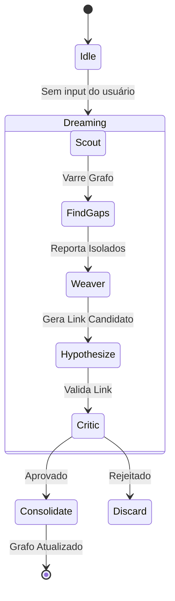

# Autonomia Ativa: O Self-Feeding Loop

## O Conceito
A maioria dos sistemas de IA são **reativos**: esperam um input do usuário para agir. O Alexandria implementa autonomia através do **Self-Feeding Loop**, um processo cíclico que permite ao sistema "ruminar" sobre seu próprio conhecimento, gerando novas hipóteses e conexões sem intervenção humana.

## Mecanismo: De Reativo para Ativo

O loop transforma o ciclo passivo (Input -> Process -> Output) em um ciclo fechado contínuo:

1.  **Observação Interna**: O sistema "olha" para seu próprio grafo de conhecimento.
2.  **Detecção de Gaps (Abduction)**: Identifica áreas onde existem conceitos desconectados ou clusters isolados.
3.  **Geração de Hipóteses**: Propõe conexões lógicas entre esses isolados.
4.  **Simulação (Sonho)**: Testa essas conexões no Spreading Activation.
5.  **Consolidação**: Se a conexão se sustenta (baixa surpresa/energia livre), ela é gravada permanentemente.

## Arquitetura Nemesis (Orquestrador)

O loop é governado pelo **NEMESIS Core**, que implementa princípios de *Active Inference*:

- **Scout Agent**: Explora o grafo buscando novidade (alta entropia).
- **Weaver Agent**: Tenta "tecer" conexões entre os achados do Scout.
- **Critic Agent**: Avalia a qualidade da conexão baseada em consistência lógica.

## Diagrama de Fluxo Autônomo

## Diferencial do Sistema
Enquanto você dorme, Alexandria continua trabalhando. Ele reorganiza seus "pensamentos", limpa conexões fracas (esquecimento ativo) e fortalece conexões fortes. Isso resulta em um sistema que fica **mais inteligente com o tempo**, não apenas com mais dados.
