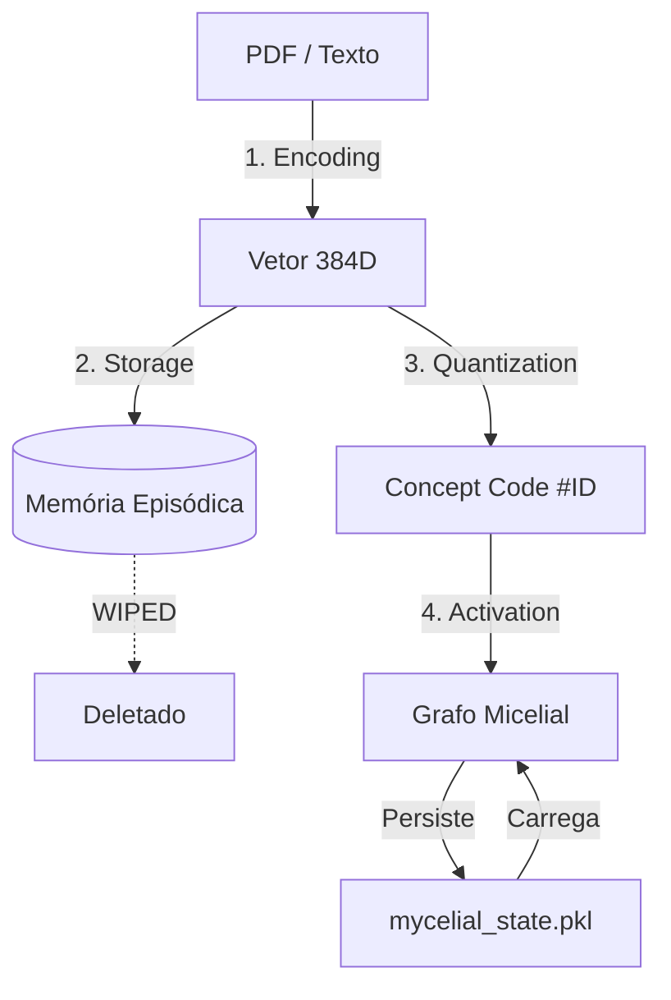

# Arquitetura de Resiliência Cognitiva: O Fenômeno da Persistência Micelial

## O Fenômeno
Durante a operação de "Memory Wipe" (deleção do `lancedb_store`), observou-se que a rede de raciocínio (`MycelialReasoning`) manteve suas 805 conexões sinápticas intactas. O sistema perdeu sua **Memória Episódica** (os textos), mas manteve sua **Estrutura de Conhecimento** (os conceitos).

## Explicação Técnica

Isso ocorre devido ao **Desacoplamento Arquitetural** entre Armazenamento e Raciocínio, mediado por Quantização Vetorial Determinística.

### 1. Separação de Camadas
O Alexandria opera em duas camadas físicas distintas:

| Camada | Componente | Armazenamento | O que Guarda? | Analogia Humana |
|--------|------------|---------------|---------------|-----------------|
| **Memória (SFS)** | `SemanticFileSystem` + `LanceDB` | `data/lancedb_store/` | Chunks de texto cru, Vetores | Hipocampo (Memórias específicas) |
| **Raciocínio (Brain)** | `MycelialReasoning` + `V2Learner` | `data/mycelial_state.pkl` | Grafo de Pesos (Relações) | Neocórtex (Padrões e Modelos mentais) |

Ao deletar o banco, removemos apenas o "Hipocampo". O "Neocórtex" permaneceu em disco.

### 2. A Ponte Determinística (Invariant Anchor)
Como o cérebro antigo pode entender os dados novos?
A mágica está na **Imutabilidade dos Vetores**:

1.  **Input:** "Redes neurais aprendem"
2.  **Encoder:** O modelo `all-MiniLM-L6-v2` é congelado. O vetor resultante é **idêntico** ao da ingestão anterior.
3.  **Quantização (VQ-VAE):** O `V2Learner` mapeia esse vetor sempre para o mesmo **Concept Code** (ex: Código #42).
4.  **Ativação:** O Mycelial vê "Código #42".

Para a rede micelial, **nada mudou**. Ela recebe os mesmos estímulos elétricos (códigos) que recebia antes, e suas sinapses (pesos hebbianos) reagem e se fortalecem conforme o aprendizado prévio.

### 3. Consequência: "Transfer Learning" Natural
Isso significa que o Alexandria possui:
- **Resistência Catastrófica:** Pode-se destruir os dados brutos, mas o "entendimento" sobre como os dados se relacionam persiste.
- **Bootstrapping Acelerado:** Ao re-ingerir os papers, o sistema não precisa "re-aprender" que "Neural Networks" se relaciona com "Backpropagation". Essa conexão já existe no grafo. A re-ingestão apenas **reforça** o que já se sabia.

## Diagrama de Fluxo

Isso confere ao sistema uma propriedade quase biológica: você pode esquecer *onde* leu algo (memória deletada), mas não esquece *o que* aprendeu com aquilo (grafo persistente).
