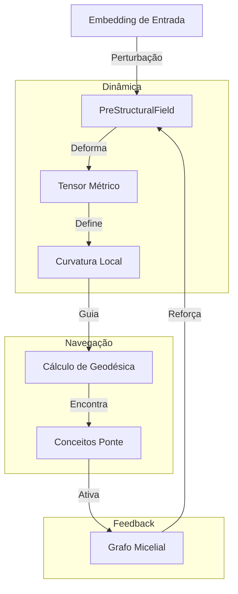

# Cognição Geométrica: O Campo Pré-Estrutural

## O Conceito
Diferente de sistemas RAG tradicionais que operam apenas em álgebra linear discreta (vetores estáticos), o **Campo Pré-Estrutural** (`PreStructuralField`) introduz **geometria diferencial** ao processo cognitivo do Alexandria.

A ideia central é que o "pensamento" não é apenas a recuperação de dados, mas a **deformação do espaço** onde os dados residem, criando "caminhos de menor resistência" (geodésicas) entre conceitos aparentemente distantes.

## Fundamentação Técnica

### 1. Dynamic Manifold (Variedade Dinâmica)
O sistema não opera em um espaço Euclideano fixo. Ele mantém uma *manifold* cujas propriedades métricas mudam com a experiência.
- **Base**: Espaço vetorial 384D.
- **Deformação**: A presença de densidade informacional (muitos papers sobre um tópico) "curva" o espaço localmente, diminuindo a distância métrica entre conceitos relacionados.

### 2. A Métrica Riemanniana
A distância entre dois pensamentos $A$ e $B$ não é fixa ($||A-B||^2$), mas depende do tensor métrico $g_{ij}(x)$ naquele ponto:
$$d(A, B) = \int_A^B \sqrt{g_{ij}\dot{x}^i\dot{x}^j} dt$$

No Alexandria:
- **Alta Ativação Micelial** = "Gravidade" alta (contrai o espaço).
- **Baixa Entropia (Free Energy)** = Espaço plano e navegável.

### 3. Geodésicas como "Insight"
Um "insight" ou conexão não-óbvia é modelado como uma **geodésica** neste espaço curvo. Em vez de uma linha reta (associação direta), o pensamento segue a curva da métrica aprendida, permitindo "saltos" lógicos que contornam vazios de conhecimento e aproveitam pontes conceituais estabelecidas.

## Diagrama da Arquitetura de Campo

## Diferencial do Sistema
O Alexandria não apenas *armazena* conhecimento. Ele *sente* a topologia desse conhecimento. Quando você pergunta sobre "Entropia", o campo se deforma para aproximar conceitos de "Termodinâmica", "Teoria da Informação" e "Predictive Coding", facilitando a recuperação de contextos profundos que uma busca vetorial simples (KNN) perderia.
