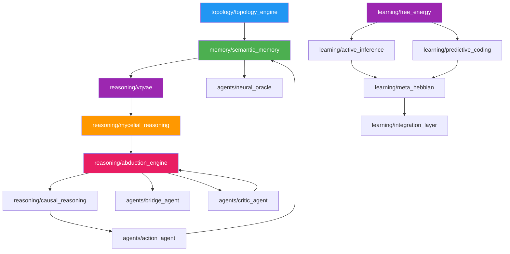

# 📦 Core - Documentação dos Módulos

**Documentação técnica do núcleo do sistema Alexandria**

---

## 🗂️ Estrutura

Esta pasta espelha a estrutura de `core/` no código-fonte:

```
docs/core/
├── agents/           → Agentes do sistema
│   ├── action_agent.md
│   ├── bridge_agent.md
│   ├── critic_agent.md
│   └── neural_oracle.md
│
├── learning/         → Módulos de aprendizado cognitivo
│   ├── README.md
│   ├── active_inference.md
│   ├── free_energy.md
│   ├── predictive_coding.md
│   ├── meta_hebbian.md
│   ├── integration_layer.md
│   ├── profiles.md
│   └── NEMESIS_MANUAL.md
│
├── memory/           → Sistemas de memória
│   ├── semantic_memory.md
│   ├── storage.md
│   └── v11_vision_encoder.md
│
├── reasoning/        → Motores de raciocínio
│   ├── abduction_engine.md
│   ├── causal_reasoning.md
│   ├── mycelial_reasoning.md
│   ├── neural_learner.md
│   └── vqvae.md
│
├── topology/         → Motor de embeddings
│   └── topology_engine.md
│
└── utils/            → Utilitários
    └── README.md
```

---

## 📊 Módulos por Categoria

### 🤖 Agents (`agents/`)

| Módulo | Arquivo | Descrição |
|--------|---------|-----------|
| Action Agent | [action_agent.md](agents/action_agent.md) | Execução de ações e registro de evidências |
| Bridge Agent | [bridge_agent.md](agents/bridge_agent.md) | Identificação e preenchimento de gaps |
| Critic Agent | [critic_agent.md](agents/critic_agent.md) | Validação científica via Gemini |
| Neural Oracle | [neural_oracle.md](agents/neural_oracle.md) | Síntese híbrida (local + cloud) |

### 🧠 Learning (`learning/`)

| Módulo | Arquivo | Descrição |
|--------|---------|-----------|
| Active Inference | [active_inference.md](learning/active_inference.md) | Agente autônomo de exploração |
| Free Energy | [free_energy.md](learning/free_energy.md) | Princípio unificador |
| Predictive Coding | [predictive_coding.md](learning/predictive_coding.md) | Inferência por minimização de erro |
| Meta-Hebbian | [meta_hebbian.md](learning/meta_hebbian.md) | Plasticidade adaptativa |
| Integration Layer | [integration_layer.md](learning/integration_layer.md) | Conexão entre módulos |
| Profiles | [profiles.md](learning/profiles.md) | Personalidades cognitivas |
| NEMESIS Manual | [NEMESIS_MANUAL.md](learning/NEMESIS_MANUAL.md) | Active Inference + Predictive Coding |

### 🔄 Loop (`loop/`)

| Módulo | Arquivo | Descrição |
|--------|---------|-----------|
| Self-Feeding Loop | [self_feeding_loop.md](loop/self_feeding_loop.md) | Orquestrador do ciclo cognitivo |
| Nemesis Integration | [nemesis_integration.md](loop/nemesis_integration.md) | Cérebro executivo (Active Inference) |
| Feedback Collector | [feedback_collector.md](loop/feedback_collector.md) | Coleta de reward e treinamento |

### 💾 Memory (`memory/`)

| Módulo | Arquivo | Descrição |
|--------|---------|-----------|
| Semantic Memory | [semantic_memory.md](memory/semantic_memory.md) | Multi-modal indexing (texto + imagens) |
| Storage | [storage.md](memory/storage.md) | LanceDB vetorial persistente |
| Vision Encoder | [v11_vision_encoder.md](memory/v11_vision_encoder.md) | VQ-VAE hierárquico visual |

### 🔬 Reasoning (`reasoning/`)

| Módulo | Arquivo | Descrição |
|--------|---------|-----------|
| Abduction Engine | [abduction_engine.md](reasoning/abduction_engine.md) | Geração automática de hipóteses |
| Causal Reasoning | [causal_reasoning.md](reasoning/causal_reasoning.md) | Grafos causais e inferência temporal |
| Mycelial Reasoning | [mycelial_reasoning.md](reasoning/mycelial_reasoning.md) | Rede Hebbian com 638k conexões |
| Neural Learner | [neural_learner.md](reasoning/neural_learner.md) | V2 adapter para VQ-VAE |
| VQ-VAE | [vqvae.md](reasoning/vqvae.md) | Compressão neural 96% |

### 🌐 Topology (`topology/`)

| Módulo | Arquivo | Descrição |
|--------|---------|-----------|
| Topology Engine | [topology_engine.md](topology/topology_engine.md) | Embeddings 384D (SentenceTransformer) |

### 🛠️ Utils (`utils/`)

| Módulo | Arquivo | Descrição |
|--------|---------|-----------|
| Harvester | [README.md](utils/README.md#harvester) | Colheita automática de papers |
| Local LLM | [README.md](utils/README.md#local-llm) | TinyLlama local para RAG |
| Logger | [README.md](utils/README.md#logger) | Logging estruturado |

---

## 🔗 Mapa de Dependências



---

## 📈 Estatísticas

| Categoria | Módulos | Documentados | Cobertura |
|-----------|---------|--------------|-----------|
| Agents | 4 | 4 | ✅ 100% |
| Learning | 7 | 7 | ✅ 100% |
| Loop | 3 | 3 | ✅ 100% |
| Memory | 3 | 3 | ✅ 100% |
| Reasoning | 5 | 5 | ✅ 100% |
| Topology | 1 | 1 | ✅ 100% |
| Utils | 3 | 3 | ✅ 100% |
| **Total** | **26** | **26** | **✅ 100%** |

---

**Última atualização**: 2025-12-07
