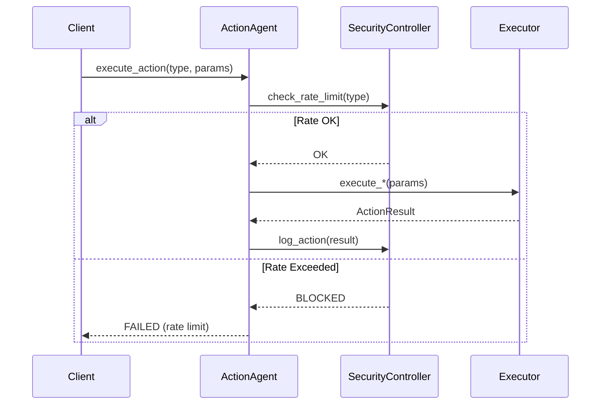

# ⚡ ActionAgent

**Module**: `core/agents/action/agent.py`  
**Lines of Code**: 358  
**Purpose**: Main orchestrator for the Action Agent system.

---

## 🎯 Overview

The **ActionAgent** is Alexandria's "hands" - it executes actions in the real world (or simulation) to test hypotheses. This module coordinates all components (security, parameters, executors, testing, evidence).

---

## 🏗️ Class: ActionAgent

```python
class ActionAgent:
    def __init__(self, sfs_path: str = "./data/", security_level: str = "strict")
```

### Components
- `security_controller`: SecurityController for rate limits and audit
- `parameter_controller`: ParameterController for safe adjustments
- `v2_learner`: V2Learner for internal learning actions

---

## 🔄 Methods

### `execute_action(action_type, parameters) → ActionResult`
Main execution method. Routes to appropriate executor based on ActionType:

| ActionType | Executor |
|------------|----------|
| `API_CALL` | `execute_api_call()` |
| `PARAMETER_ADJUSTMENT` | `execute_parameter_adjustment()` |
| `MODEL_RETRAIN` | `execute_model_retrain()` |
| `DATA_GENERATION` | `execute_data_generation()` |
| `SYSTEM_CONFIG_CHANGE` | `execute_config_change()` |
| `SIMULATION_RUN` | `execute_simulation()` |
| `INTERNAL_LEARNING` | `execute_internal_learning()` |

### `test_hypothesis(hypothesis) → TestHypothesis`
Tests a V9-generated hypothesis:
1. Creates TestHypothesis structure
2. Executes test action
3. Evaluates result → EvidenceType
4. Registers evidence in SFS

### `get_test_statistics() → Dict`
Returns statistics:
- `total_tests`
- `evidence_distribution`
- `status_distribution`
- `average_duration`
- `success_rate`

---

## 🔒 Security Flow



---

## 🏭 Factory Function

```python
from core.agents.action.agent import create_action_agent_system

agent, simulator, registrar = create_action_agent_system(sfs_instance, sfs_path="./data/")
```

Returns tuple: `(ActionAgent, TestSimulator, EvidenceRegistrar)`

---

**Last Updated**: 2025-12-13  
**Version**: 2.0 (Refactored)  
**Status**: Active
