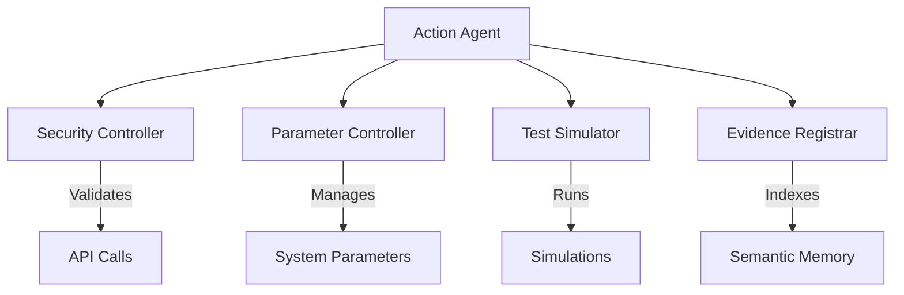
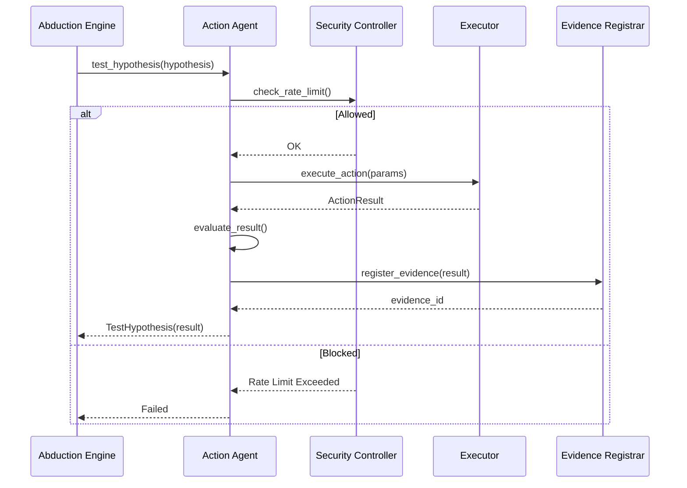

# ⚡ Action Agent

**Module**: `core/agents/action/`  
**Lines of Code**: ~500+ (Modular)  
**Purpose**: Execute actions to validate hypotheses, register evidence, and control system parameters.

---

## 🎯 Overview

The Action Agent is Alexandria's **"hands"** - it executes actions in the real world (or simulation) to test hypotheses generated by the Abduction Engine. It bridges the gap between **theory** (hypotheses) and **practice** (validation).

It has been refactored into a modular system with dedicated controllers for security, parameters, and simulation.

### Core Principle

**Test, Don't Guess**

```
Hypothesis: "Increasing V11_BETA improves clustering density"
Action: PARAMETER_ADJUSTMENT (V11_BETA = 2.5)
Result: Density increased by 15%
Verdict: ✓ Validated (Supporting Evidence)
```

---

## 🏗️ Architecture



### Components

1.  **ActionAgent** (`agent.py`): The main orchestrator.
2.  **SecurityController** (`security_controller.py`): Enforces rate limits and validates API calls.
3.  **ParameterController** (`parameter_controller.py`): Manages safe adjustment of system parameters (e.g., `V11_BETA`).
4.  **TestSimulator** (`test_simulator.py`): Runs specialized simulations (e.g., VQ-VAE accuracy tests).
5.  **EvidenceRegistrar** (`evidence_registrar.py`): Formats and indexes action results into the Semantic File System.

---

## 🎬 Action Types

The agent supports the following `ActionType` enum values:

### 1. PARAMETER_ADJUSTMENT
**Purpose**: Modify system parameters to test causal effects.
- **Target**: `ParameterController`
- **Example**: Changing learning rates, thresholds, or VQ-VAE beta.

### 2. SIMULATION_RUN
**Purpose**: Run synthetic experiments to validate hypotheses without affecting production data.
- **Target**: `TestSimulator`
- **Example**: `v11_accuracy_test` to verify parameter impact.

### 3. API_CALL
**Purpose**: query external systems (controlled by Security Controller).
- **Target**: External APIs (arXiv, etc.) - *Note: Literature search logic is often handled by Bridge Agent, but executed here.*

### 4. MODEL_RETRAIN
**Purpose**: Trigger retraining of internal models (e.g., V2 Learner).

### 5. DATA_GENERATION
**Purpose**: Generate synthetic data for stress testing or simulation.

### 6. INTERNAL_LEARNING
**Purpose**: Consolidate validated knowledge into the neural weights.

---

## 🔄 Execution Pipeline



---

## 📊 Core Classes

### ActionResult

```python
@dataclass
class ActionResult:
    action_id: str
    action_type: ActionType
    status: ActionStatus          # PENDING, EXECUTING, COMPLETED, FAILED
    result_data: Dict[str, Any]
    start_time: datetime
    end_time: Optional[datetime]
    evidence_generated: bool
    evidence_type: EvidenceType   # SUPPORTING, CONTRADICTING, NEUTRAL
```

### TestHypothesis

```python
@dataclass
class TestHypothesis:
    hypothesis_id: str
    test_action: ActionType
    test_parameters: Dict
    expected_outcome: Dict
    result: Optional[ActionResult]
    evidence_registered: bool
```

---

## 🔒 Security & Safety

The **SecurityController** ensures the agent doesn't perform dangerous actions:
- **Rate Limiting**: Prevents API spam (e.g., 10 calls / 5 mins).
- **Domain Whitelisting**: Only allows approved external domains.
- **Audit Logging**: Records all actions for review.

The **ParameterController** ensures stability:
- **Range Checking**: Parameters have defined min/max values.
- **History**: Tracks all changes for rollback capability.

---

## 🎯 Use Cases

### 1. Auto-Tuning VQ-VAE
Hypothesis: "Lowering V11_BETA to 0.5 improves reconstruction accuracy."
1.  **Action**: `SIMULATION_RUN` with `parameter_value=0.5`.
2.  **Simulator**: Runs VQ-VAE test, measures accuracy.
3.  **Result**: Accuracy increases.
4.  **Evidence**: Registered as `SUPPORTING`.
5.  **Follow-up**: `PARAMETER_ADJUSTMENT` to permanently set `V11_BETA = 0.5`.

### 2. Validating Causal Links
Hypothesis: "Concept A causes Concept B."
1.  **Action**: `LITERATURE_SEARCH` (via API_CALL).
2.  **Result**: Found papers confirming link.
3.  **Evidence**: Registered in SFS.
4.  **Consolidation**: `INTERNAL_LEARNING` updates Mycelial weights.

---

**Last Updated**: 2025-12-04
**Version**: 2.0 (Modular Refactor)
**Status**: Active
