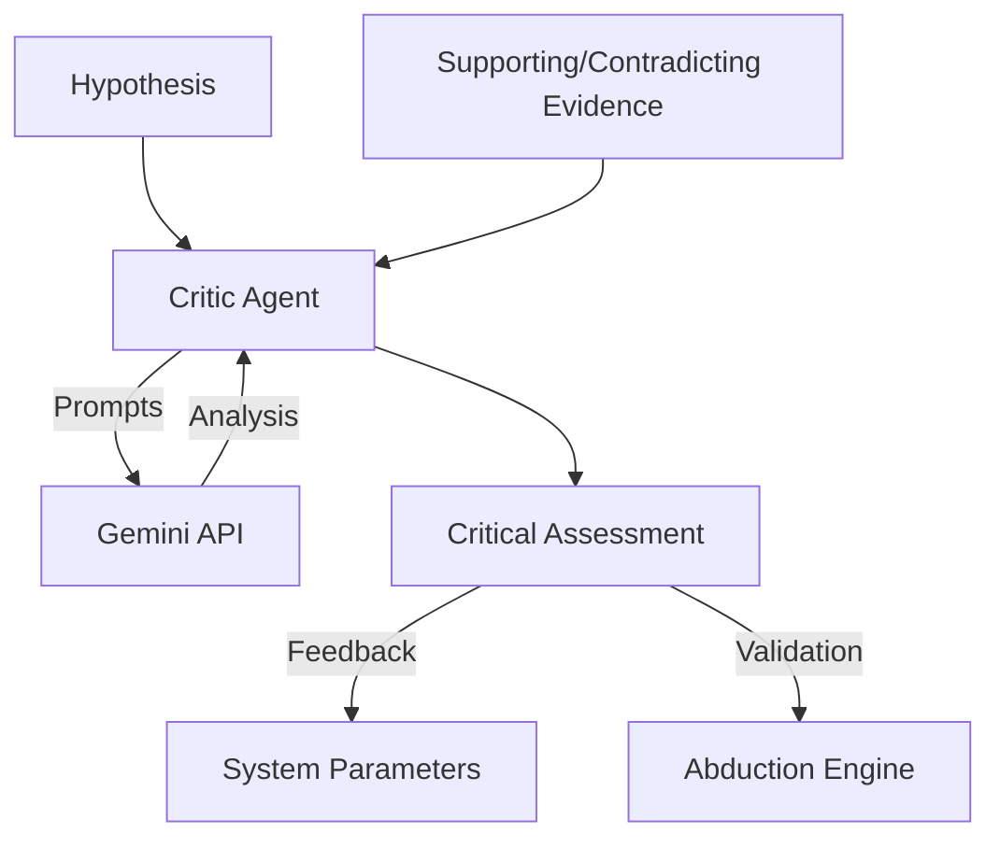

# 🧐 Critic Agent

**Module**: `core/agents/critic_agent.py`  
**Lines of Code**: ~770  
**Purpose**: Evaluate hypotheses, calculate risk scores, and provide self-regulation feedback using Gemini.

---

## 🎯 Overview

The **Critic Agent** (Senior Critic V10) serves as the system's "conscience" and quality control layer. While the Abduction Engine generates hypotheses (creativity), the Critic Agent evaluates them for scientific rigor, plausibility, and safety (scrutiny).

It utilizes **Google Gemini** (via API) to perform deep semantic analysis of hypotheses against retrieved evidence.

### Core Responsibilities

1.  **Hypothesis Evaluation**: Assigns a `TruthScore` (0.0 - 1.0) to generated hypotheses.
2.  **Risk Assessment**: Categorizes hypotheses into Risk Levels (Low, Medium, High, Critical).
3.  **Bias Detection**: Identifies confirmation bias, recency bias, and availability bias in the system's reasoning.
4.  **Self-Regulation**: Suggests adjustments to system parameters (e.g., temperature, variance) based on performance.

---

## 🏗️ Architecture



---

## 📊 Scoring System

### Truth Score
A float from 0.0 to 1.0 representing the likelihood of the hypothesis being true based on current scientific knowledge.

| Score Range | Category | Description |
|-------------|----------|-------------|
| 0.8 - 1.0 | **FACTUAL** | Well-established scientific fact. |
| 0.6 - 0.79 | **PLAUSIBLE** | Likely true, supported by strong evidence. |
| 0.4 - 0.59 | **SPECULATIVE** | Interesting but unproven; requires more testing. |
| 0.0 - 0.39 | **FALSE** | Contradicted by evidence or scientifically invalid. |

### Risk Level
Determines the safety of acting upon a hypothesis.

- **LOW**: Safe to consolidate immediately.
- **MEDIUM**: Requires standard validation (simulation/search).
- **HIGH**: Requires manual review or extensive multi-modal validation.
- **CRITICAL**: Rejected automatically; potential hallucination or dangerous inference.

---

## 🧠 Self-Regulation Loop

The Critic Agent monitors the system's "health" and suggests parameter adjustments:

1.  **Temperature Control**:
    - If Approval Rate > 80% (Too permissive) → **Decrease Temperature** (Reduce creativity).
    - If Approval Rate < 40% (Too strict) → **Increase Temperature** (Encourage exploration).

2.  **Variance Control**:
    - If Bias Detected > 0.6 → **Increase Variance** (Force diversity in sampling).

---

## 📝 Critical Assessment Structure

Every evaluation produces a `CriticalAssessment` object:

```python
@dataclass
class CriticalAssessment:
    hypothesis_id: str
    truth_score: float
    truth_category: TruthScore
    risk_level: RiskLevel
    evidence_quality: float
    reasoning_coherence: float
    supporting_facts: List[str]
    contradicting_facts: List[str]
    recommendation: str  # "approve", "review", "reject"
```

---

## 🔍 Bias Detection

The agent actively looks for cognitive biases in the system's operation:

- **Confirmation Bias**: Accepting hypotheses just because they match existing clusters.
- **Recency Bias**: Over-weighting recently ingested documents.
- **Availability Bias**: Relying on easily accessible evidence (e.g., only text, ignoring images).

---

## 🔗 Integration

- **Input**: Receives `Hypothesis` from `AbductionEngine`.
- **Context**: Queries `SemanticFileSystem` for supporting/contradicting evidence.
- **Output**: Returns `CriticalAssessment` to `ActionAgent` or `AbductionEngine`.

---

**Last Updated**: 2025-12-04
**Version**: 1.0 (V10 Implementation)
**Status**: Active
