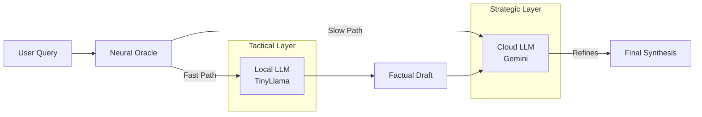

# 🔮 Neural Oracle

**Module**: `core/agents/oracle.py`  
**Lines of Code**: ~200  
**Purpose**: Hybrid natural language processing and synthesis using a "Cortex of Experts" architecture.

---

## 🎯 Overview

The **Neural Oracle** is the system's voice and synthesizer. It implements a **Hybrid Architecture** that combines the speed and privacy of a local LLM with the reasoning power of a cloud-based foundation model.

### The "Cortex of Experts"

1.  **Tactical Expert (Local)**:
    - **Model**: `TinyLlama-1.1B-Chat` (Optimized for CPU/AVX512).
    - **Role**: Fast, factual RAG (Retrieval-Augmented Generation), privacy-sensitive processing.
    - **Latency**: < 100ms.
    - **Cost**: Free.

2.  **Strategic Expert (Cloud)**:
    - **Model**: `Google Gemini 1.5 Flash`.
    - **Role**: Complex reasoning, stylistic refinement, "Semantic Collision" synthesis.
    - **Latency**: ~1-2s.
    - **Cost**: API usage.

---

## 🏗️ Architecture

---

## 🔄 Synthesis Modes

The Oracle operates in three modes:

### 1. Local Mode (Offline/Fast)
- Uses **only** TinyLlama.
- Best for: Quick summaries, factual lookups, when offline.
- **Command**: `synthesize(..., mode="local")`

### 2. Gemini Mode (High Quality)
- Uses **only** Gemini.
- Best for: Creative writing, complex reasoning, "Semantic Collision".
- **Command**: `synthesize(..., mode="gemini")`

### 3. Hybrid Mode (Default)
- **Step 1**: TinyLlama generates a "Factual Draft" based on retrieved evidence.
- **Step 2**: Gemini refines the draft, improving flow and tone, and adding strategic insights.
- **Benefit**: Reduces hallucination (grounded by local model) while maintaining high fluency.
- **Command**: `synthesize(..., mode="hybrid")`

---

## 💥 Semantic Collider

The Oracle is capable of **"Semantic Collision"**, a process where disparate pieces of evidence are forced together to generate novel insights.

**Prompt Strategy**:
> "Do not just summarize. **Collide** the evidence to generate sparks of new insights. **Fuse** seemingly unconnected concepts..."

This is primarily powered by the Strategic Expert (Gemini) due to the high abstraction capability required.

---

## 🛠️ Technical Implementation

### Local Optimization
The local model is optimized for consumer hardware (specifically Intel i9 CPUs):
- **Float32**: Used instead of FP16 for CPU performance.
- **Batch Size 1**: Optimized for real-time interaction.
- **Threads**: 8 threads for parallel processing.

### Fallback Mechanism
If the API Key is missing or the network is down, the system automatically degrades gracefully to **Local Mode**, ensuring the agent remains functional (albeit less eloquent).

---

**Last Updated**: 2025-12-04
**Version**: 1.0
**Status**: Active
