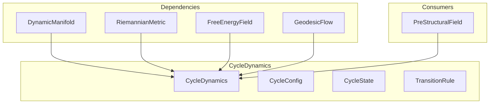

# 🔄 CycleDynamics

**Module**: `core/field/cycle_dynamics.py`  
**Lines**: 592  
**Purpose**: Engine for Expansion → Configuration → Compression cycle.

---

## Overview

The **CycleDynamics** is the heart of the system — the cycle that makes everything evolve. Each iteration transforms the transformation rules themselves (self-modifying).

### Phases

| Phase | Purpose | Trigger |
|-------|---------|---------|
| **EXPANSION** | Grow space in new dimensions | High free energy (F > 0.7) |
| **CONFIGURATION** | Elements arrange into patterns | Always runs |
| **COMPRESSION** | Collapse redefining metric | Low free energy (F < 0.3) |
| **META_UPDATE** | Update transition rules | Always runs |

### The Magic

The cycle modifies how future cycles work — this enables real learning.

---

## Dependencies

| Import | Purpose |
|--------|---------|
| `numpy` | Array operations |
| `.manifold` | DynamicManifold |
| `.metric` | RiemannianMetric |
| `.free_energy_field` | FreeEnergyField |
| `.geodesic_flow` | GeodesicFlow |

---

## Classes

### CyclePhase (Enum)

```python
class CyclePhase(Enum):
    IDLE = "idle"
    EXPANSION = "expansion"
    CONFIGURATION = "configuration"
    COMPRESSION = "compression"
    META_UPDATE = "meta_update"
```

### CycleConfig

```python
@dataclass
class CycleConfig:
    # Expansion
    expansion_threshold: float = 0.7
    max_expansion_dims: int = 32
    expansion_rate: float = 0.1
    
    # Configuration
    configuration_steps: int = 50
    configuration_temperature: float = 1.0
    configuration_cooling_rate: float = 0.95
    
    # Compression
    compression_threshold: float = 0.3
    min_compression_dims: int = 0
    compression_rate: float = 0.1
    
    # Meta-learning
    meta_learning_rate: float = 0.01
    history_length: int = 10
```

### CycleState

```python
@dataclass
class CycleState:
    phase: CyclePhase
    cycle_number: int
    pre_expansion: Optional[FieldState]
    post_expansion: Optional[FieldState]
    post_configuration: Optional[FieldState]
    post_compression: Optional[FieldState]
    dimensions_added: int
    dimensions_removed: int
    free_energy_delta: float
    attractors_formed: int
```

### TransitionRule

```python
@dataclass
class TransitionRule:
    expansion_weights: np.ndarray
    compression_weights: np.ndarray
    configuration_bias: np.ndarray
    history: List[Dict]  # For meta-learning
```

---

## CycleDynamics Methods

### Core Cycle

| Method | Signature | Description |
|--------|-----------|-------------|
| `run_cycle` | `(trigger) → CycleState` | Execute full cycle |
| `trigger_cycle` | `(embedding) → CycleState` | Start cycle from embedding |
| `continuous_cycles` | `(n, triggers) → List[CycleState]` | Run N cycles |
| `until_stable` | `(max_cycles, threshold) → List` | Run until stable |

### Phases

| Method | Signature | Description |
|--------|-----------|-------------|
| `_expansion_phase` | `(state) → int` | Add dimensions if F high |
| `_configuration_phase` | `(state)` | Annealing to low F |
| `_compression_phase` | `(state) → int` | Remove dimensions if F low |
| `_meta_update` | `(state) → Dict` | Update transition rules |

### Helpers

| Method | Signature | Description |
|--------|-----------|-------------|
| `_compute_expansion_directions` | `(n_dims) → np.ndarray` | Find expansion basis |
| `_identify_compressible_dimensions` | `(n_dims) → List[int]` | Find compressible dims |
| `_crystallize_to_graph` | `()` | Save to Mycelial graph |

### State

| Method | Signature | Description |
|--------|-----------|-------------|
| `get_current_state` | `() → Dict` | Current system state |
| `get_history_summary` | `() → Dict` | Cycle history metrics |
| `reset` | `()` | Reset cycle state |

---

## Communication



---

## Usage Examples

### Single Cycle

```python
from core.field.cycle_dynamics import CycleDynamics, CycleConfig

config = CycleConfig(expansion_threshold=0.5)
cycle = CycleDynamics(manifold, metric, field, flow, config)

# Run one cycle
state = cycle.run_cycle()
print(f"ΔF: {state.free_energy_delta:.4f}")
print(f"Dims: +{state.dimensions_added}/-{state.dimensions_removed}")
```

### With Trigger

```python
embedding = topology.encode(["quantum computing"])[0]
state = cycle.trigger_cycle(embedding)
```

### Until Stable

```python
states = cycle.until_stable(max_cycles=50, stability_threshold=0.01)
print(f"Stabilized after {len(states)} cycles")
```

### Continuous Cycles

```python
states = cycle.continuous_cycles(n_cycles=10)
summary = cycle.get_history_summary()
print(f"Net dim change: {summary['net_dim_change']}")
```

---

**Last Updated**: 2025-12-13  
**Version**: 1.0
