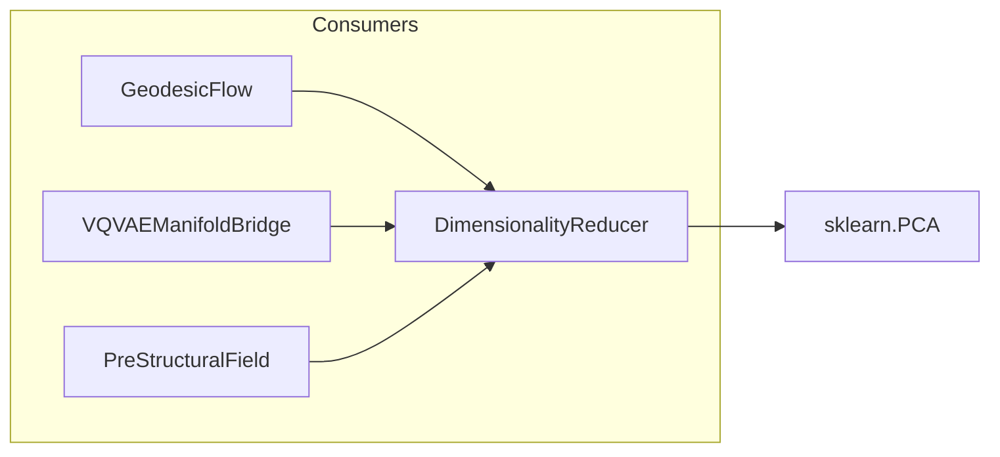

# 📐 DimensionalityReducer

**Module**: `core/field/dim_reduction.py`  
**Lines**: 83  
**Purpose**: Project embeddings (384D) → Manifold Space (32D) for efficient geodesic calculations.

---

## Overview

The **DimensionalityReducer** compresses 384D embeddings to 32D for efficient manifold operations. Uses pre-trained PCA or falls back to Random Projection for immediate functionality.

### Projection Modes

| Mode | Condition | Method |
|------|-----------|--------|
| **PCA** | Model exists at `data/pca_32d.pkl` | Learned projection from data |
| **Random Projection** | No PCA model | Semi-orthogonal random matrix (fallback) |

---

## Dependencies

| Import | Purpose |
|--------|---------|
| `numpy` | Matrix operations |
| `pickle` | Model persistence |
| `sklearn.decomposition` | PCA (if trained) |

---

## Class: DimensionalityReducer

```python
DimensionalityReducer(
    input_dim: int = 384,
    target_dim: int = 32,
    save_path: str = "data/pca_32d.pkl"
)
```

### Attributes

| Attribute | Type | Description |
|-----------|------|-------------|
| `input_dim` | `int` | Input dimension (384) |
| `target_dim` | `int` | Target dimension (32) |
| `save_path` | `str` | Path to PCA model |
| `pca` | `PCA` | Sklearn PCA (if loaded) |
| `is_fitted` | `bool` | Whether PCA is loaded |
| `projection_matrix` | `np.ndarray` | Fallback random projection [384, 32] |

### Methods

| Method | Signature | Description |
|--------|-----------|-------------|
| `transform` | `(embedding) → np.ndarray` | Project 384D → 32D |
| `fit_partial` | `(embeddings)` | Incremental training (placeholder) |
| `_load` | `()` | Load PCA from save_path |

---

## Communication



---

## Usage Examples

### Transform Embeddings

```python
from core.field.dim_reduction import DimensionalityReducer

reducer = DimensionalityReducer()

# Single embedding
embedding_384 = np.random.randn(384)
reduced_32 = reducer.transform(embedding_384)
print(reduced_32.shape)  # (32,)

# Batch
batch_384 = np.random.randn(10, 384)
batch_32 = reducer.transform(batch_384)
print(batch_32.shape)  # (10, 32)
```

### Check Mode

```python
if reducer.is_fitted:
    print("Using trained PCA")
else:
    print("Using Random Projection fallback")
```

---

## Internal Details

### Random Projection Initialization

```python
# Semi-orthogonal matrix via QR decomposition
rng = np.random.default_rng(42)
random_matrix = rng.standard_normal((384, 32))
q, _ = np.linalg.qr(random_matrix)
projection_matrix = q[:, :32]
```

This ensures vectors are projected preserving relative distances (Johnson-Lindenstrauss lemma).

---

**Last Updated**: 2025-12-13  
**Version**: 1.0  
**Status**: Active
