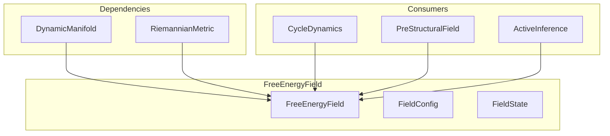

# ⚡ FreeEnergyField

**Module**: `core/field/free_energy_field.py`  
**Lines**: 500  
**Purpose**: Free energy landscape F(x) = E(x) - T·S(x) over the manifold.

---

## Overview

The **FreeEnergyField** is the landscape that determines system dynamics:
- **Low F** = preferred states (attractors)
- **Gradients** = direction of natural "descent"

### Formula

```
F(x) = E(x) - T · S(x)

Where:
  E(x) = Internal energy (surprise/prediction error)
  S(x) = Entropy (uncertainty)
  T    = Temperature (exploration vs exploitation)
```

---

## Dependencies

| Import | Purpose |
|--------|---------|
| `numpy` | Array operations |
| `scipy.ndimage` | Gaussian filter |
| `scipy.signal` | Peak finding |
| `.manifold` | DynamicManifold, ManifoldPoint |
| `.metric` | RiemannianMetric |

---

## Classes

### FieldConfig

```python
@dataclass
class FieldConfig:
    temperature: float = 1.0       # T in F = E - TS
    energy_scale: float = 1.0      # Energy scaling
    entropy_scale: float = 1.0     # Entropy scaling
    smoothing_sigma: float = 0.1   # Field smoothing
    grid_resolution: int = 32      # Visualization grid
    well_threshold: float = -0.5   # Attractor detection
```

### FieldState

```python
@dataclass
class FieldState:
    energy_field: np.ndarray       # E(x) on grid
    entropy_field: np.ndarray      # S(x) on grid
    free_energy_field: np.ndarray  # F(x) = E - TS
    curvature_field: np.ndarray    # Metric curvature
    gradient_field: np.ndarray     # ∇F at each point
    attractors: List[np.ndarray]   # Local minima of F
    grid_points: np.ndarray        # Grid coordinates
```

---

## FreeEnergyField Methods

### Field Components

| Method | Signature | Description |
|--------|-----------|-------------|
| `energy_at` | `(point) → float` | E(x) at point (surprise) |
| `entropy_at` | `(point) → float` | S(x) at point (uncertainty) |
| `free_energy_at` | `(point) → float` | F(x) = E - T·S |
| `gradient_at` | `(point, epsilon) → np.ndarray` | ∇F at point |

### Field Computation

| Method | Signature | Description |
|--------|-----------|-------------|
| `compute_field` | `(grid_points) → FieldState` | Compute full field state |
| `_find_attractors` | `(grid, F) → List[np.ndarray]` | Find local minima |

### Dynamics

| Method | Signature | Description |
|--------|-----------|-------------|
| `descend` | `(point, step_size, steps) → np.ndarray` | Gradient descent on F |
| `flow_field` | `(grid_points) → np.ndarray` | Velocity field -∇F |

### Temperature Control

| Method | Signature | Description |
|--------|-----------|-------------|
| `set_temperature` | `(T)` | Adjust exploration/exploitation |
| `anneal` | `(schedule, steps)` | Simulated annealing |

### Integration

| Method | Signature | Description |
|--------|-----------|-------------|
| `sync_with_variational_fe` | `()` | Sync with existing VFE module |
| `update_from_prediction_error` | `(errors)` | Update from prediction errors |
| `get_state` | `() → FieldState` | Get cached state |
| `stats` | `() → Dict` | Field statistics |

---

## Communication



---

## Usage Examples

### Compute Free Energy

```python
from core.field.free_energy_field import FreeEnergyField, FieldConfig

config = FieldConfig(temperature=0.5)
field = FreeEnergyField(manifold, metric, config)

# At a single point
F = field.free_energy_at(point)
print(f"F = {F:.4f}")
```

### Compute Full Field

```python
state = field.compute_field()

print(f"Mean F: {state.mean_free_energy:.3f}")
print(f"Attractors: {state.num_attractors}")
```

### Gradient Descent

```python
# Descend to attractor
final = field.descend(start_point, step_size=0.01, steps=50)
```

### Temperature Annealing

```python
# Linear cooling schedule
field.anneal(lambda t: 1.0 - t/100, steps=100)
```

---

## Internal Details

### Energy Computation

Low energy near active points:
```python
for pid, p in active_points:
    dist = np.linalg.norm(point - p.coordinates)
    energy -= p.activation / (dist + 0.1)
```

### Entropy Computation

Based on neighbor distance variance:
```python
neighbors = manifold.get_neighbors(point, k=16)
entropy = variance(distances) / mean(distances)
```

---

**Last Updated**: 2025-12-13  
**Version**: 1.0
