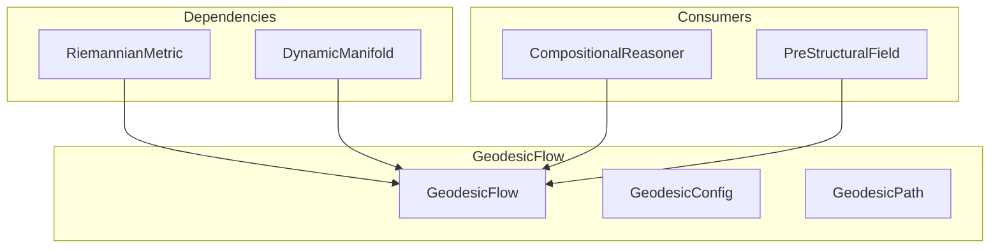

# 🛤️ GeodesicFlow

**Module**: `core/field/geodesic_flow.py`  
**Lines**: 265  
**Purpose**: Geodesic path integration (shortest paths in curved space).

---

## Overview

The **GeodesicFlow** computes geodesics — the shortest paths in curved Riemannian space. Like "straight lines" that follow curvature.

### Key Concepts

| Concept | Description |
|---------|-------------|
| **IVP** | Initial Value Problem: given start + velocity |
| **BVP** | Boundary Value Problem: given start + end |
| **Shooting Method** | Solve BVP by iteratively adjusting initial velocity |

### Geodesic Equation

```
d²x^k/dt² + Γ^k_ij (dx^i/dt)(dx^j/dt) = 0

Where Γ^k_ij are Christoffel symbols from the metric
```

---

## Dependencies

| Import | Purpose |
|--------|---------|
| `numpy` | Vector operations |
| `.metric` | RiemannianMetric (Christoffel symbols) |
| `dataclasses` | Config, Path structures |

---

## Classes

### GeodesicConfig

```python
@dataclass
class GeodesicConfig:
    dt: float = 0.02              # Integration step
    max_steps: int = 200          # Max integration steps
    active_dims: int = 24         # Active dimensions for Christoffel
    energy_renorm: bool = True    # Conserve kinetic energy
    vel_damping: float = 0.0      # Velocity damping
    speed_floor: float = 1e-6     # Minimum speed threshold
    use_scipy_integrator: bool = False  # Use scipy.integrate.solve_ivp
    
    # Shooting Method parameters
    shooting_iters: int = 35      # Max shooting iterations
    lr: float = 0.35              # Learning rate for velocity correction
    tol: float = 1e-2             # Convergence tolerance
    patience: int = 35            # Steps without improvement
```

### GeodesicPath

```python
@dataclass
class GeodesicPath:
    points: np.ndarray    # [n_steps, dim] trajectory
    length: float         # Accumulated metric length
    converged: bool       # Reached target within tolerance
    end_error: float      # Final distance to target
    best_step: int        # Step with minimum error
```

---

## GeodesicFlow Methods

### Core Methods

| Method | Signature | Description |
|--------|-----------|-------------|
| `__init__` | `(manifold, metric, config)` | Initialize with manifold and metric |
| `_speed2` | `(x, v) → float` | Kinetic energy vᵀg(x)v |
| `_integrate_ivp` | `(start, v0, end, steps) → GeodesicPath` | Integrate geodesic equation (IVP) |
| `shortest_path` | `(start, end, max_iterations) → GeodesicPath` | Find geodesic between points (BVP) |
| `propagate_activation` | `(point, steps, decay) → List[Point]` | Wave propagation (placeholder) |

---

## Communication



---

## Usage Examples

### Shortest Path (BVP)

```python
from core.field.geodesic_flow import GeodesicFlow, GeodesicConfig

flow = GeodesicFlow(manifold, metric)

# Find geodesic between two points
path = flow.shortest_path(start_point, end_point)

if path.converged:
    print(f"Geodesic found: {path.n_steps} steps, length={path.length:.3f}")
else:
    print(f"Best path: error={path.end_error:.4f}")
```

### Initial Value Problem

```python
# Integrate from start with given velocity
initial_velocity = np.random.randn(384) * 0.1
path = flow._integrate_ivp(start, initial_velocity, end=target, steps=100)

# Access trajectory
for point in path.points[::10]:  # Every 10th point
    print(point[:5])  # First 5 coords
```

---

## Internal Details

### Semi-Implicit Euler Integration

```python
# Geodesic acceleration
Γ = metric.christoffel_at_active(x, active_dims)
a = -np.einsum("kij,i,j->k", Γ, v, v)

# Update
v = v + a * dt
x = x + v * dt
```

### Energy Renormalization

Preserves kinetic energy `vᵀg(x)v` to maintain geodesic parametrization.

### Shooting Method

Iteratively adjusts initial velocity using gradient-like correction:
```python
v_new = v_old - (lr / T) * (x_final - target)
```

---

**Last Updated**: 2025-12-13  
**Version**: 2.0
