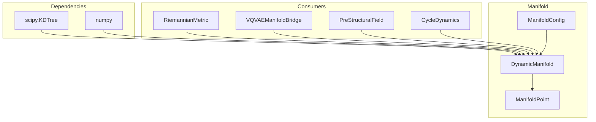

# 🌐 DynamicManifold

**Module**: `core/field/manifold.py`  
**Lines**: 402  
**Purpose**: Differentiable manifold with variable dimension for knowledge representation.

---

## Overview

The **DynamicManifold** is the geometric space where knowledge lives. Unlike discrete graphs, it's a continuous space that can dynamically expand and contract its dimensions.

### Key Concepts

| Concept | Description |
|---------|-------------|
| **Points** | Concepts/embeddings projected into the manifold |
| **VQ-VAE Codes** | Discrete coordinates (anchors) from quantization |
| **Dimension** | Can grow (expansion) and shrink (compression) |
| **Topology** | Emerges from point distribution |

### VQ-VAE Connection

```
VQ-VAE: 384D → 4 codes (4 heads × 256 values each)
        ↓
These codes are discrete coordinates in the manifold
        ↓
The manifold interpolates between these anchors
```

---

## Dependencies

| Import | Purpose |
|--------|---------|
| `numpy` | Coordinate operations, linear algebra |
| `scipy.spatial.KDTree` | Efficient k-nearest neighbor search |
| `scipy.sparse` | Sparse matrix representations |
| `dataclasses` | Config and Point data structures |

---

## Classes

### ManifoldConfig

```python
@dataclass
class ManifoldConfig:
    base_dim: int = 384           # Base dimension (embedding size)
    num_heads: int = 4            # VQ-VAE heads
    codebook_size: int = 256      # Codes per head
    max_expansion: int = 128      # Max additional dimensions
    sparsity_threshold: float = 0.01  # Activation threshold
    neighborhood_k: int = 16      # K neighbors for local structure
```

### ManifoldPoint

```python
@dataclass
class ManifoldPoint:
    coordinates: np.ndarray       # Continuous coordinates [dim]
    discrete_codes: np.ndarray    # VQ-VAE codes [4]
    activation: float = 0.0       # Current activation level
    metadata: Dict[str, Any]      # Additional metadata
```

---

## DynamicManifold Methods

### Embedding & Projection

| Method | Signature | Description |
|--------|-----------|-------------|
| `embed` | `(embedding, codes=None) → ManifoldPoint` | Project 384D embedding into manifold |
| `from_vqvae_codes` | `(codes) → ManifoldPoint` | Create point from VQ-VAE codes only |
| `set_anchor_points` | `(codebook_vectors)` | Set anchor points from VQ-VAE codebook |

### Point Operations

| Method | Signature | Description |
|--------|-----------|-------------|
| `add_point` | `(point_id, point)` | Add point to manifold |
| `get_point` | `(point_id) → ManifoldPoint` | Retrieve point by ID |
| `activate_point` | `(point_id, intensity=1.0)` | Trigger activation (causes metric deformation) |
| `decay_activations` | `(rate=0.1)` | Decay all activations (relaxation) |

### Structure & Neighbors

| Method | Signature | Description |
|--------|-----------|-------------|
| `get_neighbors` | `(point, k) → List[(id, dist)]` | Find k nearest neighbors |
| `get_active_points` | `() → List[(id, point)]` | Points above activation threshold |
| `_rebuild_kdtree` | `()` | Rebuild KDTree for neighbor search |

### Dimension Expansion/Contraction

| Method | Signature | Description |
|--------|-----------|-------------|
| `expand_dimension` | `(n_dims=1, basis=None)` | Add new dimensions during EXPANSION phase |
| `contract_dimension` | `(n_dims=1)` | Remove dimensions during COMPRESSION phase |

### Serialization

| Method | Signature | Description |
|--------|-----------|-------------|
| `get_coordinates_matrix` | `() → np.ndarray` | Matrix [n_points, dim] |
| `get_activations` | `() → np.ndarray` | Vector of activations |
| `to_dict` | `() → Dict` | Serialize for persistence |
| `from_dict` | `(data) → DynamicManifold` | Reconstruct from serialized data |
| `stats` | `() → Dict` | Statistics dictionary |

---

## Communication



---

## Usage Examples

### Basic Usage

```python
from core.field.manifold import DynamicManifold, ManifoldConfig

# Create manifold
config = ManifoldConfig(base_dim=384)
manifold = DynamicManifold(config)

# Project embedding
embedding = np.random.randn(384)
point = manifold.embed(embedding)

# Add to manifold
manifold.add_point("concept_1", point)

# Activate (trigger)
manifold.activate_point("concept_1", intensity=0.8)

# Find neighbors
neighbors = manifold.get_neighbors(point, k=5)
# Returns: [(point_id, distance), ...]
```

### Dimension Expansion/Contraction

```python
# Expand dimensions (during EXPANSION phase)
manifold.expand_dimension(n_dims=4)
print(manifold.current_dim)  # 388

# Contract dimensions (during COMPRESSION phase)
manifold.contract_dimension(n_dims=2)
print(manifold.current_dim)  # 386
```

### Serialization

```python
# Save
data = manifold.to_dict()

# Load
manifold = DynamicManifold.from_dict(data)
```

### Statistics

```python
stats = manifold.stats()
# {
#     "num_points": 100,
#     "current_dim": 386,
#     "base_dim": 384,
#     "expansion_dims": 2,
#     "active_points": 15,
#     "mean_activation": 0.23,
#     "max_activation": 0.95
# }
```

---

## Internal State

### Attributes

| Attribute | Type | Description |
|-----------|------|-------------|
| `config` | `ManifoldConfig` | Configuration |
| `current_dim` | `int` | Current dimension (can change) |
| `points` | `Dict[str, ManifoldPoint]` | Points dictionary |
| `anchor_points` | `np.ndarray` | VQ-VAE codebook anchors |
| `_kdtree` | `KDTree` | Structure for neighbor search |
| `_dirty` | `bool` | Flag for rebuild |
| `_expansion_dims` | `List[np.ndarray]` | Expansion basis vectors |

---

**Last Updated**: 2025-12-13  
**Version**: 1.0  
**Status**: Active
