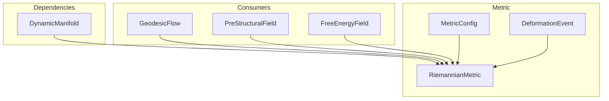

# 📐 RiemannianMetric

**Module**: `core/field/metric.py`  
**Lines**: 612  
**Purpose**: Dynamic Riemannian metric that deforms space when concepts are triggered.

---

## Overview

The **RiemannianMetric** defines how to measure distances in space. When a concept is triggered, the metric **locally deforms** — creating "attraction wells" and altering geodesic paths.

### Key Concepts

| Concept | Description |
|---------|-------------|
| **Euclidean Metric** | `g_ij = δ_ij` (identity) — "flat" space |
| **Deformation** | `g_ij(x)` varies with position — "curved" space |
| **Curvature** | Emerges from metric variation |
| **Geodesics** | Shortest paths (affected by curvature) |

### The Magic

Triggering a concept deforms the space, making related concepts **geodesically closer** even if Euclidean distance doesn't change:

```
g(x) = I + Σ_i D_i(x)

Where I is identity and D_i are local Gaussian deformations
centered on active points.
```

---

## Dependencies

| Import | Purpose |
|--------|---------|
| `numpy` | Tensor operations |
| `concurrent.futures` | ThreadPoolExecutor for parallel Christoffel |
| `.manifold` | DynamicManifold, ManifoldPoint |

---

## Classes

### MetricConfig

```python
@dataclass
class MetricConfig:
    deformation_radius: float = 0.8      # Influence radius
    deformation_strength: float = 1.0    # Max deformation strength
    decay_rate: float = 0.05             # Relaxation rate
    min_curvature: float = 0.0           # Minimum curvature
    max_curvature: float = 10.0          # Maximum curvature
    grid_resolution: int = 32            # Grid resolution for field
    kernel_type: str = "cauchy"          # "gaussian" | "cauchy"
    mode: str = "attractor"              # "attractor" | "obstacle"
    cutoff_multiplier: float = 6.0       # cutoff = radius * multiplier
    radius_scale_with_dim: bool = True   # Scale with sqrt(dim/10)
```

### DeformationEvent

```python
@dataclass
class DeformationEvent:
    center: np.ndarray       # Center point [dim]
    intensity: float         # Intensity
    radius: float            # Influence radius
    timestamp: float         # When it occurred
```

---

## RiemannianMetric Methods

### Metric Tensor

| Method | Signature | Description |
|--------|-----------|-------------|
| `metric_at` | `(point) → np.ndarray[dim,dim]` | Compute `g_ij` at point (symmetric, positive-definite) |
| `metric_tensor_inverse` | `(point) → np.ndarray` | Compute `g^{ij}` (for raising indices) |
| `distance` | `(p1, p2, steps=10) → float` | Approximate Riemannian distance |

### Deformation

| Method | Signature | Description |
|--------|-----------|-------------|
| `deform_at` | `(point, intensity, radius)` | Create deformation at point (trigger) |
| `deform_at_point` | `(manifold_point)` | Deform based on ManifoldPoint activation |
| `relax` | `(rate=None)` | Decay all deformations over time |
| `clear_deformations` | `()` | Remove all deformations |

### Curvature

| Method | Signature | Description |
|--------|-----------|-------------|
| `curvature_scalar_at` | `(point, epsilon=0.01) → float` | Ricci scalar at point |
| `curvature_tensor` | `(grid_points) → np.ndarray` | Curvature field over grid |

### Christoffel Symbols (for Geodesics)

| Method | Signature | Description |
|--------|-----------|-------------|
| `christoffel_at` | `(point, epsilon, n_workers) → np.ndarray[dim,dim,dim]` | Compute Γ^k_ij for geodesic equation |
| `christoffel_at_active` | `(x, active_dims, eps) → np.ndarray` | Optimized for first `active_dims` |
| `_christoffel_sparse` | `(point, epsilon) → np.ndarray` | Sparse version for high dim |
| `_metric_derivative` | `(point, direction, i, j, epsilon) → float` | ∂_direction g_ij |

### Utilities

| Method | Signature | Description |
|--------|-----------|-------------|
| `find_wells` | `(threshold=0.5) → List[np.ndarray]` | Find curvature "wells" (attractors) |
| `gradient_at` | `(point, epsilon=0.01) → np.ndarray` | Gradient of curvature |
| `stats` | `() → Dict` | Metric statistics |

---

## Communication



---

## Usage Examples

### Basic Metric Operations

```python
from core.field.metric import RiemannianMetric, MetricConfig
from core.field.manifold import DynamicManifold

manifold = DynamicManifold()
metric = RiemannianMetric(manifold)

# Get metric tensor at a point
point = np.random.randn(384)
g = metric.metric_at(point)  # [384, 384] symmetric matrix
```

### Creating Deformations

```python
# Trigger a concept - creates deformation
metric.deform_at(concept_coords, intensity=1.0, radius=0.5)

# Or from ManifoldPoint with its activation
metric.deform_at_point(active_point)

# Relax over time
metric.relax(rate=0.1)
```

### Computing Distances

```python
# Riemannian distance (affected by deformations)
dist = metric.distance(point_a, point_b, steps=20)
```

### Curvature Analysis

```python
# Scalar curvature at point
curvature = metric.curvature_scalar_at(point)

# Find attraction wells
wells = metric.find_wells(threshold=0.3)
for well in wells:
    print(f"Well at: {well[:5]}...")  # First 5 coords
```

### Christoffel Symbols

```python
# For geodesic computation
Γ = metric.christoffel_at(point, epsilon=0.01)
# Γ[k, i, j] = Γ^k_ij for equation:
# d²x^k/dt² + Γ^k_ij (dx^i/dt)(dx^j/dt) = 0
```

---

## Internal Details

### Kernel Types

| Kernel | Formula | Behavior |
|--------|---------|----------|
| `gaussian` | `w = exp(-0.5 * (d/r)²)` | Fast decay |
| `cauchy` | `w = 1 / (1 + (d/r)²)` | Slow decay (default) |

### Modes

| Mode | Formula | Effect |
|------|---------|--------|
| `attractor` | `g = (1+w)I - w·n⊗n` | Paths favor going through center |
| `obstacle` | `g = I + w·n⊗n` | Paths repelled from center |

---

**Last Updated**: 2025-12-13  
**Version**: 1.0  
**Status**: Active
