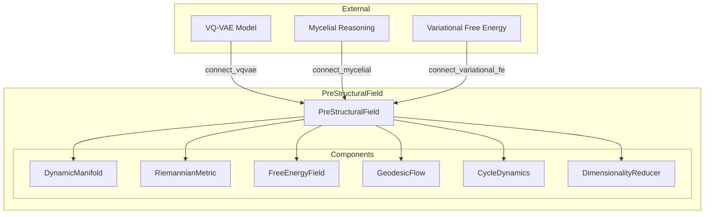

# 🧠 PreStructuralField

**Module**: `core/field/pre_structural_field.py`  
**Lines**: 582  
**Purpose**: Unified wrapper connecting geometric field with VQ-VAE and Mycelial.

---

## Overview

Central "glue" unifying all geometric components. Lives in 32D for fast geodesics.

---

## Dependencies

| Import | Purpose |
|--------|---------|
| `numpy` | Array operations |
| `.manifold` | DynamicManifold |
| `.metric` | RiemannianMetric |
| `.free_energy_field` | FreeEnergyField |
| `.geodesic_flow` | GeodesicFlow |
| `.cycle_dynamics` | CycleDynamics |
| `.dim_reduction` | DimensionalityReducer |

---

## 🏗️ Architecture



---

## ⚙️ Configuration

```python
@dataclass
class PreStructuralConfig:
    # Manifold
    base_dim: int = 32           # Reduced dim for geodesics
    input_dim: int = 384         # Semantic embedding dim
    max_expansion: int = 64      # Max manifold dimensions
    
    # Metric
    deformation_radius: float = 0.3
    deformation_strength: float = 0.5
    
    # Field
    temperature: float = 1.0     # Exploration vs exploitation
    
    # Cycle
    configuration_steps: int = 20
    expansion_threshold: float = 0.7
    compression_threshold: float = 0.3
    
    # Geodesic
    max_geodesic_steps: int = 20
    use_scipy: bool = False      # False = faster
```

---

## 🔌 External Connections

### 1. VQ-VAE (`connect_vqvae`)
Connects to the VQ-VAE model via `VQVAEManifoldBridge`:
- Codes become anchor points on the manifold
- Closes the gap between semantic space (S_λ) and discrete space (S_ι)

### 2. Mycelial (`connect_mycelial`)
Connects to MycelialReasoning:
- Crystallized graphs feed the Hebbian network
- Attractors become nodes, geodesics become edges

### 3. Variational FE (`connect_variational_fe`)
Synchronizes beliefs and free energy components with existing `VariationalFreeEnergy`.

---

## 🎬 Main Operations

### `trigger(embedding, codes, intensity)`
Activates a concept in the field:
1. **Reduces** embedding from 384D → 32D
2. **Encodes** via VQ-VAE if codes not provided
3. **Embeds** point in manifold
4. **Deforms** metric at point
5. **Computes** field state

```python
state = field.trigger(embedding_384d, intensity=1.0)
print(f"Attractors: {len(state.attractors)}")
```

### `propagate(field_state, steps)`
Evolves the field dynamics:
- Relaxes metric
- Decays activations
- Returns sequence of `FieldState`

### `run_cycle(trigger_embedding)`
Runs complete cognitive cycle:
```
Expansion → Configuration → Compression
```
Returns `CycleState` with results.

### `crystallize()`
Converts current field state to graph structure:
- **Nodes**: Attractors with coordinates and free energy
- **Edges**: Weighted by Riemannian distance

If Mycelial connected, incorporates graph into Hebbian network.

---

## 🌡️ Temperature Control

```python
field.set_temperature(T=0.5)  # Exploitation mode

# Or annealing
states = field.anneal(start_temp=2.0, end_temp=0.1, steps=50)
```

- **High T**: System explores (entropy dominates)
- **Low T**: System exploits (energy dominates)

---

## 📊 Statistics

```python
stats = field.stats()
# Returns:
# {
#   'manifold': {...},
#   'metric': {'deformations': n},
#   'field': {...},
#   'triggers': count,
#   'cycles_completed': count,
#   'connected': {'vqvae': bool, 'mycelial': bool, 'variational_fe': bool}
# }
```

---

## 🔗 Integration with Other Modules

| Component | Purpose |
|-----------|---------|
| `DynamicManifold` | Geometric space management |
| `RiemannianMetric` | Distance/curvature computation |
| `FreeEnergyField` | Energy landscape, attractors |
| `GeodesicFlow` | Path computation |
| `CycleDynamics` | Expansion/compression cycles |
| `DimensionalityReducer` | 384D → 32D projection |

---

**Last Updated**: 2025-12-13  
**Version**: 1.0  
**Status**: Active
