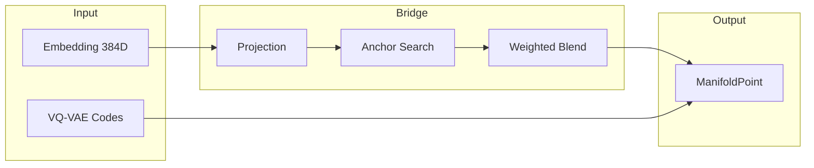

# 🌉 VQVAEManifoldBridge

**Module**: `core/field/vqvae_manifold_bridge.py`  
**Lines**: 884  
**Purpose**: Bridge between VQ-VAE codes and continuous DynamicManifold.

---

## Overview

Closes the gap between S_λ (continuous 384D) and S_ι (discrete codebook).

---

## Dependencies

| Import | Purpose |
|--------|---------|
| `numpy` | Vector operations |
| `scipy.spatial.KDTree` | Nearest anchor search |
| `.manifold` | DynamicManifold, ManifoldPoint |

- **S_λ**: The continuous semantic space (384D embeddings)
- **S_ι**: The discrete VQ-VAE codebook space (4 heads × 256 codes × 128D)

### Core Theory

```
g_ij(x) = δ_ij + Σ_a w_a · exp(-|x - c_a|² / r²)
```

Where `c_a` are anchor points from the VQ-VAE codebook. The metric curves toward discrete attractors.

---

## 🏗️ Architecture



---

## 📦 Data Structures

### ManifoldPoint
```python
@dataclass
class ManifoldPoint:
    coordinates: np.ndarray      # Continuous coordinates [dim]
    discrete_codes: np.ndarray   # VQ-VAE codes [num_heads]
    activation: float = 0.0      # Current activation level
    head_contributions: Optional[np.ndarray] = None
    nearest_anchor_distance: float = 0.0
```

### AnchorPoint
```python
@dataclass
class AnchorPoint:
    head_idx: int
    code_idx: int
    coordinates: np.ndarray
    usage_count: int = 0
    activation_strength: float = 1.0
```

### BridgeConfig
```python
@dataclass
class BridgeConfig:
    embedding_dim: int = 384
    num_heads: int = 4
    codes_per_head: int = 256
    head_dim: int = 128
    
    projection_mode: ProjectionMode = WEIGHTED_ANCHORS
    
    pull_radius: float = 0.3      # Anchor influence radius
    pull_strength: float = 0.5    # Max pull strength [0-1]
    num_nearest_anchors: int = 4  # Anchors for weighted blend
    
    deformation_radius: float = 0.2
    deformation_strength: float = 0.3
```

---

## 🎬 Projection Modes

| Mode | Description | Speed |
|------|-------------|-------|
| `FLAT` | No deformation, just find codes | Fast |
| `NEAREST_ANCHOR` | Pull toward single nearest anchor | Medium |
| `WEIGHTED_ANCHORS` | Blend of k nearest anchors (recommended) | Medium |
| `GEODESIC_SNAP` | Snap via geodesic path | Slow |

---

## 🔄 Main Methods

### `connect_vqvae(vqvae_model)`
Connects to VQ-VAE and extracts codebook:
- Tries multiple extraction APIs
- Processes codebook into anchor points
- Builds KDTree for fast search

### `embed(embedding) → ManifoldPoint`
Projects embedding into manifold:
1. Project to latent dimension (384D → 512D)
2. Normalize if configured
3. Apply projection mode (weighted blend)
4. Find codes per head
5. Return ManifoldPoint

### `from_vqvae_codes(codes) → ManifoldPoint`
Reconstructs ManifoldPoint from VQ-VAE codes:
- Concatenates code vectors from each head
- Creates exact attractor point

### `compute_metric_deformation(point) → np.ndarray`
Calculates metric tensor at point:
- Starts with identity (flat metric)
- Adds Gaussian contributions from nearby anchors
- Returns [dim × dim] metric matrix

---

## 🔧 Integration

### Patching DynamicManifold
```python
from vqvae_manifold_bridge import patch_dynamic_manifold, create_integrated_field

bridge = create_integrated_field(vqvae_model)
patch_dynamic_manifold(manifold, bridge)

# Now manifold.embed() uses bridge logic
point = manifold.embed(embedding)
```

### Factory Function
```python
bridge = create_integrated_field(my_vqvae, config=BridgeConfig(
    pull_strength=0.6,
    num_nearest_anchors=8
))
```

---

## ⚙️ Calibration

The bridge can load calibrated parameters from `config/bridge_calibration.json`:
```json
{
    "pull_strength": 0.5,
    "pull_radius": 0.3,
    "deformation_strength": 0.3,
    "calibration_score": 0.85
}
```

---

## 📊 Statistics

```python
stats = bridge.stats()
# {
#   "connected": True,
#   "num_anchors": 1024,
#   "num_heads": 4,
#   "codes_per_head": 256,
#   "projection_mode": "weighted",
#   "has_kdtree": True
# }
```

---

**Last Updated**: 2025-12-13  
**Version**: 1.0  
**Status**: Active
