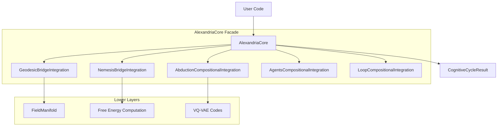

# 🧬 Alexandria Unified Integration

**Module**: `core/integrations/alexandria_unified.py`
**Lines of Code**: ~718
**Purpose**: Master integration layer that unifies all subsystems into a single coherent cognitive cycle.

---

## 🎯 Overview

The **AlexandriaCore** class is the central orchestrator of the Alexandria system. It wraps all specialized integrations (Geodesic, Nemesis, Abduction, Agents, Loop) into a unified interface, providing a single entry point for executing complete cognitive cycles.

### Why It Exists
Rather than manually wiring the Bridge module, the Field, the Compositional Reasoner, and Learning layers in every script, this module encapsulates the complexity. You instantiate one `AlexandriaCore` and call `cognitive_cycle()`.

---

## 🏗️ Architecture



---

## 📊 Core Classes

### `AlexandriaConfig`
Central configuration dataclass for all subsystem parameters.
```python
@dataclass
class AlexandriaConfig:
    bridge_pull_strength: float = 0.5
    nemesis_risk_weight: float = 1.0
    abduction_max_hypotheses: int = 5
    loop_max_iterations: int = 100
    loop_exploration_rate: float = 0.1
```

### `CognitiveCycleResult`
Output of one complete think-act-learn cycle.
```python
@dataclass
class CognitiveCycleResult:
    perception: Dict[str, Any]
    reasoning: Dict[str, Any]
    gaps_detected: List[Dict]
    hypotheses_generated: List[Dict]
    action_selected: Dict[str, Any]
    learning_metrics: Dict[str, float]
    free_energy: float
    iteration: int
    duration_ms: float
```

---

## 🎯 Use Cases

### 1. Run a Single Cognitive Cycle
```python
from core.integrations.alexandria_unified import AlexandriaCore
import numpy as np

core = AlexandriaCore.from_vqvae(vqvae_model)
observation = np.random.randn(384)

result = core.cognitive_cycle(observation)
print(f"Free Energy: {result.free_energy:.4f}")
print(f"Gaps: {len(result.gaps_detected)}, Hypotheses: {len(result.hypotheses_generated)}")
```

### 2. Health Check
```python
status = core.health_check()
# Returns dict with component availability
```

---

## 🔗 Dependencies

- **Requires**: `GeodesicBridgeIntegration`, `NemesisBridgeIntegration`, `AbductionCompositionalIntegration`, `AgentsCompositionalIntegration`, `LoopCompositionalIntegration`.
- **Used By**: `scripts/demos/demo_full_system.py`, `interface/pages/4_🔮_Abduction.py`.

---

**Last Updated**: 2025-12-11
**Version**: 1.0
**Status**: Production
