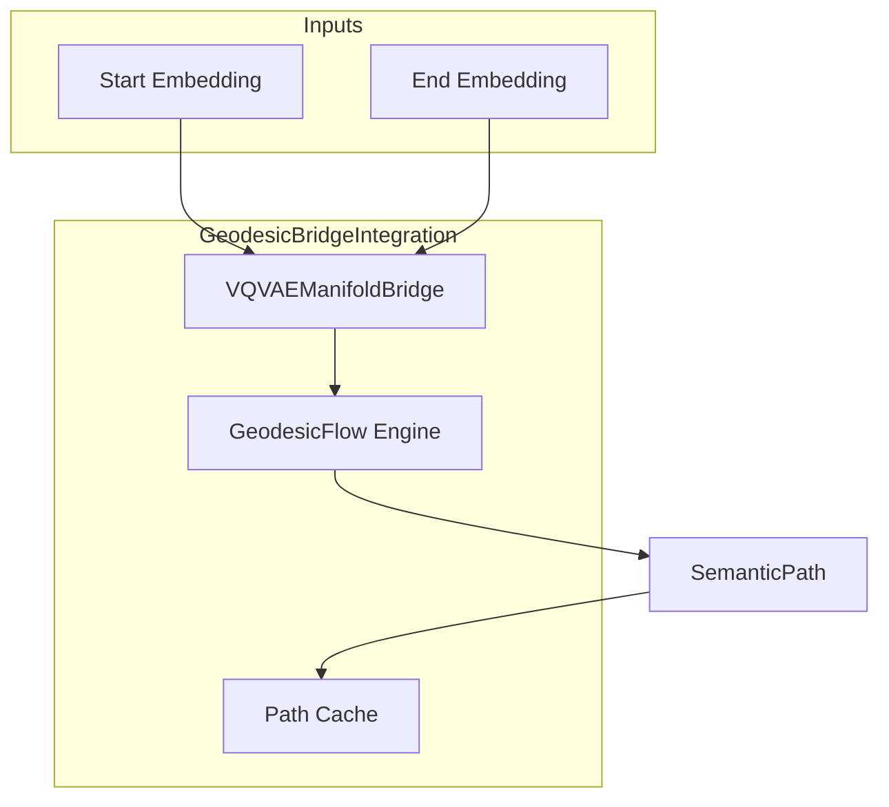

# 🛤️ Geodesic Bridge Integration

**Module**: `core/integrations/geodesic_bridge_integration.py`
**Lines of Code**: ~656
**Purpose**: Connect the geodesic flow engine to the curved manifold (VQ-VAE Bridge), enabling semantic path computation.

---

## 🎯 Overview

This integration allows Alexandria to compute **semantic paths** (geodesics) between concepts in the curved latent space defined by the VQ-VAE manifold. Instead of straight-line (Euclidean) paths, concepts are connected via **geodesics** that follow the learned metric.

### Key Capabilities
1. **Semantic Path Finding**: Compute the "shortest" path between two embeddings respecting curvature.
2. **Activation Propagation**: Spread activation from a concept radially through the manifold.
3. **Geodesic Fields**: Explore all directions from a point to map local geometry.

---

## 🏗️ Architecture



---

## 📊 Core Classes

### `GeodesicBridgeConfig`
Configuration dataclass for tuning geodesic computation.

### `SemanticPath`
Result of a geodesic computation:
```python
@dataclass
class SemanticPath:
    start: np.ndarray
    end: np.ndarray
    points: np.ndarray          # Intermediate waypoints
    geodesic_length: float      # Path length in manifold
    euclidean_length: float     # Straight-line distance
    curvature_integral: float   # Total curvature traversed
    attractors_visited: List[int]
    converged: bool
```

### `ActivationMap`
Result of spreading activation:
```python
@dataclass
class ActivationMap:
    source: np.ndarray
    activations: Dict[int, float]  # Concept ID -> activation level
    total_energy: float
    n_activated: int
```

---

## 🎯 Key Methods

| Method | Description |
|--------|-------------|
| `semantic_path(start, end)` | Computes geodesic between two embeddings |
| `propagate_activation(source, radius)` | Spreads activation from a point |
| `geodesic_field(center, n_directions)` | Maps local geometry |
| `distance(a, b, geodesic=True)` | Computes distance (geodesic or Euclidean) |

---

## 🔗 Dependencies
- **VQVAEManifoldBridge**: Provides the metric tensor and curvature.
- **GeodesicFlow**: Core geodesic ODE solver.

**Used By**: `AlexandriaCore`, `NemesisBridgeIntegration`.

---

**Last Updated**: 2025-12-11
**Version**: 1.0
**Status**: Production
