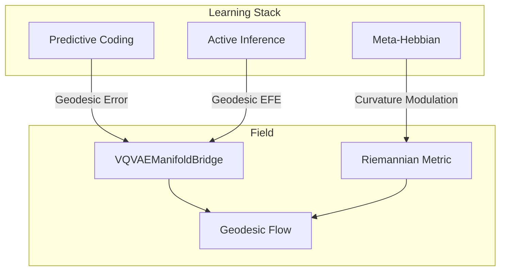

# 📚 Learning Field Integration

**Module**: `core/integrations/learning_field_integration.py`
**Lines of Code**: ~858
**Purpose**: Connect the Learning Stack (Predictive Coding, Active Inference, Meta-Hebbian) to the Pre-Structural Field.

---

## 🎯 Overview

This integration unifies the three main learning paradigms with the curved manifold:

1. **Predictive Coding**: Prediction errors are computed as geodesic distances.
2. **Active Inference**: Action planning uses geodesic EFE.
3. **Meta-Hebbian**: Learning rates are modulated by local curvature.

### Key Insight
By computing errors and plans geodesically, the system respects the learned topology of knowledge. Errors "in the direction of" strong conceptual connections are less surprising than orthogonal deviations.

---

## 🏗️ Architecture



---

## 📊 Core Classes

### `GeometricPrediction`
```python
@dataclass
class GeometricPrediction:
    predicted: np.ndarray
    observed: np.ndarray
    error: np.ndarray
    geodesic_error: float       # Distance in manifold
    euclidean_error: float      # Straight-line error
    curvature_at_prediction: float
    precision: float
```

### `GeometricPredictiveCoding`
PC layer that uses geodesic distance for error computation.

### `GeometricActiveInference`
AI agent that plans in the curved manifold.

### `GeometricMetaHebbian`
Meta-learning layer where learning rates depend on local curvature.

### `LearningFieldIntegration`
Master class that coordinates all three geometric learning modules.

---

## 🎯 Key Methods

| Method | Description |
|--------|-------------|
| `full_cycle(observation, context)` | Runs PC→encode→AI→plan→MH→adapt |
| `encode(observation)` | Geodesic predictive coding encoding |
| `plan(current, goal)` | Geodesic action planning |
| `adapt(prediction)` | Curvature-modulated learning |

---

## 🔗 Dependencies
- **VQVAEManifoldBridge**: Geodesic and metric computations.
- **PredictiveCodingNetwork**, **ActiveInferenceAgent**, **MetaHebbianOptimizer**: Base learning modules.

**Used By**: `AlexandriaCore`, `LoopCompositionalIntegration`.

---

**Last Updated**: 2025-12-11
**Version**: 1.0
**Status**: Production
