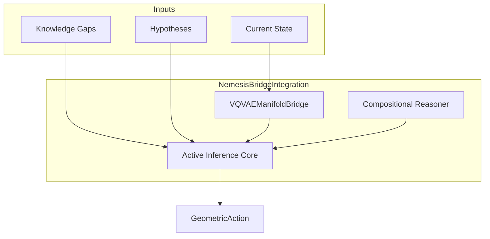

# 🧠 Nemesis Bridge Integration

**Module**: `core/integrations/nemesis_bridge_integration.py`
**Lines of Code**: ~724
**Purpose**: Connect the Active Inference engine (Nemesis) to the curved manifold for geometry-aware action selection.

---

## 🎯 Overview

The **NemesisBridgeIntegration** extends Active Inference to operate on a curved semantic space. The Expected Free Energy (EFE) is computed using **geodesic distance** instead of Euclidean, making the agent aware of the learned knowledge topology.

### Key Capabilities
1. **Geometric Action Selection**: Choose actions that minimize EFE computed geodesically.
2. **Curvature-Aware Planning**: Bonus for exploring high-curvature regions (interesting areas).
3. **Belief Updating**: Update generative model based on geometric prediction errors.

---

## 🏗️ Architecture



---

## 📊 Core Classes

### `GeometricEFE`
Expected Free Energy with geometric components:
```python
@dataclass
class GeometricEFE:
    total: float
    risk: float                 # Distance to preferred state
    ambiguity: float            # Uncertainty along path
    curvature_term: float       # Bonus for curved regions
    field_energy: float         # Free energy at target
    geodesic_length: float
    attractors_visited: int
```

### `GeometricAction`
Action enriched with geometric information:
```python
@dataclass
class GeometricAction:
    action_type: str
    target: str
    parameters: Dict[str, Any]
    geometric_efe: GeometricEFE
    geodesic_path: Optional[np.ndarray]
    epistemic_value: float
    pragmatic_value: float
    geometric_value: float
```

---

## 🎯 Key Methods

| Method | Description |
|--------|-------------|
| `select_action_geometric(gaps, hypotheses, state)` | Selects best action via geometric EFE |
| `update_beliefs_geometric(observation, action, reward)` | Updates model post-action |
| `_compute_geometric_efe(state, action)` | Computes full EFE with all terms |

---

## 🔗 Dependencies
- **VQVAEManifoldBridge**: Metric and field computations.
- **NemesisIntegration**: Base Active Inference logic.
- **CompositionalReasoner**: Optional, for compositional action generation.

**Used By**: `AlexandriaCore.cognitive_cycle()`.

---

**Last Updated**: 2025-12-11
**Version**: 1.0
**Status**: Production
