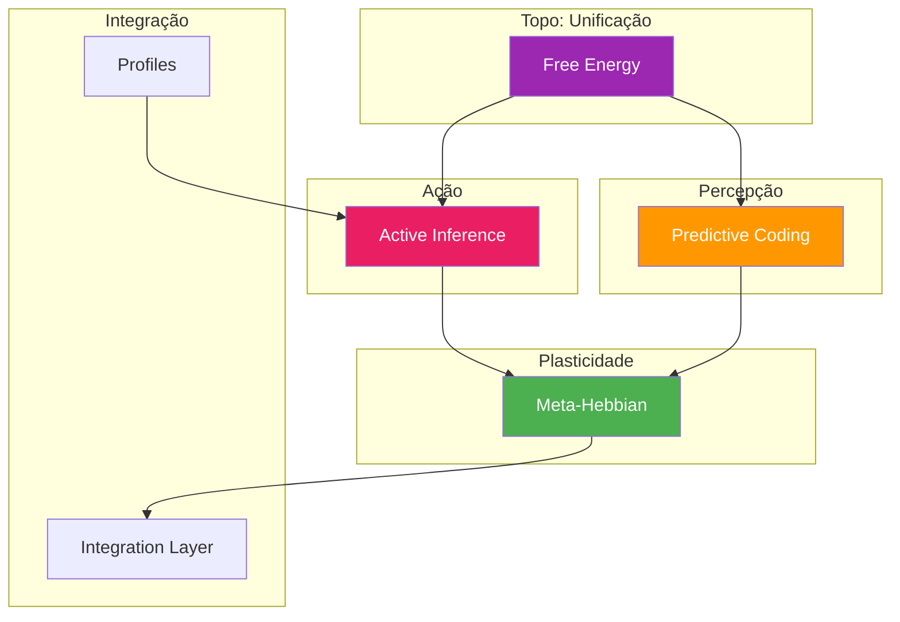

# 🧠 Learning - Documentação dos Módulos

**Sistema de aprendizado cognitivo do Alexandria**

---

## 🗂️ Estrutura

```
docs/core/learning/
├── active_inference.md     → Agente autônomo de exploração
├── free_energy.md          → Princípio de energia livre (unificador)
├── predictive_coding.md    → Inferência hierárquica preditiva
├── meta_hebbian.md         → Meta-aprendizado via plasticidade
├── integration_layer.md    → Integração entre módulos
├── profiles.md             → Personalidades cognitivas
└── NEMESIS_MANUAL.md       → Manual do sistema NEMESIS
```

---

## 📊 Módulos por Hierarquia Conceitual



---

## 📈 Módulos

| Módulo | Arquivo | LOC | Descrição |
|--------|---------|-----|-----------|
| Active Inference | [active_inference.md](active_inference.md) | 1486 | Agente de exploração epistêmica autônoma |
| Free Energy | [free_energy.md](free_energy.md) | 1257 | Princípio unificador (topo da hierarquia) |
| Predictive Coding | [predictive_coding.md](predictive_coding.md) | 981 | Inferência por minimização de erro |
| Meta-Hebbian | [meta_hebbian.md](meta_hebbian.md) | 784 | Regras de plasticidade evoluídas |
| Integration Layer | [integration_layer.md](integration_layer.md) | 1223 | Ponto de conexão entre módulos |
| Profiles | [profiles.md](profiles.md) | 102 | Scout, Judge, Weaver personalities |
| NEMESIS Manual | [NEMESIS_MANUAL.md](NEMESIS_MANUAL.md) | - | Manual completo do sistema |

---

## 🔗 Fluxo de Dados

```
Observação → Predictive Coding → Beliefs
                    ↓
            Free Energy (compute F)
                    ↓
            Active Inference (plan action)
                    ↓
            Meta-Hebbian (update rules)
                    ↓
            Ação Executada → Nova Observação
```

---

**Última atualização**: 2025-12-07
