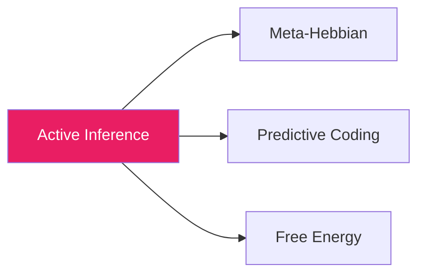
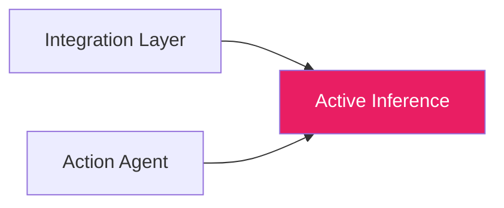

# 🧠 Active Inference

**Module**: `core/learning/active_inference.py`  
**Lines of Code**: 1486  
**Purpose**: Agente de Active Inference para seleção de ações epistêmicas

---

## 🎯 Overview

O Active Inference implementa um **agente cognitivo autônomo** baseado no framework de Karl Friston. O agente mantém crenças (beliefs) sobre o estado do conhecimento, tem preferências sobre estados desejados, e seleciona ações que minimizam a energia livre esperada (Expected Free Energy).

Este é o módulo que dá **autonomia** ao Alexandria - permite que o sistema decida proativamente o que explorar, quais gaps investigar, e como expandir o conhecimento autonomamente.

### Conceito Chave: Expected Free Energy

```
G(π) = Risk + Ambiguity
     = D_KL[Q(o|π)||P(o)] + E_Q[H(o|s,π)]

Risk: Quão longe das preferências
Ambiguity: Incerteza sobre resultados
```

O agente escolhe ações que **minimizam G** - ou seja, que levam a estados preferidos (baixo risk) e que reduzem incerteza (baixa ambiguity).

---

## 🏗️ Architecture

```mermaid
graph TB
    subgraph Core["Active Inference Agent"]
        B[Beliefs Q(s)]
        P[Preferences P(o)]
        GM[Generative Model]
    end
    
    subgraph Actions["Tipos de Ação"]
        A1[QUERY_SEARCH]
        A2[EXPLORE_CLUSTER]
        A3[FOLLOW_CONNECTION]
        A4[DEEPEN_TOPIC]
        A5[BRIDGE_CONCEPTS]
        A6[FILL_GAP]
    end
    
    subgraph Planning["Seleção de Ação"]
        EFE[Expected Free Energy G]
        PI[Policy π]
    end
    
    B --> EFE
    P --> EFE
    GM --> EFE
    EFE --> PI
    PI --> Actions
    
    style Core fill:#E91E63,color:#fff
    style Planning fill:#2196F3,color:#fff
```

---

## 🔍 Modelo Generativo

O `GenerativeModel` encapsula a dinâmica do mundo:

```python
# P(s_t+1 | s_t, a_t): Transição de estado dado ação
def predict_next_state(self, current_state, action):
    transition_matrix = self.transition_models[action.action_type]
    mean = transition_matrix @ current_state
    return mean, precision

# P(o_t | s_t): Observação esperada dado estado
def predict_observation(self, state):
    return self.observation_model @ state
```

### Aprendizado do Modelo

```python
# Δ A = lr * (s_t+1 - A @ s_t) @ s_t.T
def update_from_experience(self, prev_state, action, next_state):
    prediction = self.transition_models[action.action_type] @ prev_state
    error = next_state - prediction
    self.transition_models[action.action_type] += lr * np.outer(error, prev_state)
```

---

## 🔍 Seleção de Ação

### Expected Free Energy

```python
def _compute_expected_free_energy(self, action, current_state, horizon):
    """
    G(π) = Σ_t [Risk_t + Ambiguity_t]
    """
    total_G = 0
    state = current_state
    
    for t in range(horizon):
        # Prediz próximo estado
        next_state, precision = self.generative_model.predict_next_state(state, action)
        
        # Risk: distância das preferências
        risk = self._compute_risk(next_state)
        
        # Ambiguity: incerteza da predição
        ambiguity = self._compute_ambiguity(precision)
        
        total_G += risk + ambiguity
        state = next_state
    
    return total_G
```

### Planejamento

```python
def plan(self, horizon=5, context=None):
    """Seleciona melhor ação via Monte Carlo"""
    
    candidate_actions = self._generate_candidate_actions(context)
    
    for action in candidate_actions:
        G = self._compute_expected_free_energy(action, self.current_state, horizon)
        action.expected_information_gain = -G  # Menor G = maior ganho
    
    # Softmax sobre -G para seleção probabilística
    return self._softmax_select(candidate_actions)
```

---

## 🔗 Inter-Module Communication

### **Depends On**:



**1. Meta-Hebbian** (`meta_hebbian.py`)
- **Purpose**: Plasticidade adaptativa
- **Call**: `meta_hebbian.compute_weight_update()`
- **When**: Após ação bem-sucedida

**2. Free Energy** (`free_energy.py`)
- **Purpose**: Métricas de minimização
- **Call**: `free_energy.compute()`
- **When**: Avaliação de estados

### **Used By**:



---

## 📊 Core Classes

### ActionType

```python
class ActionType(Enum):
    QUERY_SEARCH = auto()       # Buscar documentos
    EXPLORE_CLUSTER = auto()    # Explorar cluster de conceitos
    FOLLOW_CONNECTION = auto()  # Seguir conexão existente
    DEEPEN_TOPIC = auto()       # Aprofundar em tópico
    BRIDGE_CONCEPTS = auto()    # Conectar conceitos distantes
    FILL_GAP = auto()           # Preencher gap de conhecimento
    CONSOLIDATE = auto()        # Consolidar aprendizado
    REST = auto()               # Não fazer nada
```

### Action

```python
@dataclass
class Action:
    action_type: ActionType
    target: str                          # Alvo da ação
    parameters: Dict[str, Any]
    expected_information_gain: float     # Ganho esperado
    expected_risk: float
    priority: float
```

### Belief

```python
@dataclass
class Belief:
    concept_id: str
    mean: np.ndarray          # Estado estimado
    precision: np.ndarray     # Inverso da variância
    last_updated: int
    observation_count: int
    
    @property
    def uncertainty(self):
        return 1.0 / np.mean(self.precision)
```

### Preference

```python
@dataclass
class Preference:
    topic_weights: Dict[str, float]  # Peso por tópico
    novelty_preference: float = 0.5   # 0=conservador, 1=explorador
    depth_preference: float = 0.5     # 0=amplo, 1=profundo
    connection_preference: float = 0.5
```

---

## 🎯 Use Cases

### 1. Exploração Autônoma

```python
from core.learning.active_inference import ActiveInferenceAgent, ActiveInferenceConfig

config = ActiveInferenceConfig(
    planning_horizon=5,
    novelty_bonus=0.3
)
agent = ActiveInferenceAgent(config)

# Agente decide próxima ação
action = agent.plan(context={"current_topic": "neural networks"})
print(f"Ação escolhida: {action.action_type} → {action.target}")
```

### 2. Detecção de Gaps

```python
# Identifica gaps no conhecimento
gaps = agent.detect_knowledge_gaps()

for gap in gaps[:5]:
    print(f"Gap: {gap.description} (priority: {gap.priority:.2f})")
```

### 3. Ciclo Completo

```python
# Loop autônomo de aprendizado
while agent.should_continue():
    action = agent.plan()
    observation = execute_action(action)  # Externo
    agent.update_beliefs(observation)
    agent.learn_from_experience(action, observation)
```

---

## 📈 Performance

| Operation | Time | Notes |
|-----------|------|-------|
| **plan()** | ~50ms | 5-step horizon |
| **update_beliefs()** | ~5ms | Single belief |
| **detect_gaps()** | ~200ms | Full scan |
| **learn_from_experience()** | ~10ms | Model update |

---

## ⚙️ Configuration

```python
@dataclass
class ActiveInferenceConfig:
    state_dim: int = 64              # Dimensão do estado interno
    action_embedding_dim: int = 32   # Embedding das ações
    planning_horizon: int = 5        # Passos de lookahead
    num_action_samples: int = 20     # Candidatos por seleção
    temperature: float = 1.0         # Softmax temperature
    risk_weight: float = 1.0         # Peso do risco
    ambiguity_weight: float = 1.0    # Peso da ambiguidade
    novelty_bonus: float = 0.3       # Bônus para novidade
    learning_rate: float = 0.01      # LR do modelo
    belief_decay: float = 0.99       # Decay dos beliefs
```

---

## 🔮 Future Enhancements

- [ ] Hierarchical Active Inference (multi-scale planning)
- [ ] Meta-learning de preferências baseado em feedback
- [ ] Integração com reinforcement learning
- [ ] Ações contínuas (não apenas discretas)

---

**Last Updated**: 2025-12-07  
**Version**: 1.0  
**Status**: Production
