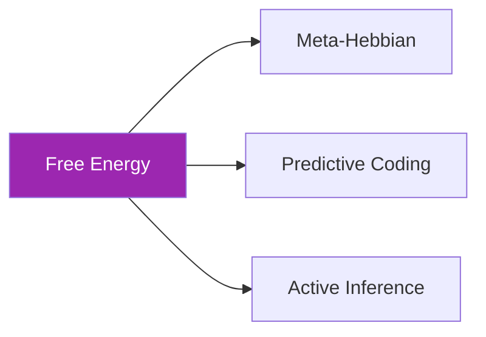
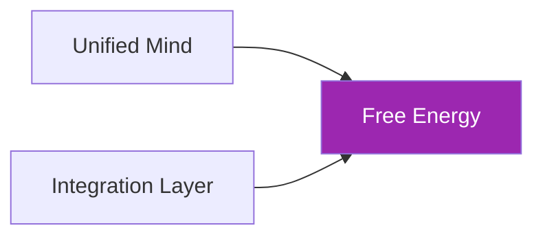

# ⚡ Free Energy Principle

**Module**: `core/learning/free_energy.py`  
**Lines of Code**: 1257  
**Purpose**: Implementação do Princípio de Energia Livre (topo da hierarquia cognitiva)

---

## 🎯 Overview

O módulo Free Energy é o **topo conceitual** de toda a hierarquia cognitiva do Alexandria. Implementa o Princípio de Energia Livre de Karl Friston, que unifica percepção, ação e aprendizado sob uma única métrica: **minimizar energia livre variacional**.

Este módulo integra os outros módulos de learning:
- **Hebbian** → minimiza energia local
- **Meta-Hebbian** → aprende como minimizar
- **Predictive Coding** → minimiza erro de predição
- **Active Inference** → minimiza F esperado via ação

### Conceito Chave: Free Energy

```
F = Complexity - Accuracy
F = D_KL[Q(s) || P(s)] - E_Q[log P(o|s)]

Complexity: Distância entre beliefs Q e prior P
Accuracy: Quão bem o modelo explica observações
```

**Objetivo**: Minimizar F → Beliefs precisos com modelo parcimonioso.

---

## 🏗️ Architecture

```mermaid
graph TB
    subgraph Components["Free Energy System"]
        VFE[Variational Free Energy]
        EFE[Expected Free Energy]
        UM[Unified Mind]
    end
    
    subgraph Inputs
        O[Observations]
        B[Beliefs Q(s)]
        P[Priors P(s)]
    end
    
    subgraph Outputs
        F[F Score]
        UB[Updated Beliefs]
        UA[Selected Actions]
    end
    
    O --> VFE
    B --> VFE
    P --> VFE
    VFE --> F
    VFE --> UB
    
    B --> EFE
    EFE --> UA
    
    VFE --> UM
    EFE --> UM
    
    style Components fill:#9C27B0,color:#fff
    style Outputs fill:#4CAF50,color:#fff
```

---

## 🔍 Variational Free Energy

### Computação de F

```python
def compute(self, observation: Optional[np.ndarray] = None):
    """
    F = Complexity - Accuracy
    
    Returns:
        F: Energia livre total
        components: Breakdown
    """
    # Complexity: D_KL[Q(s) || P(s)]
    complexity = self._kl_divergence_gaussian(
        self.belief_mean, self.belief_variance,
        self.prior_mean, self.prior_variance
    )
    
    # Accuracy: E_Q[log P(o|s)]
    if observation is not None:
        predicted_obs = self.recognition_model @ self.belief_mean
        accuracy = -0.5 * np.sum((observation - predicted_obs)**2 * self.obs_precision)
    else:
        accuracy = 0.0
    
    F = self.config.complexity_weight * complexity - self.config.accuracy_weight * accuracy
    
    return F, {"complexity": complexity, "accuracy": accuracy}
```

### Atualização de Beliefs

```python
def update_beliefs(self, observation: np.ndarray, learning_rate=None):
    """
    Move beliefs na direção que reduz F.
    
    Δμ = -dF/dμ = precision * (W.T @ (o - W @ μ))
    """
    lr = learning_rate or self.config.belief_learning_rate
    
    # Prediction error
    prediction = self.recognition_model @ self.belief_mean
    error = observation - prediction
    
    # Gradient descent on F
    gradient = self.recognition_model.T @ (self.obs_precision * error)
    self.belief_mean += lr * gradient
    
    # Update precision based on error variance
    self._update_precision(error)
```

---

## 🔍 Expected Free Energy

### Seleção de Ação

```python
class ExpectedFreeEnergy:
    """
    G(π) = D_KL[Q(o|π) || P(o)] + E[H(o|s,π)]
         = Risk + Ambiguity
    """
    
    def compute_for_action(self, action, current_belief):
        # Risk: Distância das preferências
        predicted_outcome = self.model.predict_outcome(action)
        risk = self._kl_divergence(predicted_outcome, self.preferences)
        
        # Ambiguity: Incerteza esperada
        ambiguity = self._expected_entropy(action, current_belief)
        
        G = self.config.risk_weight * risk + self.config.ambiguity_weight * ambiguity
        return G
```

---

## 🔍 Unified Mind

### Integração Completa

```python
class UnifiedMind:
    """
    Sistema que integra todos os componentes:
    - Meta-Hebbian (plasticidade)
    - Predictive Coding (percepção)
    - Active Inference (ação)
    - Free Energy (métrica unificadora)
    """
    
    def cognitive_cycle(self, observation):
        # 1. Percepção via Predictive Coding
        code, pc_stats = self.predictive_coding.process(observation)
        
        # 2. Atualiza beliefs
        self.free_energy.update_beliefs(observation)
        
        # 3. Seleciona ação via Active Inference
        action = self.active_inference.plan()
        
        # 4. Aprende via Meta-Hebbian
        if action.was_successful:
            self.meta_hebbian.evolve_rules(fitness_scores)
        
        return action, self.free_energy.compute()
```

---

## 🔗 Inter-Module Communication

### **Depends On**:



### **Used By**:



---

## 📊 Core Classes

### FreeEnergyMode

```python
class FreeEnergyMode(Enum):
    PERCEPTION = auto()   # Só atualiza beliefs
    ACTION = auto()       # Só seleciona ações
    LEARNING = auto()     # Só aprende modelo
    FULL = auto()         # Ciclo completo
```

### FreeEnergyConfig

```python
@dataclass
class FreeEnergyConfig:
    state_dim: int = 64
    observation_dim: int = 384
    complexity_weight: float = 1.0
    accuracy_weight: float = 1.0
    risk_weight: float = 1.0
    ambiguity_weight: float = 1.0
    belief_learning_rate: float = 0.1
    model_learning_rate: float = 0.01
    precision_learning_rate: float = 0.001
    preferred_states: Optional[np.ndarray] = None
    history_length: int = 1000
```

---

## 🎯 Use Cases

### 1. Computar Energia Livre

```python
from core.learning.free_energy import VariationalFreeEnergy, FreeEnergyConfig

vfe = VariationalFreeEnergy(FreeEnergyConfig())

observation = get_embedding("neural plasticity")
F, components = vfe.compute(observation)

print(f"Free Energy: {F:.4f}")
print(f"  Complexity: {components['complexity']:.4f}")
print(f"  Accuracy: {components['accuracy']:.4f}")
```

### 2. Ciclo Cognitivo Completo

```python
from core.learning.free_energy import UnifiedMind

mind = UnifiedMind()

for observation in observation_stream:
    action, F = mind.cognitive_cycle(observation)
    
    if F > threshold:
        print(f"Alta surpresa! F={F:.4f}")
```

---

## 📈 Performance

| Operation | Time | Notes |
|-----------|------|-------|
| **compute()** | ~2ms | F calculation |
| **update_beliefs()** | ~5ms | Gradient step |
| **cognitive_cycle()** | ~100ms | Full loop |
| **compute_for_action()** | ~10ms | Per action |

---

## ⚙️ Configuration

```python
# Decomposição 1: Complexity - Accuracy
COMPLEXITY_WEIGHT = 1.0  # Penaliza beliefs complexos
ACCURACY_WEIGHT = 1.0    # Recompensa boas predições

# Decomposição 2: Risk - Ambiguity  
RISK_WEIGHT = 1.0        # Penaliza estados não-preferidos
AMBIGUITY_WEIGHT = 1.0   # Penaliza incerteza

# Learning rates
BELIEF_LR = 0.1          # Update de beliefs
MODEL_LR = 0.01          # Update do modelo generativo
PRECISION_LR = 0.001     # Update de precisão
```

---

**Last Updated**: 2025-12-07  
**Version**: 1.0  
**Status**: Production
