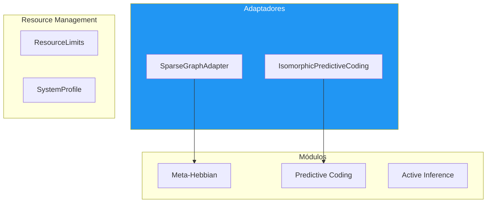

# 🔌 Integration Layer

**Module**: `core/learning/integration_layer.py`  
**Lines of Code**: 1223  
**Purpose**: Camada de integração que conecta todos os módulos cognitivos

---

## 🎯 Overview

O Integration Layer é o **ponto de conexão** entre todos os módulos de learning. Resolve conflitos de interface entre os diferentes módulos e fornece uma API unificada.

### Conflitos Resolvidos

| Conflito | Problema | Solução |
|----------|----------|---------|
| **A** | Meta-Hebbian assume matriz densa, Mycelial usa Dict esparso | `SparseGraphAdapter` |
| **B** | PC comprime para 32D, VQ-VAE espera 384D | `IsomorphicPredictiveCoding` |
| **C** | Diferentes profiles de recurso | `ResourceLimits` por profile |

---

## 🏗️ Architecture



---

## 🔍 SparseGraphAdapter

```python
class SparseGraphAdapter:
    """Permite Meta-Hebbian operar em grafos esparsos"""
    
    def apply_to_sparse_graph(
        self,
        graph: Dict[int, Dict[int, float]],
        activated_nodes: Set[int],
        activations: Optional[Dict[int, float]] = None
    ):
        # Extrai submatriz local
        local_nodes = self._get_local_neighborhood(activated_nodes)
        local_matrix = self._to_dense(graph, local_nodes)
        
        # Aplica Meta-Hebbian
        updated = self.meta_hebbian.compute_weight_update(
            local_matrix,
            pre_activations,
            post_activations
        )
        
        # Converte de volta para esparso
        self._update_sparse(graph, local_nodes, updated)
```

---

## 🔍 IsomorphicPredictiveCoding

```python
class IsomorphicPredictiveCoding:
    """PC que preserva dimensionalidade 384D"""
    
    def process(self, embedding: np.ndarray, learn: bool = True):
        # Processa através do PC interno
        code = self.pc_network.encode(embedding)
        
        # Reconstrói para 384D
        output = self._reconstruct(code)
        
        if learn:
            self.pc_network.learn(embedding)
        
        return output, stats
```

---

## 🔍 System Profiles

```python
class SystemProfile(Enum):
    LITE = auto()        # 2GB RAM, 10k nodes
    BALANCED = auto()    # 8GB RAM, 100k nodes
    PERFORMANCE = auto() # 32GB RAM, 1M nodes

@dataclass
class ResourceLimits:
    max_memory_mb: int
    max_graph_nodes: int
    pruning_threshold: float
    
    @classmethod
    def from_profile(cls, profile: SystemProfile):
        configs = {
            SystemProfile.LITE: (2000, 10000, 0.3),
            SystemProfile.BALANCED: (8000, 100000, 0.1),
            SystemProfile.PERFORMANCE: (32000, 1000000, 0.01)
        }
        return cls(*configs[profile])
```

---

## 📊 IntegrationConfig

```python
@dataclass
class IntegrationConfig:
    profile: SystemProfile = SystemProfile.BALANCED
    embedding_dim: int = 384
    pc_hidden_dims: List[int] = field(default_factory=lambda: [384, 384])
    pc_code_dim: int = 384
    pc_num_iterations: int = 5
    meta_num_heads: int = 4
    meta_evolution_interval: int = 100
    ai_state_dim: int = 64
    ai_planning_horizon: int = 5
    state_dir: str = "data/integration/"
```

---

## 🎯 Use Cases

### 1. Sistema Integrado Completo

```python
from core.learning.integration_layer import IntegrationLayer, IntegrationConfig

config = IntegrationConfig(profile=SystemProfile.BALANCED)
layer = IntegrationLayer(config)

# Processa embedding através de todo o pipeline
result = layer.process(embedding)
```

---

**Last Updated**: 2025-12-07  
**Version**: 1.0  
**Status**: Production
