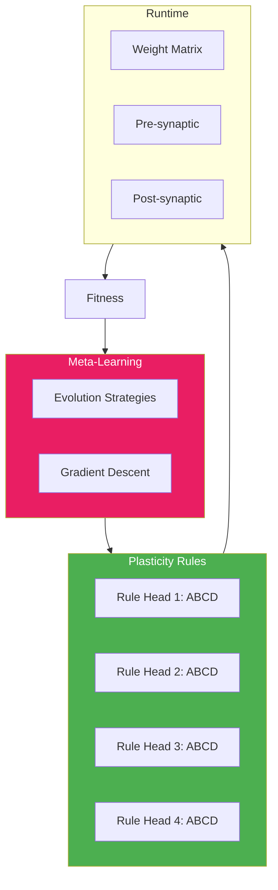
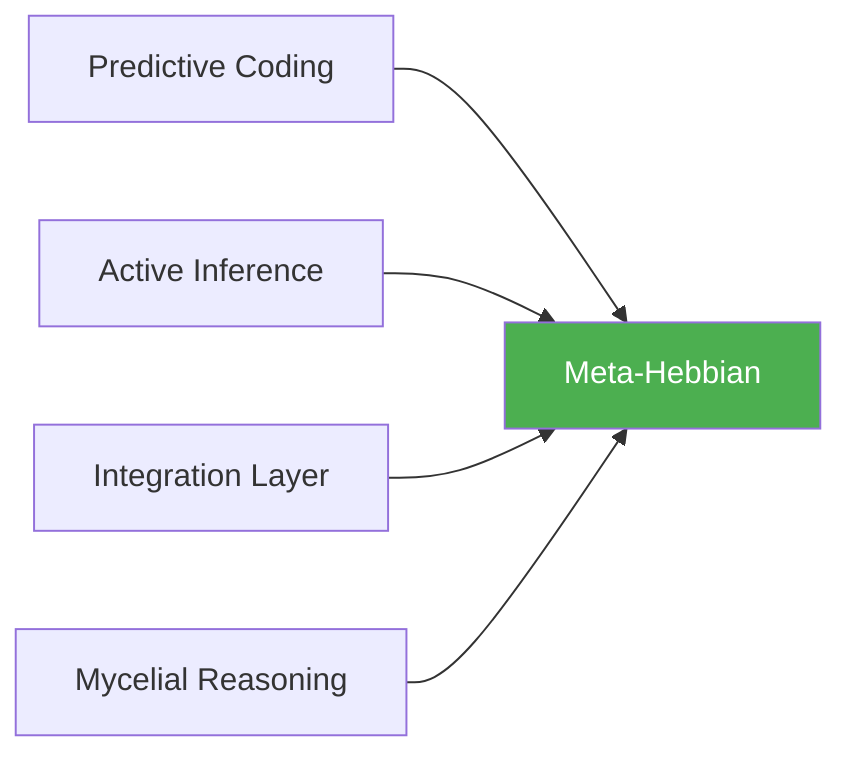

# 🧬 Meta-Hebbian Plasticity

**Module**: `core/learning/meta_hebbian.py`  
**Lines of Code**: 784  
**Purpose**: Meta-aprendizado via regras de plasticidade Hebbian evoluídas

---

## 🎯 Overview

O Meta-Hebbian implementa **meta-aprendizado**: em vez de otimizar pesos diretamente, otimiza as **regras** que governam como os pesos mudam. Baseado no paper "Meta-Learning through Hebbian Plasticity in Random Networks" (Najarro & Risi).

Isso permite que o sistema **aprenda a aprender** - as regras de plasticidade evoluem para serem mais eficientes para o domínio específico.

### Conceito Chave: Regra ABCD

```
Δw_ij = η × (A×o_i×o_j + B×o_i + C×o_j + D)

A: Termo Hebbian clássico (correlação)
B: Termo pré-sináptico
C: Termo pós-sináptico  
D: Decay/bias
η: Learning rate
```

---

## 🏗️ Architecture



---

## 🔍 Regras de Plasticidade

```python
@dataclass
class PlasticityRule:
    A: float = 1.0   # Hebbian term
    B: float = 0.0   # Pre-synaptic term
    C: float = 0.0   # Post-synaptic term
    D: float = 0.0   # Decay/constant
    eta: float = 0.01  # Learning rate
    
    def compute_delta(self, pre: float, post: float) -> float:
        return self.eta * (
            self.A * pre * post +
            self.B * pre +
            self.C * post +
            self.D
        )
    
    def compute_delta_matrix(self, pre: np.ndarray, post: np.ndarray):
        """Vectorized para todas as sinapses"""
        outer = np.outer(post, pre)  # [post_size x pre_size]
        return self.eta * (
            self.A * outer +
            self.B * pre[np.newaxis, :] +
            self.C * post[:, np.newaxis] +
            self.D
        )
```

---

## 🔍 Evolução das Regras

### Evolution Strategies

```python
def evolve_rules(self, fitness_scores: List[float]):
    """
    Evolui regras baseado em fitness.
    M(H, T_old) → T_new
    """
    current_fitness = np.mean(fitness_scores[-10:])
    
    if self.config.evolution_method == EvolutionMethod.EVOLUTION_STRATEGIES:
        return self._evolve_es(current_fitness)
    else:
        return self._evolve_gradient(fitness_scores)

def _evolve_es(self, current_fitness: float):
    """
    Evolution Strategies (Najarro & Risi style)
    """
    # Gera população de regras mutadas
    population = []
    for _ in range(self.config.population_size):
        mutated = self._mutate_rules(self.rules, self.config.sigma)
        population.append(mutated)
    
    # Avalia cada candidato
    fitness = [self._evaluate_rules(rules) for rules in population]
    
    # Seleciona elite
    elite_idx = np.argsort(fitness)[-int(self.config.elite_ratio * len(population)):]
    elite = [population[i] for i in elite_idx]
    
    # Nova regra = média da elite
    self.rules = self._average_rules(elite)
```

---

## 🔗 Inter-Module Communication

### **Depends On**:
Nenhuma dependência interna.

### **Used By**:



---

## 📊 Core Classes

### MetaHebbianConfig

```python
@dataclass
class MetaHebbianConfig:
    num_codes: int = 1024         # Tamanho da rede
    num_heads: int = 4            # Regras paralelas
    rules_per_head: bool = True   # Regra diferente por head
    evolution_method: EvolutionMethod = EvolutionMethod.EVOLUTION_STRATEGIES
    population_size: int = 50
    sigma: float = 0.1            # Mutation strength
    elite_ratio: float = 0.2
    param_bounds: Tuple = (-2.0, 2.0)
    eta_bounds: Tuple = (0.0001, 0.1)
```

---

## 🎯 Use Cases

### 1. Aplicar a Rede Micelial

```python
from core.learning.meta_hebbian import MetaHebbianPlasticity

mh = MetaHebbianPlasticity()

# Aplica regras às conexões
new_connections = mh.apply_to_mycelial(
    connections=mycelial_network.connections,
    activated_codes=active_codes,
    activation_strengths=strengths
)
```

### 2. Evoluir Regras

```python
# Após ciclo de aprendizado
fitness_scores = [0.7, 0.75, 0.8, 0.82]  # Histórico
stats = mh.evolve_rules(fitness_scores)

print(f"Nova regra: A={mh.rules[0].A:.3f}, B={mh.rules[0].B:.3f}")
```

---

## 📈 Performance

| Operation | Time | Notes |
|-----------|------|-------|
| **compute_weight_update()** | ~2ms | Single matrix |
| **apply_to_mycelial()** | ~50ms | Sparse graph |
| **evolve_rules()** | ~500ms | ES population=50 |

---

**Last Updated**: 2025-12-07  
**Version**: 1.0  
**Status**: Production
