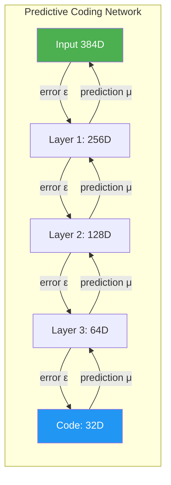
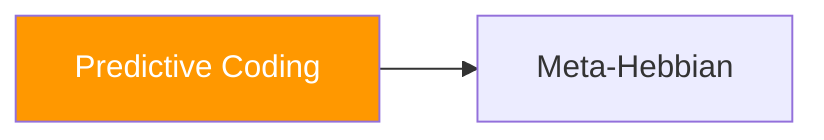
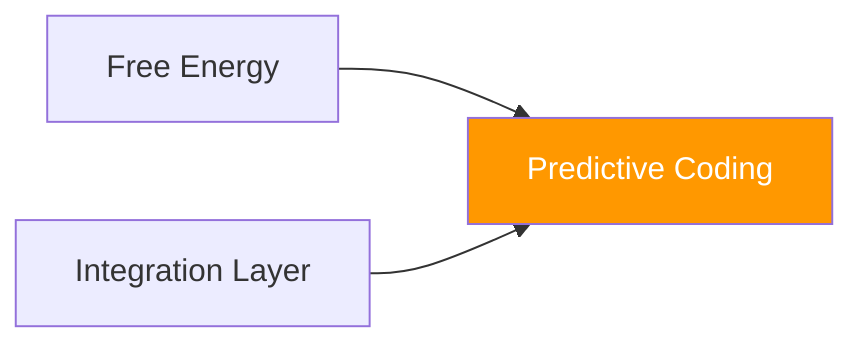

# 🔮 Predictive Coding

**Module**: `core/learning/predictive_coding.py`  
**Lines of Code**: 981  
**Purpose**: Rede hierárquica de codificação preditiva para inferência

---

## 🎯 Overview

O Predictive Coding implementa uma **rede neural hierárquica** onde cada camada tenta prever a atividade da camada abaixo. Os **erros de predição** são propagados para cima, enquanto **predições** fluem para baixo.

Este é o mecanismo de **percepção** do Alexandria - não é feedforward tradicional, mas um processo iterativo que minimiza energia livre através de settling dinâmico.

### Conceito Chave

```
Erro = Precisão × (Input - Predição)
     ε = Π × (o - μ)

Input bottom-up: o que realmente observamos
Predição top-down: o que esperávamos ver
Precisão: confiança no erro
```

---

## 🏗️ Architecture



---

## 🔍 Camada Preditiva

Cada `PredictiveLayer` implementa:

```python
class PredictiveLayer:
    def predict(self, top_down_input=None):
        """
        Gera predição para camada abaixo.
        prediction = W_pred @ representation + bias + noise
        """
        if top_down_input is not None:
            self.representation = top_down_input
        
        prediction = self.W_pred @ self.representation + self.bias
        prediction += np.random.normal(0, self.config.prediction_noise, prediction.shape)
        return prediction
    
    def compute_error(self, bottom_up_input):
        """
        Computa erro de predição precision-weighted.
        error = precision * (input - prediction)
        """
        prediction = self.predict()
        raw_error = bottom_up_input - prediction
        error = self.precision * raw_error
        return error
    
    def update_representation(self, bottom_up_error, top_down_prediction=None):
        """
        Atualiza representação para minimizar erro.
        
        Δμ = lr * (W_err @ ε_below - ε_self)
        """
        for _ in range(self.config.num_iterations):
            # Erro vindo de baixo
            gradient = self.W_err @ bottom_up_error
            
            # Erro próprio (constraint top-down)
            if top_down_prediction is not None:
                self_error = self.representation - top_down_prediction
                gradient -= self_error
            
            self.representation += self.config.learning_rate * gradient
```

---

## 🔍 Rede Completa

### Processo de Inferência

```python
class PredictiveCodingNetwork:
    def encode(self, observation, num_iterations=10):
        """
        Codifica observação através de settling iterativo.
        
        NÃO é um forward pass - é um processo de energia mínima.
        """
        # Inicializa com forward pass
        x = observation
        for layer in self.layers:
            layer.representation = layer.W_init @ x
            x = layer.representation
        
        # Settling: itera até convergir
        for _ in range(num_iterations):
            # Top-down: predições
            for i in range(len(self.layers) - 1, 0, -1):
                prediction = self.layers[i].predict()
                self.layers[i-1].top_down_prediction = prediction
            
            # Bottom-up: erros
            errors = [None] * len(self.layers)
            errors[0] = self.layers[0].compute_error(observation)
            for i in range(1, len(self.layers)):
                errors[i] = self.layers[i].compute_error(self.layers[i-1].representation)
            
            # Update representations
            for i, layer in enumerate(self.layers):
                layer.update_representation(
                    errors[i],
                    layer.top_down_prediction if hasattr(layer, 'top_down_prediction') else None
                )
        
        return self.layers[-1].representation
```

### Aprendizado

```python
def learn(self, observation):
    """
    Atualiza pesos para melhorar predições futuras.
    
    ΔW_pred = lr * ε @ μ.T (Hebbian no erro!)
    """
    code = self.encode(observation)
    
    for i, layer in enumerate(self.layers):
        if i == 0:
            target = observation
        else:
            target = self.layers[i-1].representation
        
        error = target - layer.predict()
        
        # Hebbian update on prediction weights
        layer.W_pred += self.config.learning_rate * np.outer(error, layer.representation)
        
        # Update precision
        layer._update_precision(error)
```

---

## 🔗 Inter-Module Communication

### **Depends On**:



**Meta-Hebbian** (`meta_hebbian.py`)
- **Purpose**: Regras de plasticidade adaptativas
- **Call**: `meta_hebbian.apply_to_layer()`
- **When**: Opcional, para plasticidade avançada

### **Used By**:



---

## 📊 Core Classes

### PrecisionMode

```python
class PrecisionMode(str, Enum):
    FIXED = "fixed"        # Precisão constante
    LEARNED = "learned"    # Precisão aprendida por camada
    ADAPTIVE = "adaptive"  # Precisão ajustada online por erro
```

### PredictiveCodingConfig

```python
@dataclass
class PredictiveCodingConfig:
    input_dim: int = 384
    hidden_dims: List[int] = field(default_factory=lambda: [256, 128, 64])
    code_dim: int = 32
    num_iterations: int = 10         # Iterações de settling
    learning_rate: float = 0.01
    inference_rate: float = 0.1      # Taxa para atualizar representations
    precision_mode: PrecisionMode = PrecisionMode.ADAPTIVE
    base_precision: float = 1.0
    precision_lr: float = 0.001
    use_meta_hebbian: bool = True
    prediction_noise: float = 0.01
```

---

## 🎯 Use Cases

### 1. Encode Embedding

```python
from core.learning.predictive_coding import PredictiveCodingNetwork

pc = PredictiveCodingNetwork()

embedding = get_embedding("neuromodulation in learning")
code = pc.encode(embedding, num_iterations=10)

print(f"Input: {embedding.shape} → Code: {code.shape}")
# Input: (384,) → Code: (32,)
```

### 2. Learn from Data

```python
for embedding in corpus_embeddings:
    # Encode and learn
    code = pc.encode(embedding)
    pc.learn(embedding)

# Save learned weights
pc.save_state("models/pc_learned.pkl")
```

### 3. Get Surprise (Anomaly Detection)

```python
# Quanto o input difere das predições
surprise = pc.get_surprise(new_embedding)

if surprise > threshold:
    print(f"Anomalia detectada! Surprise: {surprise:.4f}")
```

---

## 📈 Performance

| Operation | Time | Notes |
|-----------|------|-------|
| **encode()** | ~15ms | 10 iterations |
| **learn()** | ~5ms | Single sample |
| **get_surprise()** | ~3ms | No learning |
| **save_state()** | ~50ms | Full network |

---

## ⚙️ Configuration

```python
# Arquitetura
INPUT_DIM = 384                  # Sentence-Transformer output
HIDDEN_DIMS = [256, 128, 64]     # Compressão gradual
CODE_DIM = 32                    # Representação final

# Inferência
NUM_ITERATIONS = 10              # Passos de settling
INFERENCE_RATE = 0.1             # Step size para representation update

# Precisão
PRECISION_MODE = "adaptive"      # Aprende online
BASE_PRECISION = 1.0
PRECISION_LR = 0.001
```

---

## 🔮 Future Enhancements

- [ ] Attention-weighted precision
- [ ] Temporal predictive coding (sequências)
- [ ] Sparse coding constraints
- [ ] GPU acceleration (PyTorch backend)

---

**Last Updated**: 2025-12-07  
**Version**: 1.0  
**Status**: Production
