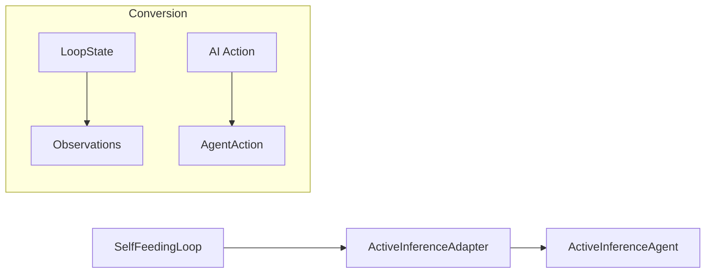

# 🧠 Active Inference Adapter

**Module**: `core/loop/active_inference_adapter.py`  
**Lines of Code**: ~174  
**Purpose**: Connects ActiveInferenceAgent to SelfFeedingLoop via ActionSelectionAdapter protocol.

---

## 🎯 Overview

The **ActiveInferenceActionAdapter** bridges the gap between:

- **ActiveInferenceAgent** (core/learning) - theoretical FEP-based decision making
- **SelfFeedingLoop** (core/loop) - practical action execution

### Responsibilities

1. Convert `LoopState` → Active Inference observations/beliefs
2. Convert Active Inference actions → `AgentAction`
3. Track call statistics and action history

---

## 🏗️ Architecture



---

## ⚙️ Configuration

```python
ActiveInferenceActionAdapter(
    topology_engine=None,  # For encoding gaps to embeddings
    state_dim=64           # Observation vector dimension
)
```

Internal agent uses:
```python
ActiveInferenceConfig(
    state_dim=64,
    planning_horizon=3,
    num_action_samples=10,
    temperature=1.0
)
```

---

## 🔄 Workflow

### `select_action(loop_state)`
1. **Update beliefs** from knowledge gaps
2. **Register gaps** in agent's uncertainty map
3. **Build context** (cycle, hypotheses, field stats)
4. **Compute EFE** for action candidates
5. **Select best action** via softmax
6. **Convert** to `AgentAction`

### `update_after_action(action, reward)`
- Increments timestep
- Decays beliefs for temporal consistency

---

## 📦 Action Type Mapping

| Active Inference | Unified ActionType |
|-----------------|-------------------|
| QUERY_SEARCH | `ActionType.QUERY_SEARCH` |
| EXPLORE_CLUSTER | `ActionType.EXPLORE_CLUSTER` |
| BRIDGE_CONCEPTS | `ActionType.BRIDGE_CONCEPTS` |
| FILL_GAP | `ActionType.FILL_GAP` |
| ... | ... |

---

## 📊 Statistics

```python
stats = adapter.get_stats()
# {
#   "call_count": 42,
#   "agent_available": True,
#   "last_action": {...},
#   "history_length": 42
# }
```

---

## 🛡️ Fallback

When agent unavailable, returns safe fallback:
```python
AgentAction(
    action_type=ActionType.QUERY_SEARCH,
    target="exploration",
    source="fallback"
)
```

---

**Last Updated**: 2025-12-13  
**Version**: 1.0  
**Status**: Active
