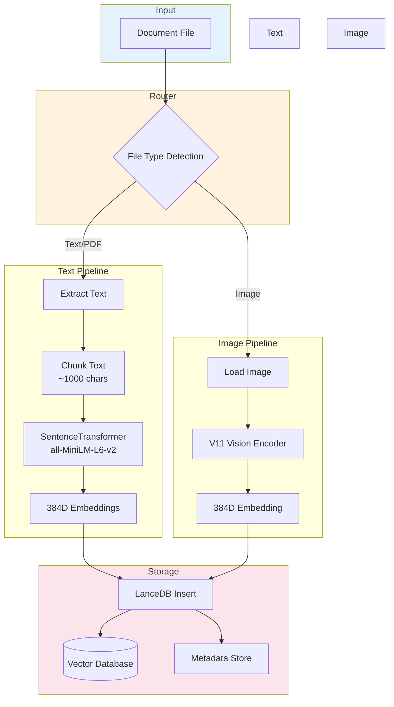
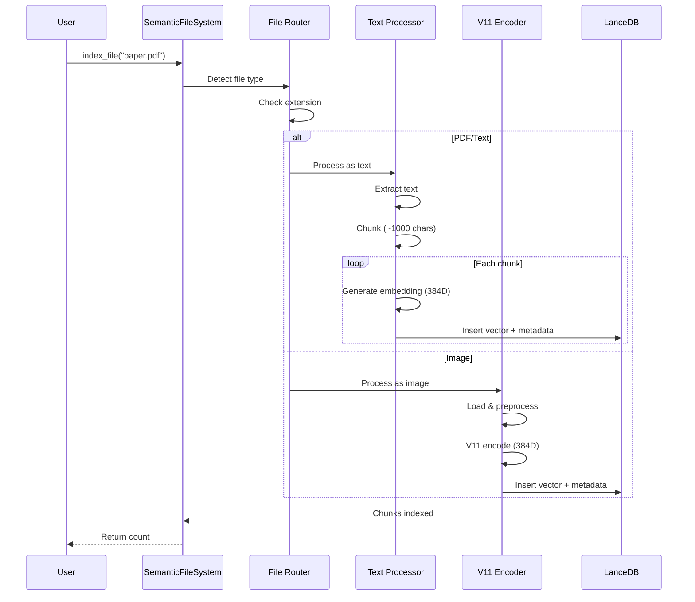
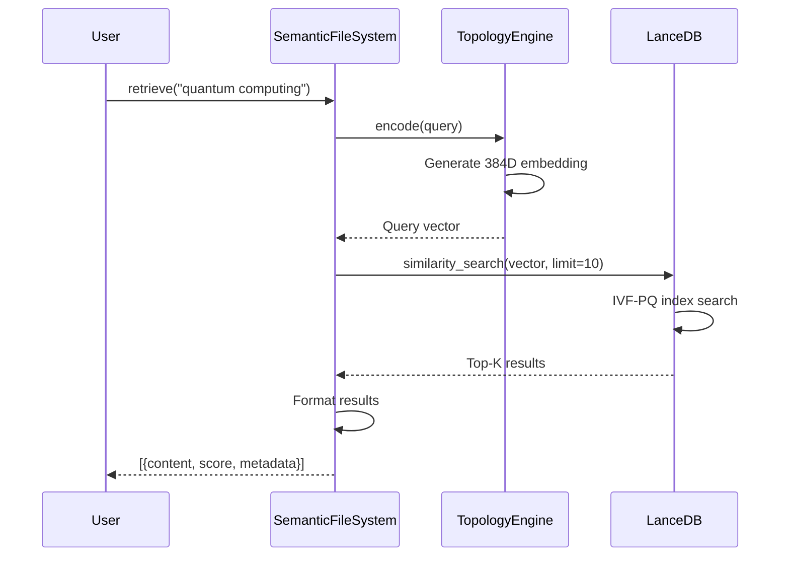
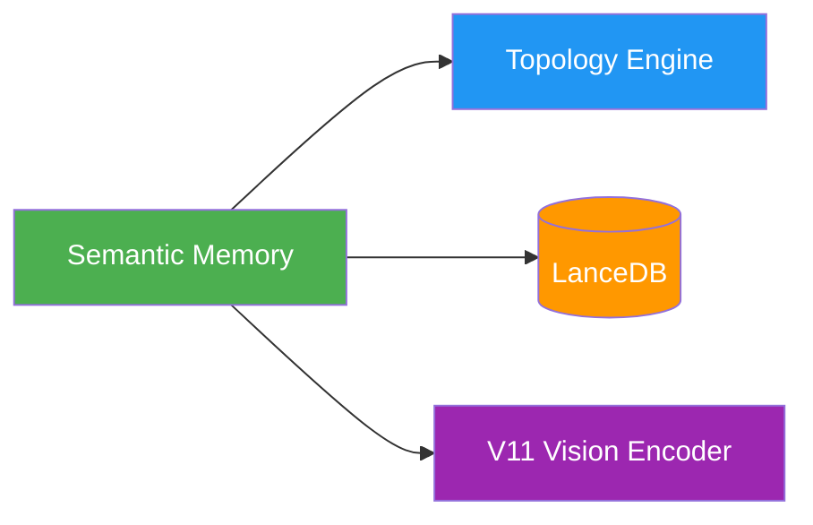
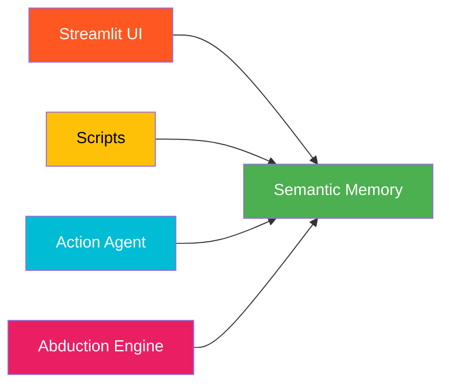

# 📚 Semantic Memory System

**Module**: `core/memory/semantic_memory.py`  
**Lines of Code**: 488  
**Purpose**: Multi-modal document indexing and retrieval

---

## 🎯 Overview

The Semantic Memory System is Alexandria's **core storage layer**, responsible for ingesting, processing, and indexing documents (text & images) into a searchable vector database.

### Key Responsibilities

1. **Multi-modal ingestion**: PDFs, text files, images
2. **Intelligent chunking**: Paragraph-aware text segmentation  
3. **Vector embedding**: Convert chunks to 384D semantic vectors
4. **Storage**: LanceDB vector database with metadata
5. **Retrieval**: Semantic similarity search

---

## 🏗️ Architecture



---

## 📋 Core Classes

### 1. **SemanticFileSystem**

Main class for multi-modal indexing and retrieval.

```python
class SemanticFileSystem:
    def __init__(self, topology_engine, engine_encoder=None):
        """
        Args:
            topology_engine: TopologyEngine instance (for embeddings)
            engine_encoder: Optional SentenceTransformer model
        """
        self.topology = topology_engine
        self.engine_encoder = engine_encoder
        self.vision_loader = VisionLoader()  # For images
        self.image_processor = ImageProcessor(self.vision_loader)
```

**Key Methods**:

| Method | Purpose | Returns |
|--------|---------|---------|
| `index_file(file_path, doc_type)` | Index document (auto-detects type) | `int` (chunks indexed) |
| `retrieve(query, modality_filter, limit)` | Semantic search | `List[Dict]` (results) |
| `get_stats()` | System statistics | `Dict` |

---

## 🔄 Data Flow

### Indexing Flow



### Retrieval Flow



---

## 🧩 Components

### **VisionLoader**

Loads and manages V11 Vision Encoder for image processing.

```python
class VisionLoader:
    def load_model(self):
        """
        Lazy-loads V11 Vision Encoder.
        Uses V11VisionEncoderSimplified wrapper for robust integration.
        """
        from core.memory.v11_vision_encoder import V11VisionEncoderSimplified
        self.v11_encoder = V11VisionEncoderSimplified()
```

### **ImageProcessor**

Pre-processes images using V11 encoder.

```python
class ImageProcessor:
    def process_image(self, image_path: str):
        """
        Process single image → 384D vector
        
        Returns:
            torch.Tensor (384D) or None
        """
```

### **FileUtils**

Static utilities for file type detection.

```python
class FileUtils:
    @staticmethod
    def is_image_file(file_path: str) -> bool:
        """Check if file is supported image (.jpg, .png, etc)"""
    
    @staticmethod
    def is_text_file(file_path: str) -> bool:
        """Check if file is text/PDF"""
```

---

## 🔗 Inter-Module Communication

### **Depends On**:



**1. Topology Engine** (`core/topology/topology_engine.py`)
- **Purpose**: Generate semantic embeddings
- **Call**: `topology.encode(chunks)` → Returns 384D vectors
- **When**: Every text chunk during indexing

**2. LanceDB** (External library)
- **Purpose**: Vector storage and similarity search
- **Call**: Direct table operations
- **When**: Insert (indexing), Search (retrieval)

**3. V11 Vision Encoder** (`core/memory/v11_vision_encoder.py`)
- **Purpose**: Image → 384D embedding
- **Call**: `v11_encoder.encode_image(image)`
- **When**: Image file indexing

### **Used By**:



**1. Streamlit UI** (`interface/app.py`)
- **Purpose**: User-facing document upload & search
- **Call**: `memory.index_file()`, `memory.retrieve()`

**2. Scripts** (`scripts/`)
- **Purpose**: Batch processing, auto-ingestion
- **Call**: `memory.index_file()` in loops

**3. Action Agent** (`core/agents/action_agent.py`)
- **Purpose**: Evidence registration
- **Call**: `sfs.index_file()` for validation results

**4. Abduction Engine** (`core/reasoning/abduction_engine.py`)
- **Purpose**: Knowledge gap analysis
- **Call**: `sfs.retrieve()` for validating hypotheses

---

## 💾 Storage Format

### LanceDB Schema

```python
{
    "chunk_id": str,        # Unique ID: "file_123_chunk_5"
    "source": str,          # Original file path
    "content": str,         # Text content (first 200 chars)
    "vector": List[float],  # 384D embedding
    "modality": str,        # "TEXTUAL" or "VISUAL"
    "chunk_index": int,     # Position in document
    "chunk_size": int,      # Character count
    "doc_type": str,        # "GEN", "SCI", etc.
    "indexed_at": str       # ISO timestamp
}
```

---

## 📊 Performance Metrics

| Operation | Speed | Memory |
|-----------|-------|--------|
| **Text Chunking** | 1,000 chunks/sec | <50 MB |
| **Embedding (Text)** | 500 chunks/sec | ~1 GB |
| **Embedding (Image)** | 5-10 images/sec | ~500 MB |
| **LanceDB Insert** | 10,000/sec (batch) | <100 MB |
| **Vector Search** | <50ms (p99) | Varies by corpus |

---

## 🛠️ Key Algorithms

### Text Chunking

```python
def _chunk_text(self, text: str, chunk_size: int = 1000) -> List[str]:
    """
    Paragraph-aware chunking:
    1. Split by double newlines (paragraphs)
    2. Accumulate until ~1000 chars
    3. Avoid mid-paragraph splits
    """
    paragraphs = text.split('\n\n')
    chunks = []
    current_chunk = ""
    
    for para in paragraphs:
        if len(current_chunk) + len(para) <= chunk_size:
            current_chunk += para + "\n\n"
        else:
            if current_chunk:
                chunks.append(current_chunk.strip())
            current_chunk = para + "\n\n"
    
    return chunks
```

**Why paragraph-aware?**
- Preserves semantic coherence
- Avoids cutting sentences mid-way
- Better retrieval quality

---

## 🎯 Use Cases

### 1. **Document Indexing**

```python
from core.memory.semantic_memory import SemanticFileSystem
from core.topology.topology_engine import TopologyEngine

engine = TopologyEngine()
memory = SemanticFileSystem(engine)

# Index single document
chunks = memory.index_file("research_paper.pdf", doc_type="SCI")
print(f"Indexed {chunks} chunks")
```

### 2. **Semantic Search**

```python
# Search across all modalities
results = memory.retrieve(
    query="machine learning optimization",
    modality_filter=None,  # Search both text and images
    limit=10
)

for r in results:
    print(f"[{r['relevance']:.3f}] {r['content'][:100]}...")
```

### 3. **Image-Only Search**

```python
# Search only images
results = memory.retrieve(
    query="neural network architecture diagram",
    modality_filter="VISUAL",
    limit=5
)
```

---

## ⚠️ Limitations

1. **Max chunk size**: 1000 characters (configurable)
2. **Image formats**: .jpg, .png, .jpeg, .bmp, .gif
3. **PDF OCR**: Requires external tools for scanned PDFs
4. **Memory**: Full corpus loaded during search (not streaming)

---

## 🔮 Future Enhancements

- [ ] Streaming ingestion for large files
- [ ] Advanced OCR integration
- [ ] Multi-language support
- [ ] Hierarchical chunking
- [ ] Automatic chunk size optimization

---

**Last Updated**: 2025-12-01  
**Version**: 1.0  
**Status**: Production
