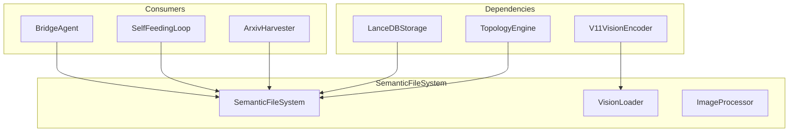

# 📚 SemanticFileSystem

**Module**: `core/memory/semantic_memory.py`  
**Lines**: 498  
**Purpose**: Multi-modal semantic memory — unified indexing of text and images.

---

## Overview

The **SemanticFileSystem** unifies text and image indexing into a single 384D vector space. Uses MiniLM for text and V11VisionEncoder for images.

### Router Logic

| File Type | Pipeline |
|-----------|----------|
| `.txt`, `.md`, `.pdf` | Chunk → MiniLM → 384D |
| `.png`, `.jpg` | V11VisionEncoder → 384D |

### Storage

Uses **LanceDB** for high-performance vector storage.

---

## Dependencies

| Import | Purpose |
|--------|---------|
| `torch` | Tensors |
| `torchvision` | Image transforms |
| `PIL` | Image loading |
| `pypdf` | PDF extraction |
| `.v11_vision_encoder` | V11VisionEncoderSimplified |
| `.storage` | LanceDBStorage |

---

## Classes

### VisionLoader

```python
class VisionLoader:
    """Loads V11 Vision Encoder on demand."""
    
    def load_model(self) -> bool
    def unload_model(self)
```

### FileUtils

```python
class FileUtils:
    @staticmethod
    def is_image_file(path) -> bool
    @staticmethod
    def is_text_file(path) -> bool
```

### ImageProcessor

```python
class ImageProcessor:
    def process_image(path) -> Optional[torch.Tensor]  # 384D
    def batch_process_images(paths) -> List[Optional[torch.Tensor]]
```

---

## SemanticFileSystem Methods

### Indexing

| Method | Signature | Description |
|--------|-----------|-------------|
| `index_file` | `(path, doc_type) → int` | Multi-modal router |
| `_index_text_file` | `(path) → Dict` | Text/PDF indexing |
| `_index_image_file` | `(path) → Dict` | Image indexing |
| `_chunk_text` | `(text, chunk_size) → List[str]` | Text segmentation |
| `_extract_text_from_pdf` | `(path) → str` | PDF text extraction |

### Retrieval

| Method | Signature | Description |
|--------|-----------|-------------|
| `retrieve` | `(query, modality_filter, limit) → List[Dict]` | Semantic search |

### Stats

| Method | Signature | Description |
|--------|-----------|-------------|
| `get_stats` | `() → Dict` | Storage statistics |

---

## Communication



---

## Usage Examples

### Index Files

```python
from core.memory.semantic_memory import SemanticFileSystem
from core.topology.topology_engine import TopologyEngine

topology = TopologyEngine()
sfs = SemanticFileSystem(topology)

# Index text file
sfs.index_file("docs/README.md", doc_type="GEN")

# Index PDF
sfs.index_file("papers/arxiv.pdf", doc_type="SCI")

# Index image
sfs.index_file("images/diagram.png", doc_type="IMG")
```

### Retrieve

```python
# Cross-modal search
results = sfs.retrieve(
    query="neural network architecture",
    modality_filter=None,  # Or "TEXTUAL", "VISUAL"
    limit=5
)

for r in results:
    print(f"[{r['modalidade']}] {r['content'][:50]}...")
    print(f"  Relevance: {r['relevance']:.3f}")
```

### Stats

```python
stats = sfs.get_stats()
print(f"Total items: {stats['total_items']}")
```

---

## Internal Details

### Vector Dimension

All modalities map to **384D** (unified space).

### Chunking

Text files are segmented by paragraphs, max 1000 chars per chunk.

### Vision Encoding

V11VisionEncoder uses hierarchical VQ with thermodynamic optimization (863 lines).

---

**Last Updated**: 2025-12-13  
**Version**: V11
