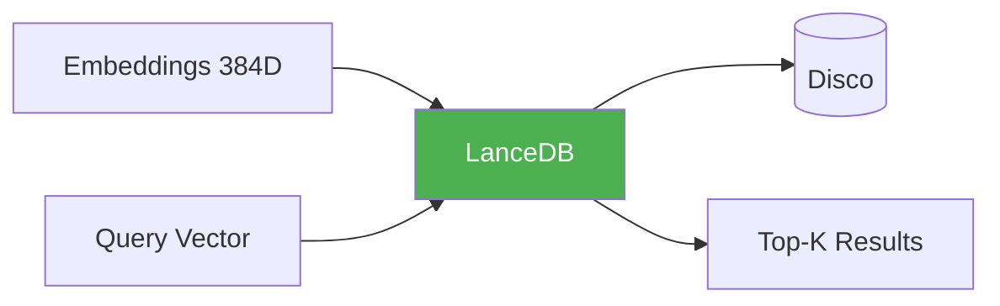

# 💾 LanceDB Storage

**Module**: `core/memory/storage.py`  
**Lines of Code**: 160  
**Purpose**: Armazenamento vetorial persistente de alta performance

---

## 🎯 Overview

O LanceDB Storage substitui armazenamento JSON por um **banco vetorial columnar** que permite busca eficiente em milhões de vetores com baixo uso de RAM. Utiliza LanceDB internamente.

---

## 🏗️ Architecture



---

## 📊 Schema

```python
schema = pa.schema([
    pa.field("vector", pa.list_(pa.float32(), 384)),  # Embedding
    pa.field("id", pa.string()),                       # ID único
    pa.field("content", pa.string()),                  # Conteúdo textual
    pa.field("source", pa.string()),                   # Origem
    pa.field("modality", pa.string()),                 # TEXT/VISUAL
    pa.field("timestamp", pa.string()),                # ISO datetime
    pa.field("metadata", pa.string())                  # JSON extra
])
```

---

## 🎯 Use Cases

### 1. Adicionar Memórias

```python
from core.memory.storage import LanceDBStorage

storage = LanceDBStorage()

storage.add(
    ids=["mem_001", "mem_002"],
    vectors=[embedding1, embedding2],
    contents=["texto 1", "texto 2"],
    sources=["doc.pdf", "doc.pdf"],
    modalities=["TEXT", "TEXT"]
)
```

### 2. Busca Vetorial

```python
results = storage.search(
    query_vector=query_embedding,
    limit=10,
    filter_sql="modality = 'TEXT'"
)

for r in results:
    print(f"{r['content'][:50]}... (relevance: {r['relevance']:.2f})")
```

---

## 📈 Performance

| Operation | Time | Notes |
|-----------|------|-------|
| **add()** | ~5ms/item | Batch supported |
| **search()** | ~10ms | Top-10 in 1M vectors |
| **count()** | ~1ms | Metadata only |

---

**Last Updated**: 2025-12-07  
**Version**: 1.0  
**Status**: Production
