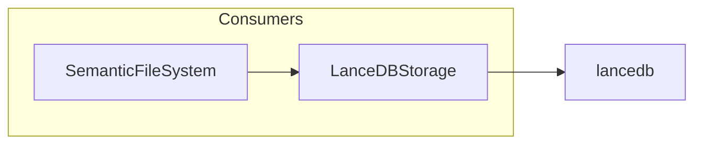

# 💾 LanceDBStorage

**Module**: `core/memory/storage.py`  
**Lines**: 160  
**Purpose**: High-performance vector storage on disk using LanceDB.

---

## Overview

The **LanceDBStorage** replaces JSON file storage with LanceDB (columnar format), enabling efficient search on millions of vectors with low RAM usage.

### Benefits

| Feature | Description |
|---------|-------------|
| **Columnar** | Efficient disk-based storage |
| **ANN** | Approximate nearest neighbor search |
| **Filtering** | SQL-like WHERE clauses |
| **Persistent** | Auto-save to disk |

---

## Dependencies

| Import | Purpose |
|--------|---------|
| `lancedb` | Vector database |
| `pyarrow` | Schema definition |
| `numpy` | Vector operations |
| `config.settings` | DATA_DIR path |

---

## Class: LanceDBStorage

```python
LanceDBStorage(db_path: str = None)
# Default: data/lancedb_store
```

### Schema

```python
schema = pa.schema([
    pa.field("vector", pa.list_(pa.float32(), 384)),
    pa.field("id", pa.string()),
    pa.field("content", pa.string()),
    pa.field("source", pa.string()),
    pa.field("modality", pa.string()),
    pa.field("timestamp", pa.string()),
    pa.field("metadata", pa.string())  # JSON string
])
```

### Methods

| Method | Signature | Description |
|--------|-----------|-------------|
| `add` | `(ids, vectors, contents, sources, modalities, extra_metadata)` | Add items to database |
| `search` | `(query_vector, limit, filter_sql) → List[Dict]` | ANN vector search |
| `count` | `() → int` | Number of rows |
| `_init_table` | `()` | Create or load table |

---

## Communication



---

## Usage Examples

### Add Items

```python
from core.memory.storage import LanceDBStorage

storage = LanceDBStorage()

storage.add(
    ids=["doc_1", "doc_2"],
    vectors=[[0.1, 0.2, ...], [0.3, 0.4, ...]],  # 384D
    contents=["Text 1", "Text 2"],
    sources=["/path/doc1.txt", "/path/doc2.txt"],
    modalities=["TEXTUAL", "TEXTUAL"],
    extra_metadata=[{"type": "GEN"}, {"type": "SCI"}]
)
```

### Search

```python
results = storage.search(
    query_vector=[0.1, 0.2, ...],  # 384D
    limit=5,
    filter_sql="modality = 'TEXTUAL'"
)

for r in results:
    print(f"{r['id']}: {r['content'][:50]}...")
    print(f"  Relevance: {r['relevance']:.3f}")
```

### Count

```python
total = storage.count()
print(f"Total items: {total}")
```

---

## Internal Details

### Relevance Calculation

```python
# LanceDB returns L2 distance (lower is better)
# Convert to relevance (0 to 1)
dist = r.get('_distance', 1.0)
relevance = max(0, 1 - (dist / 2))
```

---

**Last Updated**: 2025-12-13  
**Version**: 1.0
