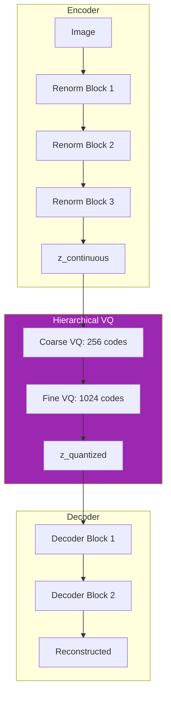

# 👁️ V11 Vision Encoder

**Module**: `core/memory/v11_vision_encoder.py`  
**Lines of Code**: 633  
**Purpose**: Encoder visual com VQ-VAE hierárquico e otimização termodinâmica

---

## 🎯 Overview

O V11 Vision Encoder implementa um **VQ-VAE hierárquico** com controle termodinâmico adaptativo para codificar imagens. Parte do sistema MONOLITH para convergência ontológica multimodal.

---

## 🏗️ Architecture



---

## 🔍 Componentes Principais

### AdaptiveThermodynamics

```python
class AdaptiveThermodynamics:
    """β-scheduler dinâmico baseado em performance"""
    
    def compute_beta(self, epoch: int, accuracy: float, loss_delta: float = 0):
        # β controla o trade-off reconstruction vs. KL
        # Aumenta conforme accuracy melhora
        base = self.BETA_MIN + (self.BETA_MAX - self.BETA_MIN) * accuracy
        momentum = loss_delta * self.BETA_MOMENTUM
        return np.clip(base + momentum, self.BETA_MIN, self.BETA_MAX)
```

### HierarchicalVQ

```python
class HierarchicalVQ(nn.Module):
    """VQ de 2 níveis: coarse (256) + fine (1024)"""
    
    def forward(self, z_continuous):
        # Nível grosso: captura estrutura global
        z_coarse, loss_coarse, perp_coarse = self.coarse_vq(z_continuous)
        
        # Nível fino: captura detalhes
        z_fine, loss_fine, perp_fine = self.fine_vq(z_coarse)
        
        # Gating adaptativo
        gate = torch.sigmoid(self.fine_gate)
        z_q = gate * z_fine + (1 - gate) * z_coarse
        
        return z_q, total_loss, metrics
```

### DisentanglementLoss

```python
class DisentanglementLoss(nn.Module):
    """Factor-VAE loss para representações desemaranhadas"""
    
    def compute_total_correlation(self, z, mu, logvar):
        # TC penaliza dependências entre dimensões
        # Força cada dimensão a codificar fatores independentes
```

---

## 📊 Core Classes

| Classe | Propósito |
|--------|-----------|
| `AdaptiveThermodynamics` | β-scheduling dinâmico |
| `HierarchicalVQ` | Quantização em 2 níveis |
| `VectorQuantizerWithStats` | VQ com tracking de uso |
| `DisentanglementLoss` | Factor-VAE TC loss |
| `AdaptiveRenormalizationBlock` | Skip connections + attention |

---

## 🎯 Use Cases

```python
from core.memory.v11_vision_encoder import HierarchicalVQ, AdaptiveThermodynamics

# Configuração
config = AdaptiveThermodynamics()
vq = HierarchicalVQ(
    coarse_dim=256, fine_dim=256,
    coarse_book=256, fine_book=1024
)

# Forward pass
z_q, vq_loss, metrics = vq(z_continuous)
print(f"Perplexity: {metrics['perplexity']:.2f}")
```

---

**Last Updated**: 2025-12-07  
**Version**: 1.0  
**Status**: Production
