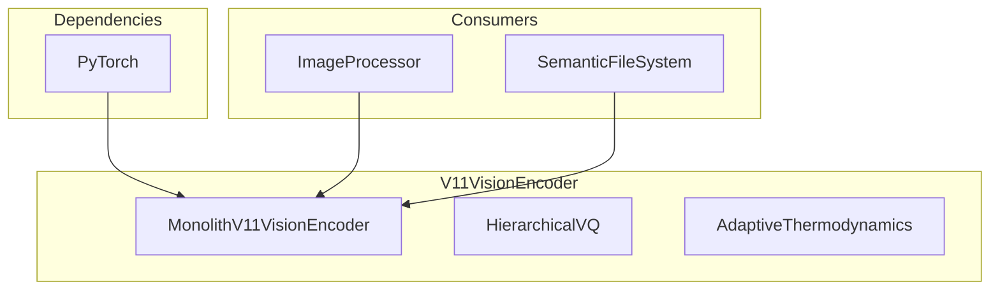

# 👁️ V11VisionEncoder

**Module**: `core/memory/v11_vision_encoder.py`  
**Lines**: 633  
**Purpose**: Hierarchical VQ-VAE vision encoder with adaptive thermodynamics.

---

## Overview

The **V11VisionEncoder** implements a hierarchical VQ-VAE system for image encoding with:
- Adaptive β-scheduler for thermodynamic control
- Two-level quantization (coarse + fine)
- Disentanglement via Factor-VAE loss
- Output: 384D vectors unified with text embeddings

### Architecture

```
Image (28x28)
    ↓
Feature Extraction (AdaptiveRenormalization)
    ↓
Variational Bottleneck (μ, σ)
    ↓
Hierarchical VQ (Coarse + Fine)
    ↓
384D Embedding (normalized)
```

---

## Dependencies

| Import | Purpose |
|--------|---------|
| `torch`, `torch.nn` | Neural networks |
| `torchvision.transforms` | Image preprocessing |
| `PIL` | Image loading |
| `numpy` | Array operations |

---

## Classes

### AdaptiveThermodynamics

```python
class AdaptiveThermodynamics:
    BETA_MIN = 1e-4
    BETA_MAX = 1e-1
    BETA_WARMUP_EPOCHS = 3
    COARSE_DIM = 128
    FINE_DIM = 64
    COARSE_CODEBOOK = 16   # Abstract categories
    FINE_CODEBOOK = 256    # Fine details
    
    def compute_beta(epoch, accuracy, loss_delta) -> float
    def entropy_pressure(epoch) -> float
```

### HierarchicalVQ

Two-level vector quantization with bidirectional flow:
- **Coarse**: Abstract categories (16 codes)
- **Fine**: Residual details (256 codes)

### VectorQuantizerWithStats

VQ with EMA updates and perplexity tracking.

### DisentanglementLoss

Factor-VAE loss for decorrelated representations.

### AdaptiveRenormalizationBlock

Feature extraction with skip connections and self-attention.

### MonolithV11VisionEncoder

Full encoder model with:
- `encode(x) → (z, μ, logvar)`
- `decode(z) → reconstruction`
- `forward(x) → Dict`
- `get_image_embeddings(x) → 384D`

### V11VisionEncoderSimplified

Simplified interface for SFS integration:
- `load_model() → bool`
- `encode_image(path) → np.ndarray[384]`
- `batch_encode_images(paths) → List[np.ndarray]`

---

## Communication



---

## Usage Examples

### Encode Image

```python
from core.memory.v11_vision_encoder import V11VisionEncoderSimplified

encoder = V11VisionEncoderSimplified()

# Single image
embedding = encoder.encode_image("image.png")
print(embedding.shape)  # (384,)
```

### Batch Encode

```python
embeddings = encoder.batch_encode_images(["img1.png", "img2.png"])
```

### Low-Level API

```python
from core.memory.v11_vision_encoder import MonolithV11VisionEncoder

model = MonolithV11VisionEncoder()
model.eval()

# Full forward
x = torch.randn(1, 1, 28, 28)
output = model(x)

print(output['logits'].shape)         # [1, 10]
print(output['reconstruction'].shape) # [1, 1, 28, 28]
print(output['metrics']['coarse_perplexity'])
```

---

## Internal Details

### β-Scheduler

Dynamic β based on accuracy:
- Warmup (epochs < 3): β = β_min
- Learning (accuracy < 85%): β = β_min
- Competent (accuracy ≥ 85%): β increases toward β_max

### Hierarchical VQ Flow

```python
# Split latent
z_coarse = z[:, :128]
z_fine = z[:, 128:]

# Coarse → Fine influence
coarse_influence = coarse_to_fine(z_coarse_q)
residual = z_fine - gate * coarse_influence

# Fine → Coarse feedback
fine_feedback = fine_to_coarse(z_fine_q)
z_coarse_corrected = z_coarse_q + 0.1 * gate * fine_feedback
```

---

**Last Updated**: 2025-12-13  
**Version**: V11
