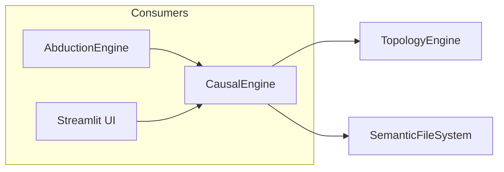
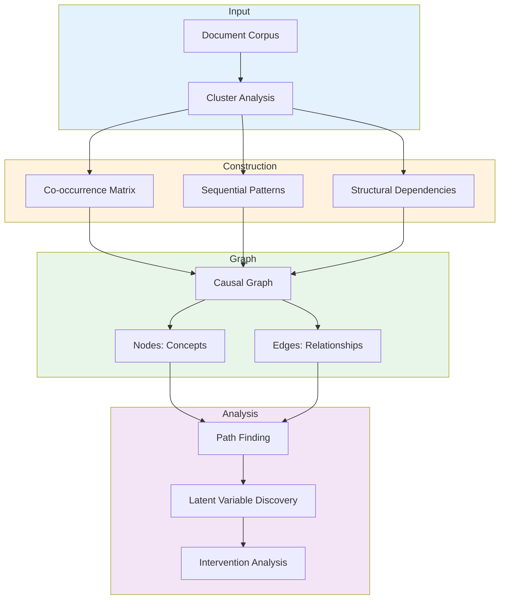
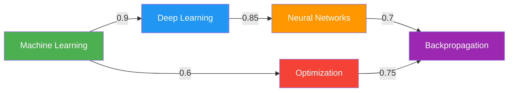
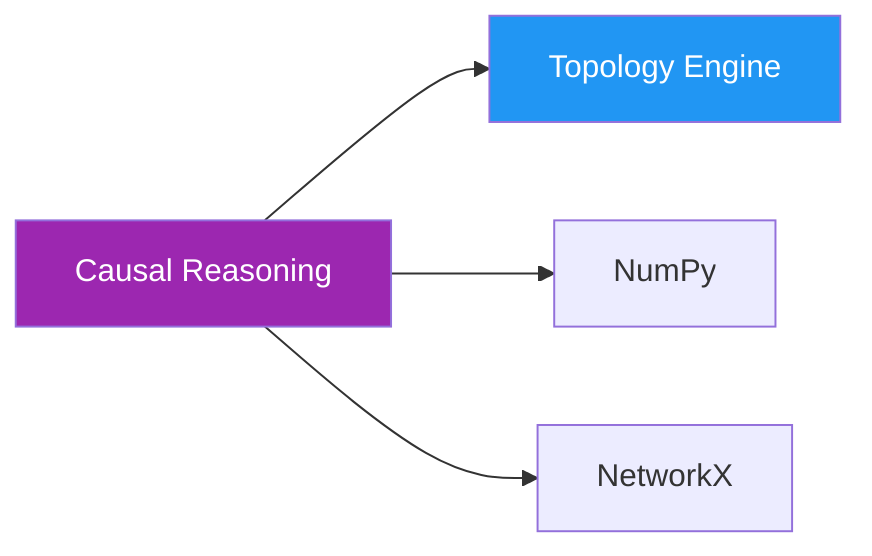
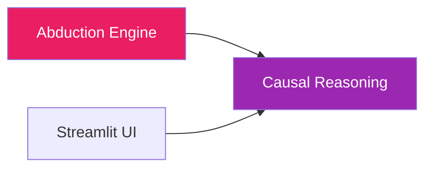

# 🕸️ CausalEngine

**Module**: `core/reasoning/causal_reasoning.py`  
**Lines**: 526  
**Purpose**: Build and analyze causal relationships between concepts.

---

## Overview

Constructs directed graph of causal relationships from document corpus.

---

## Dependencies

| Import | Purpose |
|--------|---------|
| `numpy` | Matrix operations |
| `sklearn.decomposition` | PCA, SVD for latent discovery |
| `core.topology.topology_engine` | TopologyEngine for clustering |
| `core.memory.semantic_memory` | SemanticFileSystem for docs |

---

## Communication



---

## Overview

### Why Causal Reasoning?

**Correlation ≠ Causation**

```
Observation: Ice cream sales & drowning both increase in summer
Correlation: High! ✓
Causation: Ice cream causes drowning? ✗

Actual: Temperature → Ice cream sales
        Temperature → Swimming → Drowning
```

Causal graphs capture these **true relationships**.

---

## 🏗️ Architecture



---

## 📊 Causal Graph Structure

### Nodes

```python
Node = {
    "id": str,                    # Concept ID
    "label": str,                 # Human-readable name
    "cluster_embedding": np.array, # Semantic embedding
    "document_count": int,        # How many docs mention it
    "metadata": Dict              # Additional info
}
```

### Edges

```python
Edge = {
    "source": str,                # From concept
    "target": str,                # To concept
    "weight": float,              # Causal strength (0-1)
    "evidence": List[str],        # Supporting documents
    "type": str,                  # "direct", "mediated", "latent"
    "confidence": float           # How certain we are (0-1)
}
```

### Example Graph



---

## 🔨 Graph Construction

### 1. Co-occurrence Analysis

> [!NOTE]
> **Heuristic Approach**: The current implementation relies on statistical heuristics (co-occurrence frequency and timestamp metadata) to infer potential causal links. It does not yet perform full causal discovery (e.g., PC algorithm).

```python
def build_from_cooccurrence(documents):
    """
    If A and B appear together often → might be related.
    """
    cooccurrence_matrix = np.zeros((n_concepts, n_concepts))
    
    for doc in documents:
        concepts = extract_concepts(doc)
        for c1, c2 in itertools.combinations(concepts, 2):
            cooccurrence_matrix[c1, c2] += 1
    
    # Normalize
    cooccurrence_matrix /= len(documents)
    
    # Threshold: only keep strong co-occurrences
    graph.add_edges_where(cooccurrence_matrix > threshold)
```

### 2. Sequential Pattern Mining

```python
def find_temporal_patterns(documents):
    """
    If A appears before B in text → A might cause B.
    """
    for doc in documents:
        concepts = extract_concepts_with_positions(doc)
        
        for i, concept_a in enumerate(concepts):
            for concept_b in concepts[i+1:]:  # After A
                # A precedes B in this document
                temporal_graph.add_edge(
                    concept_a, 
                    concept_b, 
                    weight=1.0 / (position_gap + 1)
                )
```

### 3. Structural Dependencies

```python
def extract_structural_relations(parsed_text):
    """
    Use dependency parsing to find causal language.
    
    Examples:
    - "A causes B"
    - "B results from A"
    - "A leads to B"
    """
    for sentence in parsed_text:
        if has_causal_verb(sentence):
            source, target = extract_arguments(sentence)
            graph.add_edge(source, target, type="direct", confidence=0.9)
```

---

## 🔍 Path Finding

### Shortest Path

```python
def find_causal_path(source: str, target: str) -> List[str]:
    """
    Find shortest causal chain from source to target.
    
    Uses BFS (Breadth-First Search).
    """
    queue = deque([(source, [source])])
    visited = {source}
    
    while queue:
        current, path = queue.popleft()
        
        if current == target:
            return path
        
        for neighbor in graph.neighbors(current):
            if neighbor not in visited:
                visited.add(neighbor)
                queue.append((neighbor, path + [neighbor]))
    
    return None  # No path found
```

### All Paths

```python
def find_all_paths(source: str, target: str, max_length: int = 5):
    """
    Find all causal paths (up to max_length).
    
    Uses DFS (Depth-First Search).
    """
    paths = []
    
    def dfs(current, path):
        if current == target:
            paths.append(path)
            return
        
        if len(path) >= max_length:
            return
        
        for neighbor in graph.neighbors(current):
            if neighbor not in path:  # Avoid cycles
                dfs(neighbor, path + [neighbor])
    
    dfs(source, [source])
    return paths
```

---

## 🔬 Latent Variable Discovery

### Problem

Sometimes concepts seem related but have no direct connection:

```
A: Ice Cream Sales ↗
B: Drowning Deaths ↗

No edge A → B or B → A
```

### Solution: Find Hidden Cause

```python
def discover_latent_variables(concept_a, concept_b):
    """
    Find concepts that explain correlation without causation.
    
    Looks for: C → A and C → B (C is latent variable)
    """
    # Get all concepts that influence both A and B
    a_causes = set(graph.predecessors(concept_a))
    b_causes = set(graph.predecessors(concept_b))
    
    # Common causes are latent variables
    latent_variables = a_causes & b_causes
    
    # Rank by causal strength
    ranked = sorted(
        latent_variables,
        key=lambda c: graph[c][concept_a] * graph[c][concept_b],
        reverse=True
    )
    
    return ranked
```

**Example Result**:
```python
latent_variables = discover_latent_variables("Ice Cream Sales", "Drowning")
# → ["Summer Temperature", "Season", "Weather"]
```

---

## 🔗 Inter-Module Communication

### **Depends On**:



**1. Topology Engine**
- **Purpose**: Clustering and embeddings
- **Call**: `topology.cluster_concepts()`
- **When**: Graph construction

### **Used By**:



**1. Abduction Engine**
- **Purpose**: Gap detection, hypothesis validation
- **Call**: `causal.get_graph()`, `find_path()`

**2. Streamlit UI** (`pages/3_🕸️_Knowledge_Graph.py`)
- **Purpose**: Visualize causal relationships
- **Call**: `causal.export_graph()`

---

## 🎯 Use Cases

### 1. Find Causal Chain

```python
from core.reasoning.causal_reasoning import CausalEngine

engine = CausalEngine()

# Build graph from corpus
engine.build_graph(documents)

# Find how A influences B
path = engine.find_causal_path("Machine Learning", "Image Recognition")

print(" → ".join(path))
# Output: Machine Learning → Deep Learning → CNNs → Image Recognition
```

### 2. Discover Hidden Causes

```python
# Why are A and B correlated?
latent = engine.discover_latent_variables(
    "Transformer Models",
    "Natural Language Understanding"
)

print(f"Hidden cause: {latent[0]}")
# Output: "Attention Mechanism"
```

### 3. Intervention Analysis

```python
# What happens if we "remove" concept X?
impact = engine.analyze_intervention(
    remove_concept="Backpropagation",
    target_concept="Deep Learning"
)

print(f"Impact score: {impact}")  # How much would it affect target
```

---

## 📊 Graph Statistics

### Current Production Graph

```python
{
    "total_nodes": 2847,
    "total_edges": 8432,
    "avg_degree": 5.9,
    "density": 0.0021,  # Sparse!
    "strongly_connected_components": 1,
    "avg_path_length": 3.2,
    "diameter": 8  # Max shortest path
}
```

---

## 📈 Performance

| Operation | Time | Space |
|-----------|------|-------|
| **Build Graph** | ~2s | O(n²) worst case |
| **Find Path (BFS)** | <10ms | O(V + E) |
| **All Paths (DFS)** | ~100ms | O(V^d) |
| **Latent Discovery** | ~50ms | O(V) |

Where:  
- V = vertices (concepts)
- E = edges (relationships)
- d = path depth

---

## 🔮 Future Enhancements

- [ ] Causal strength estimation (not just binary edges)
- [ ] Counterfactual reasoning ("what if X didn't happen?")
- [ ] Temporal causal graphs (time-evolving relationships)
- [ ] Probabilistic graphical models
- [ ] Causal discovery from interventional data

---

**Last Updated**: 2025-12- 01  
**Version**: 1.0  
**Status**: Production
