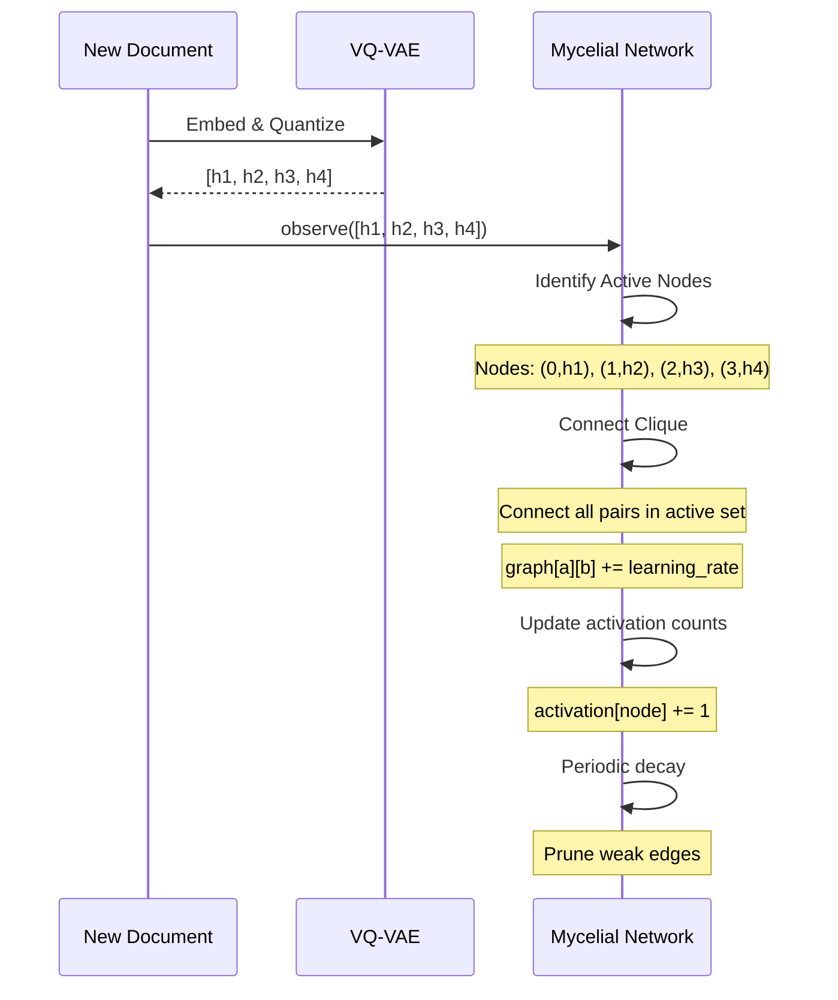
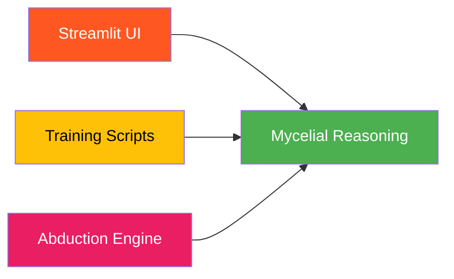

# 🍄 Mycelial Reasoning Network

**Module**: `core/reasoning/mycelial_reasoning.py`  
**Lines of Code**: ~800  
**Purpose**: Hebbian learning network over VQ-VAE codebook for emergent reasoning

---

## 🎯 Overview

The Mycelial Reasoning Network implements a **biologically-inspired learning system** that grows connections between semantic codes based on co-occurrence patterns. Like mycelium connecting roots in a forest, it creates pathways between related concepts.

### Key Concept

**"Codes that fire together, wire together"** - Hebbian learning principle

When documents use similar codes, the network strengthens connections between them, enabling:
- ✅ Pattern discovery
- ✅ Concept bridging
- ✅ Semantic propagation
- ✅ Emergent reasoning

---

## 🏗️ Architecture

```mermaid
graph TB
    subgraph Input
        A[384D Embedding]
    end
    
    subgraph VQ-VAE
        B[Monolith FineWeb Encoder]
        C[Product Quantizer]
        D[4 Codes<br/>H1: 0-255<br/>H2: 0-255<br/>H3: 0-255<br/>H4: 0-255]
    end
    
    subgraph Mycelial Network
        E[Sparse Graph<br/>Nodes: (Head, Code)]
        F{Hebbian Update}
        G[Connect Active Nodes]
        H[Weighted Edges]
        I[Decay Unused]
    end
    
    subgraph Reasoning
        J[Activation Pattern]
        K[Propagation<br/>Graph Traversal]
        L[Synthesize New Codes]
    end
    
    A --> B
    B --> C
    C --> D
    D --> F
    F --> G
    G --> E
    H --> E
    I --> E
    D --> J
    E --> K
    K --> L
    
    style Input fill:#e3f2fd
    style VQ-VAE fill:#fff3e0
    style Mycelial Network fill:#e8f5e9
    style Reasoning fill:#f3e5f5
```

---

## 📊 Network Structure

### Connection Graph (Sparse)

```python
graph: Dict[Node, Dict[Node, float]]  # Node = (head, code)
```

**Structure**:
- **Nodes**: Specific pairs of (Head, Code)
- **Edges**: Weighted connections between nodes that co-occur
- **Precision**: Topological precision (Head 1 Code A connects specifically to Head 2 Code B)

**Why Sparse?**

Sparsity is **intentional and beneficial**:
- **Memory Efficient**: Only stores active connections (O(E) vs O(N²))
- **Fast Traversal**: Propagation follows adjacency list, skipping zeros
- **Biologically Plausible**: Neurons connect to specific neighbors, not everyone
- **Topological Precision**: Eliminates ambiguity of dense matrix "averaging"

---

## 🔄 Learning Process

### Hebbian Update Algorithm



### Code Implementation

```python
def observe(self, indices):
    """
    Observe pattern [h1, h2, h3, h4] and update connections.
    
    1. Identify active nodes: [(0, h1), (1, h2), (2, h3), (3, h4)]
    2. Hebbian Update: Connect all pairs in the active set (Clique)
    3. Track: Increment activation counts
    """
    active_nodes = [self._node(h, c) for h, c in enumerate(indices)]
    
    for a, b in combinations(active_nodes, 2):
        # Bidirectional connection
        self.graph[a][b] += learning_rate
        self.graph[b][a] += learning_rate
```

---

## 🧠 Reasoning Process

### Activation Propagation

```mermaid
graph LR
    subgraph Step 0
        I[Initial Nodes<br/>(0,163), (1,74)]
    end
    
    subgraph Step 1
        A1[Activation spreads<br/>to neighbors]
    end
    
    subgraph Step 2
        A2[More nodes activated<br/>weighted by strength]
    end
    
    subgraph Output
        O[Synthesized Codes<br/>Strongest per Head]
    end
    
    I --> A1
    A1 --> A2
    A2 --> O
    
    style I fill:#4CAF50,color:#fff
    style A1 fill:#8BC34A,color:#000
    style A2 fill:#CDDC39,color:#000
    style O fill:#FF9800,color:#fff
```

### Algorithm

```python
def propagate(self, indices, steps=3):
    """
    Propagate activation through graph.
    """
    # Initialize frontier
    frontier = [initial_nodes]
    activation = {node: 1.0 for node in initial_nodes}
    
    for step in range(steps):
        new_frontier = []
        for source in frontier:
            # Spread to neighbors
            for target, weight in graph[source].items():
                flow = activation[source] * weight
                activation[target] += flow
                new_frontier.append(target)
        frontier = new_frontier
    
    return activation
```

---

## 🔗 Inter-Module Communication

### **Depends On**:


**1. VQ-VAE** (`core/reasoning/vqvae/model_wiki.py`)
- **Purpose**: Encode embeddings → discrete codes
- **Call**: `vqvae.encode(embedding)` → [h1, h2, h3, h4]
- **When**: Every observation and reasoning step

**2. MycelialVQVAE Wrapper** (`core/reasoning/mycelial_reasoning.py`)
- **Purpose**: Integration layer
- **Provides**: `encode()`, `observe()`, `reason()`

### **Used By**:



**1. Training Scripts** (`scripts/train_mycelial.py`)
- **Purpose**: Train network on document corpus
- **Call**: `mycelial.observe(codes)` in batch

**2. Abduction Engine** (`core/reasoning/abduction_engine.py`)
- **Purpose**: Find semantic bridges
- **Call**: `mycelial.find_bridges(codes_a, codes_b)`

**3. Streamlit UI** (`interface/pages/2_🍄_Mycelial_Brain.py`)
- **Purpose**: Visualize network
- **Call**: `mycelial.get_network_stats()`, `mycelial.get_hub_codes()`

---

## 📊 Key Methods

### Core API

| Method | Purpose | Complexity |
|--------|---------|------------|
| `observe(indices)` | Learn from pattern | O(h²) = O(16) |
| `propagate(indices, steps)` | Spread activation | O(E_active) |
| `reason(indices)` | Full pipeline | O(E_active) |
| `get_hub_codes(top_k)` | Find hubs | O(N) |

Where:
- `h` = num_heads (4)
- `E_active` = number of active edges traversed
- `N` = total active nodes

---

## 💾 State Persistence

### Save Format (Pickle)

```python
{
    "graph": dict,                  # Adjacency list
    "node_activation_counts": dict, # Usage frequency
    "total_observations": int,      # Total observations
    "step": int,                    # Current step
    "config": dict                  # Network configuration
}
```

### Auto-Save

Network automatically saves state to `data/mycelial_state.pkl` after modifications.

---

## 🎯 Use Cases

### 1. **Training**

```python
from core.reasoning.mycelial_reasoning import MycelialVQVAE

# Load pre-trained VQ-VAE + mycelial network
mvq = MycelialVQVAE.load_default()

# Train on corpus
for document in corpus:
    embedding = embed(document)
    codes = mvq.encode(embedding)
    mvq.observe(codes)  # Network learns!
```

### 2. **Enhanced Retrieval**

```python
# Original query codes
query_codes = mvq.encode(query_embedding)

# Reason: propagate + synthesize
enhanced_codes, activation = mvq.reason(query_codes, steps=3)

# enhanced_codes now includes related concepts!
```

---

## ⚙️ Configuration

```python
@dataclass
class MycelialConfig:
    num_heads: int = 4              # VQ-VAE heads
    codebook_size: int = 256        # Codes per head
    learning_rate: float = 0.1      # Hebbian update strength
    decay_rate: float = 0.999       # Connection decay
    propagation_steps: int = 2      # Reasoning depth
    activation_threshold: float = 0.05  # Minimum to propagate
    min_weight: float = 1e-6        # Pruning threshold
```

---

## 🔮 Future Enhancements

- [ ] Hierarchical propagation
- [ ] Attention-based weighting
- [ ] Multi-scale temporal patterns
- [ ] Automatic hub interpretation

---

**Last Updated**: 2025-12-04
**Version**: 3.1 (Modified Wiki Model)
**Status**: Production
