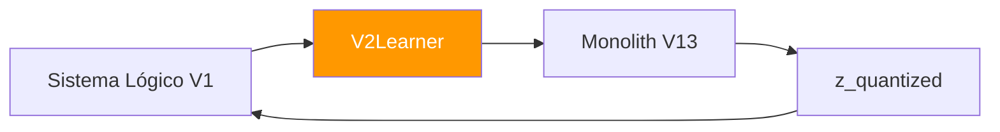

# 🧠 Neural Learner (V2)

**Module**: `core/reasoning/neural_learner.py`  
**Lines of Code**: 172  
**Purpose**: Adaptador V2 para integração VQ-VAE Monolith com sistema lógico

---

## 🎯 Overview

O V2Learner é a ponte entre o **sistema neural** (VQ-VAE Monolith V13) e o **sistema lógico**. Implementa o "Self-Feeding Cycle" onde hipóteses lógicas se tornam pesos neurais.

---

## 🏗️ Architecture



---

## 🔍 Métodos Principais

### learn()

```python
def learn(self, vectors: List[List[float]]) -> Dict[str, float]:
    """Passo de treinamento com vetores"""
    # Forward
    output = self.model(data)
    
    # Losses
    recon_loss = mse_loss(output['reconstructed'], data)
    vq_loss = commitment_loss(output['z_e'], output['z_q'])
    ortho_loss = orthogonal_loss(self.model.quantizer)
    
    total_loss = recon_loss + vq_loss + 0.1 * ortho_loss
    
    # Backward
    total_loss.backward()
    self.optimizer.step()
    
    return {"total_loss": total_loss.item(), ...}
```

### encode() / decode()

```python
def encode(self, vectors: List[List[float]]) -> np.ndarray:
    """Retorna representação latente quantizada"""
    output = self.model(data)
    return output['z_q'].cpu().numpy()

def decode(self, latents: List[List[float]]) -> np.ndarray:
    """Reconstrói vetores a partir do latente"""
    return self.model.decoder(data).cpu().numpy()
```

---

## 🎯 Use Cases

```python
from core.reasoning.neural_learner import V2Learner

learner = V2Learner()

# Treinar com novos embeddings
metrics = learner.learn(embeddings)
print(f"Loss: {metrics['total_loss']:.4f}")

# Codificar
codes = learner.encode(embeddings)

# Salvar modelo
learner.save_model()
```

---

**Last Updated**: 2025-12-07  
**Version**: 1.0  
**Status**: Production
