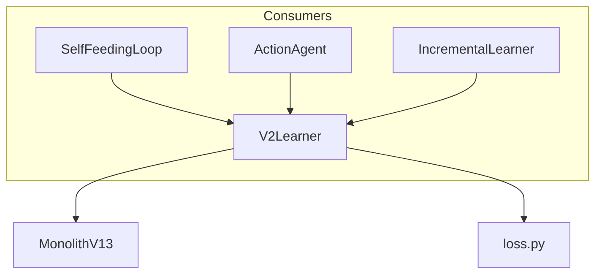

# 🧠 V2Learner

**Module**: `core/reasoning/neural_learner.py`  
**Lines**: 172  
**Purpose**: VQ-VAE adapter for Self-Feeding Cycle (logical hypotheses → neural weights).

---

## Overview

The **V2Learner** adapts the V2 neural core (MonolithV13) to the V1 logic system. It enables the "Self-Feeding Cycle" where logical hypotheses become neural weights.

### Cycle

```
Hypothesis → Embeddings → VQ-VAE Training → Updated Weights → Better Encoding
```

---

## Dependencies

| Import | Purpose |
|--------|---------|
| `torch` | Tensors, training |
| `torch.optim` | AdamW optimizer |
| `core.reasoning.vqvae.model` | MonolithV13 |
| `core.reasoning.vqvae.loss` | Loss functions |

---

## Class: V2Learner

```python
V2Learner(
    model_path: str = None,
    device: str = None  # "cuda" or "cpu"
)
```

### Attributes

| Attribute | Type | Description |
|-----------|------|-------------|
| `model` | `MonolithV13` | VQ-VAE model |
| `optimizer` | `AdamW` | Optimizer (lr=1e-4) |
| `device` | `str` | "cuda" or "cpu" |
| `is_loaded` | `bool` | Model loaded status |
| `history` | `List[Dict]` | Training history |
| `model_path` | `Path` | Model save path |

### Methods

| Method | Signature | Description |
|--------|-----------|-------------|
| `learn` | `(vectors) → Dict[str, float]` | Training step with loss metrics |
| `encode` | `(vectors) → np.ndarray` | Get quantized latent |
| `decode` | `(latents) → np.ndarray` | Reconstruct from latent |
| `save_model` | `()` | Save model and optimizer |
| `_load_model` | `()` | Load saved weights |
| `_load_history` | `()` | Load training history |
| `_save_history` | `()` | Save training history |

---

## Communication



---

## Usage Examples

### Online Learning

```python
from core.reasoning.neural_learner import V2Learner

learner = V2Learner()

# Training step
embeddings = [[0.1, 0.2, ...], [0.3, 0.4, ...]]  # 384D vectors
metrics = learner.learn(embeddings)

print(f"Total loss: {metrics['total_loss']:.4f}")
print(f"Recon loss: {metrics['recon_loss']:.4f}")
```

### Encode/Decode

```python
# Encode to latent
latents = learner.encode(embeddings)  # [N, 384]

# Decode back
reconstructed = learner.decode(latents)
```

### Persistence

```python
# Save after training
learner.save_model()

# Load (automatic on init)
learner = V2Learner(model_path="data/monolith_v13_trained.pth")
```

---

## Internal Details

### Loss Composition

```python
total_loss = recon_loss + vq_loss + 0.1 * ortho_loss

# recon_loss: MSE(reconstructed, input)
# vq_loss: Codebook + commitment
# ortho_loss: Head diversity
```

### Training History

Saved to `data/history.json` with timestamps and metrics.

---

**Last Updated**: 2025-12-13  
**Version**: 1.0
