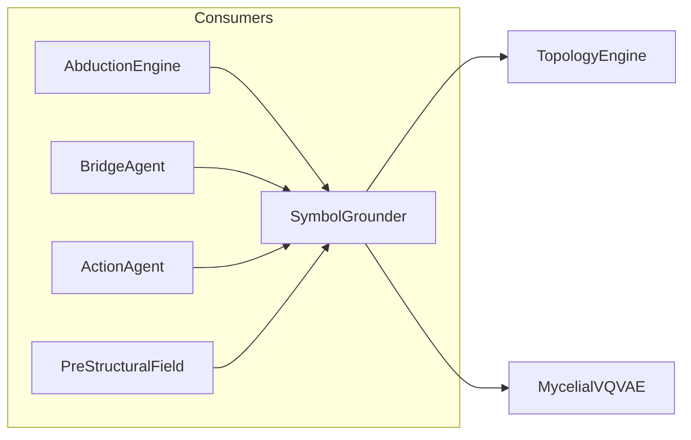

# 🔗 SymbolGrounder

**Module**: `core/reasoning/symbol_grounding.py`  
**Lines**: 117  
**Purpose**: Bridge between symbolic (text) and subsymbolic (neural/graph) representations.

---

## Overview

The **SymbolGrounder** converts free-form text into discrete Mycelial Graph nodes through a pipeline:

```
Text → TopologyEngine → 384D Embedding → VQ-VAE → 4 (head, code) Nodes
```

### Pipeline

| Stage | Component | Output |
|-------|-----------|--------|
| 1. Embed | TopologyEngine | 384D vector |
| 2. Quantize | MycelialVQVAE | [4] indices |
| 3. Format | — | List[(head, code)] |

---

## Dependencies

| Import | Purpose |
|--------|---------|
| `torch` | Tensor conversion |
| `numpy` | Array operations |
| `core.topology.topology_engine` | TopologyEngine for embedding |
| `core.reasoning.mycelial_reasoning` | MycelialVQVAE for quantization |

---

## Class: SymbolGrounder

```python
SymbolGrounder(
    topology_engine: Optional[TopologyEngine] = None,
    vqvae_wrapper: Optional[MycelialVQVAE] = None
)
```

### Lazy Initialization

If components not provided, attempts to create them automatically.

### Attributes

| Attribute | Type | Description |
|-----------|------|-------------|
| `topology` | `TopologyEngine` | Text → embedding |
| `vqvae` | `MycelialVQVAE` | Embedding → codes |

### Methods

| Method | Signature | Description |
|--------|-----------|-------------|
| `ground` | `(text: str) → List[(int, int)]` | Text → Mycelial nodes |
| `ground_gap` | `(gap_description: str) → List[Node]` | Wrapper for knowledge gaps |

---

## Communication



---

## Usage Examples

### Basic Grounding

```python
from core.reasoning.symbol_grounding import SymbolGrounder

grounder = SymbolGrounder()

# Ground a concept
nodes = grounder.ground("machine learning")
# nodes = [(0, 12), (1, 55), (2, 128), (3, 9)]

for head, code in nodes:
    print(f"Head {head}: Code {code}")
```

### Grounding Knowledge Gaps

```python
# For AbductionEngine usage
gap_nodes = grounder.ground_gap("connection between neural networks and biology")
```

### With Custom Components

```python
from core.topology.topology_engine import TopologyEngine
from core.reasoning.mycelial_reasoning import MycelialVQVAE

topology = TopologyEngine()
vqvae = MycelialVQVAE.load_default()

grounder = SymbolGrounder(
    topology_engine=topology,
    vqvae_wrapper=vqvae
)
```

---

## Internal Details

### Grounding Flow

```python
# 1. Embed text
embeddings = self.topology.encode([text])
vector = embeddings[0]  # 384D

# 2. Convert to tensor
t_vector = torch.tensor(vector, dtype=torch.float32)

# 3. Quantize
indices = self.vqvae.encode(t_vector)  # [4]

# 4. Format as nodes
nodes = [(h, int(code)) for h, code in enumerate(indices)]
```

---

## Error Handling

Returns empty list `[]` if:
- Text is empty
- TopologyEngine not available
- VQ-VAE not available
- Embedding or quantization fails

All errors are logged with appropriate warning/error level.

---

**Last Updated**: 2025-12-13  
**Version**: 1.0
