# 🧬 VQ-VAE Compression Module

**Module**: `core/reasoning/vqvae/`  
**Files**: `model.py`, `model_wiki.py`, `layers.py`, `loss.py`
**Lines of Code**: ~200  
**Purpose**: Neural compression via Product Quantization

---

## 🎯 Overview

VQ-VAE (Vector Quantized Variational AutoEncoder) compresses 384D embeddings into **4 discrete codes** (4 bytes), achieving 96% compression while preserving semantic meaning.

### Why Compression?

**Without VQ-VAE:**
- 1M documents × 384D × 4 bytes = **1.5 GB RAM**

**With VQ-VAE:**
- 1M documents × 4 bytes = **4 MB RAM**
- **375x reduction!**

Plus: Discrete codes enable **Mycelial Reasoning** (can't do Hebbian learning on continuous vectors).

---

## 🏗️ Architecture

### MonolithWiki (Production Model)

```mermaid
graph TB
    I[Input: 384D Embedding]
    
    subgraph Encoder
        E1[Linear: 384 → 1024]
        E2[LayerNorm]
        E3[GELU]
        E4[Dropout]
        E5[Linear: 1024 → 512]
    end
    
    subgraph Quantizer
        Q1[Split: 512D → 4×128D]
        Q2[Product Quantizer<br/>4 heads × 256 codes]
        Q3[4 Discrete Indices]
    end
    
    subgraph Decoder
        D1[Linear: 512 → 1024]
        D2[LayerNorm]
        D3[GELU]
        D4[Dropout]
        D5[Linear: 1024 → 384]
    end
    
    O[Output: 384D Reconstructed]
    
    I --> E1 --> E2 --> E3 --> E4 --> E5
    E5 --> Q1 --> Q2 --> Q3
    Q3 --> D1 --> D2 --> D3 --> D4 --> D5 --> O
    
    style Encoder fill:#e3f2fd
    style Quantizer fill:#fff3e0
    style Decoder fill:#e8f5e9
```



### Product Quantization

```
512D vector → Split→ [128D, 128D, 128D, 128D]
                      ↓     ↓     ↓     ↓
                    Head0 Head1 Head2 Head3
                      ↓     ↓     ↓     ↓
                   Code0 Code1 Code2 Code3
                   (0-255)(0-255)(0-255)(0-255)
```

Each head has its own **codebook** of 256 vectors (128D each).

---

## 🔬 Training Results

### Modified Wiki Model (Current Production)

**Training Data**: WikiText-103 (Modified Training)  
**Epochs**: 20  
**Final Metrics**:

| Metric | Value | Status |
|--------|-------|--------|
| **Reconstruction Loss** | 0.0025 | ✅ Excellent |
| **Codebook Usage** | 100% (1024/1024) | ✅ Perfect |
| **Power-law α** | 1.58-1.63 | ✅ Ideal (Zipf) |
| **R² fit** | 0.92-0.95 | ✅ Excellent |
| **Model Size** | 7.9 MB | Compact |

### Codebook Distribution

```
Code Usage follows Zipf's Law:
- Top 10% codes: 50% of usage
- Middle 50% codes: 40% of usage
- Bottom 40% codes: 10% of usage

Perfect for semantic diversity!
```

---

## 📊 Key Components

### 1. OrthogonalProductQuantizer

```python
class OrthogonalProductQuantizer(nn.Module):
    def __init__(self, num_heads=4, embedding_dim=512, num_embeddings=256):
        self.codebooks = nn.Parameter(
            torch.randn(num_heads, num_embeddings, head_dim)
        )
    
    def forward(self, z):
        """
        Input: [B, 512] continuous vector
        Output: [B, 4] discrete indices
        """
        # Split into heads
        z_heads = z.view(B, num_heads, head_dim)
        
        # For each head, find nearest codebook entry
        for h in range(num_heads):
            distances = torch.cdist(z_heads[:, h], codebooks[h])
            indices[:, h] = distances.argmin(dim=1)
        
        # Straight-Through Estimator (enables training)
        z_q = codebooks[indices] + (z - codebooks[indices]).detach()
        
        return z_q, indices
```

**Straight-Through Estimator (STE):**
- Forward: Use quantized (discrete)
- Backward: Use continuous (for gradients)
- Enables training despite discrete bottleneck!

---

## 🔗 Inter-Module Communication

### **Depends On**:


### **Used By**:


**1. Mycelial Reasoning**
- **Call**: `vqvae.encode(embedding)` → codes
- **Purpose**: Get discrete codes for Hebbian learning

**2. Semantic Memory** 
- **Call**: `vqvae.encode()` optional
- **Purpose**: Compress vectors before storage (future)

**3. Training Scripts**
- **Call**: `train_vqvae.py`
- **Purpose**: Train new models

---

## 🎯 Use Cases

### 1. Encode Embedding

```python
from core.reasoning.mycelial_reasoning import MycelialVQVAE

mvq = MycelialVQVAE.load_default()  # Loads wiki model

embedding = torch.randn(1, 384)  # From SentenceTransformer
codes = mvq.encode(embedding)    # → [163, 74, 22, 91]

print(f"Compressed 384D ({1536 bytes}) → 4 codes ({4 bytes})")
```

### 2. Reconstruct

```python
# Encode
codes = mvq.encode(embedding)

# Decode
reconstructed = mvq.vqvae.decoder(
    mvq.vqvae.quantizer.get_codes_from_indices(codes)
)

# Check quality
loss = F.mse_loss(reconstructed, embedding)
print(f"Reconstruction loss: {loss:.6f}")  # ~0.0025
```

---

## 📈 Performance

| Operation | Time | Notes |
|-----------|------|-------|
| **Encode** | <1ms | Single embedding |
| **Batch Encode** | ~10ms | 100 embeddings |
| **Decode** | <1ms | Reconstruction |
| **Model Load** | ~100ms | One-time cost |

---

## 🔄 Model Versions

### MonolithV13 (Old)

```python
Architecture: 384D → 256D → 384D
Latent dim: 384D
Codebook usage: 16% ❌
Status: Deprecated
```

### MonolithWiki (Current)

```python
Architecture: 384D → 1024D → 512D
Latent dim: 512D  
Codebook usage: 100% ✅
Status: Production
```

**Loader automatically selects MonolithWiki** with fallback to V13.

---

## ⚙️ Training

### Loss Function

```python
total_loss = reconstruction_loss + commitment_loss + orthogonal_loss

reconstruction_loss = MSE(output, input)        # Main objective
commitment_loss = MSE(z_e, z_q.detach())       # Encoder commits to codes
orthogonal_loss = similarity(codebook_i, codebook_j)  # Heads stay diverse
```

---

**Last Updated**: 2025-12-04
**Version**: Monolith Modified Wiki v3.1
**Status**: Production (100% codebook usage)
