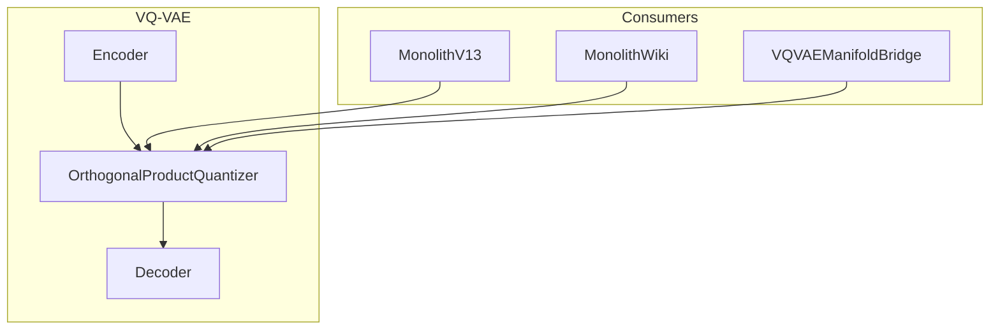

# 🔢 OrthogonalProductQuantizer

**Module**: `core/reasoning/vqvae/layers.py`  
**Lines**: 170  
**Purpose**: Product Quantizer with Straight-Through Estimator for VQ-VAE.

---

## Overview

The **OrthogonalProductQuantizer** divides vectors into `num_heads` parts and quantizes each independently. Uses Straight-Through Estimator (STE) for end-to-end differentiable training.

### Key Concepts

| Concept | Description |
|---------|-------------|
| **Product Quantization** | Split vector → quantize each head → concatenate |
| **STE** | Forward: quantized, Backward: continuous gradient |
| **Lazy Init** | Codebook initialized from first batch |

### Architecture

```
Input: z [Batch, 384]
  ↓
Split: [Batch, 4, 96]  (4 heads × 96 dim)
  ↓
For each head:
  Distance to all 256 codes
  Argmin → index
  Lookup code
  ↓
Concat: z_q [Batch, 384]
  ↓
STE: z_q = z + (z_q - z).detach()
```

---

## Dependencies

| Import | Purpose |
|--------|---------|
| `torch` | Tensors |
| `torch.nn` | Module base |

---

## Class: OrthogonalProductQuantizer

```python
OrthogonalProductQuantizer(
    num_heads: int = 4,
    embedding_dim: int = 384,
    num_embeddings: int = 256
)
```

### Attributes

| Attribute | Type | Description |
|-----------|------|-------------|
| `num_heads` | `int` | Number of quantization heads (4) |
| `num_embeddings` | `int` | Codebook size per head (256) |
| `head_dim` | `int` | Dimension per head (384/4 = 96) |
| `codebooks` | `nn.Parameter` | [4, 256, 96] learnable embeddings |
| `inited` | `Buffer` | Initialization flag |

### Methods

| Method | Signature | Description |
|--------|-----------|-------------|
| `forward` | `(z) → (z_q, indices, distances)` | Quantize with STE |
| `init_codebook` | `(z)` | Data-dependent initialization |
| `get_codes_from_indices` | `(indices) → z_q` | Decode indices to vectors |

---

## Communication



---

## Usage Examples

### Basic Quantization

```python
from core.reasoning.vqvae.layers import OrthogonalProductQuantizer

quantizer = OrthogonalProductQuantizer()

# Input: batch of 384D vectors
z = torch.randn(32, 384)

# Quantize
z_q, indices, distances = quantizer(z)

print(z_q.shape)      # [32, 384]
print(indices.shape)  # [32, 4] - one code per head
```

### Decode from Indices

```python
# Reconstruct from indices only
z_reconstructed = quantizer.get_codes_from_indices(indices)
```

---

## Internal Details

### Straight-Through Estimator

```python
# Forward: use quantized value
# Backward: gradient flows through z_reshaped
z_q = z_reshaped + (z_q - z_reshaped).detach()
```

### Distance Computation

```python
# Efficient ||z - c||² = ||z||² + ||c||² - 2<z,c>
distances = z_sq + c_sq - 2 * dot
indices = torch.argmin(distances, dim=-1)
```

---

**Last Updated**: 2025-12-13  
**Version**: 1.0
