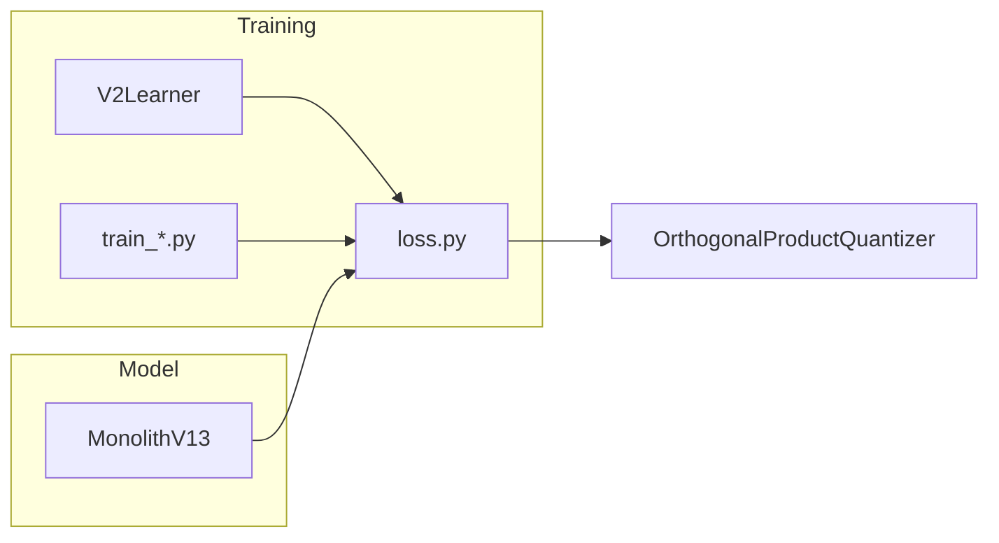

# 📉 VQ-VAE Loss Functions

**Module**: `core/reasoning/vqvae/loss.py`  
**Lines**: 110  
**Purpose**: Loss functions for training VQ-VAE with diverse codebook usage.

---

## Overview

Collection of loss functions to train the VQ-VAE Monolith:

| Loss | Purpose |
|------|---------|
| **Orthogonal** | Force heads to learn different things |
| **Commitment** | Standard VQ-VAE loss |
| **Head Balance** | Prevent energy imbalance between heads |
| **Entropy** | Encourage diverse code usage |

---

## Dependencies

| Import | Purpose |
|--------|---------|
| `torch` | Tensors |
| `torch.nn.functional` | MSE, normalize |

---

## Functions

### compute_orthogonal_loss

```python
def compute_orthogonal_loss(quantizer_module) -> torch.Tensor
```

Forces heads to learn orthogonal representations.

**Method**: 
1. Compute center of each head's codebook
2. Normalize centers
3. Compute similarity matrix (should be identity)
4. Penalize off-diagonal elements

### compute_vq_commitment_loss

```python
def compute_vq_commitment_loss(z, z_q, beta=0.25) -> torch.Tensor
```

Standard VQ-VAE loss with commitment term.

| Component | Formula | Description |
|-----------|---------|-------------|
| Codebook loss | `MSE(z_q, z.detach())` | Move codebook toward encoder |
| Commitment loss | `MSE(z_q.detach(), z)` | Move encoder toward codebook |

**Total**: `codebook_loss + beta * commitment_loss`

### compute_head_balance_loss

```python
def compute_head_balance_loss(z_q, num_heads: int) -> torch.Tensor
```

Penalizes energy imbalance between heads.

**Goal**: Each head should carry 1/4 of total energy (for 4 heads).

### compute_code_usage_entropy_loss

```python
def compute_code_usage_entropy_loss(
    indices, 
    num_embeddings: int, 
    target_entropy_frac: float = 0.8
) -> torch.Tensor
```

Encourages diverse code usage (high entropy).

**Target**: 80% of maximum entropy per head (configurable).

---

## Communication



---

## Usage Examples

### Training Loop

```python
from core.reasoning.vqvae.loss import (
    compute_orthogonal_loss, 
    compute_vq_commitment_loss,
    compute_head_balance_loss,
    compute_code_usage_entropy_loss
)

# Forward pass
output = model(x)

# Compute losses
recon_loss = F.mse_loss(output['reconstructed'], x)
vq_loss = compute_vq_commitment_loss(output['z_e'], output['z_q'])
ortho_loss = compute_orthogonal_loss(model.quantizer)
balance_loss = compute_head_balance_loss(output['z_q'], num_heads=4)
entropy_loss = compute_code_usage_entropy_loss(output['indices'], num_embeddings=256)

# Total
total = recon_loss + vq_loss + 0.1 * ortho_loss + 0.05 * balance_loss + 0.1 * entropy_loss
```

---

## Internal Details

### Entropy Calculation

```python
# Histogram of code usage
hist = torch.bincount(indices[:, h], minlength=256)
p = hist / hist.sum()

# Entropy in bits
H_bits = -(p * torch.log2(p)).sum()

# Normalized (0 to 1)
H_norm = H_bits / log2(256)  # Max entropy = 8 bits
```

---

**Last Updated**: 2025-12-13  
**Version**: 1.0
