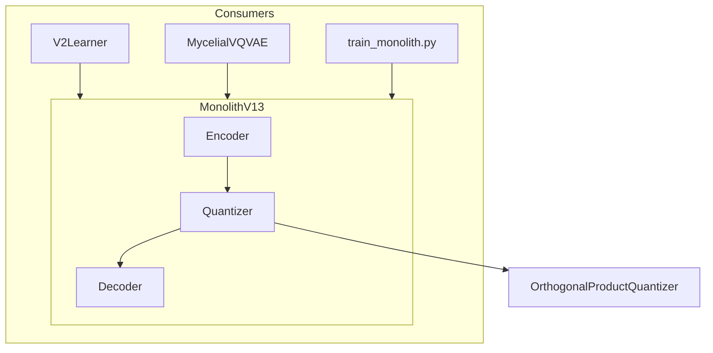

# 🧠 MonolithV13

**Module**: `core/reasoning/vqvae/model.py`  
**Lines**: 96  
**Purpose**: VQ-VAE Bottleneck model for semantic compression (384D → 4 codes → 384D).

---

## Overview

The **MonolithV13** is Alexandria's core VQ-VAE model. It compresses 384D semantic embeddings into 4 discrete codes (one per head), then reconstructs.

### Architecture

```
Input: x [Batch, 384]
         ↓
     Encoder
  [384 → 256 → 384]
         ↓
     z (latent)
         ↓
   Quantizer (PQ)
  4 heads × 256 codes
         ↓
     z_q (quantized)
         ↓
     Decoder
  [384 → 256 → 384]
         ↓
Output: reconstructed [Batch, 384]
```

---

## Dependencies

| Import | Purpose |
|--------|---------|
| `torch` | Tensors |
| `torch.nn` | Module, Linear, LayerNorm, GELU |
| `.layers` | OrthogonalProductQuantizer |

---

## Class: MonolithV13

```python
MonolithV13(
    input_dim: int = 384,
    hidden_dim: int = 256,
    latent_dim: int = None  # Defaults to input_dim
)
```

### Components

| Component | Structure | Description |
|-----------|-----------|-------------|
| `encoder` | Linear→LN→GELU→Linear→LN | Compress to latent |
| `quantizer` | OrthogonalProductQuantizer | 4 heads × 256 codes |
| `decoder` | Linear→LN→GELU→Linear | Reconstruct |

### Methods

| Method | Signature | Description |
|--------|-----------|-------------|
| `forward` | `(x) → Dict` | Full encode→quantize→decode |
| `forward_with_head_mask` | `(x, head_mask) → Dict` | With ablation mask |

### Forward Output

```python
{
    "reconstructed": out,    # [B, 384] reconstructed
    "indices": indices,      # [B, 4] code indices
    "z_e": z,               # [B, 384] pre-quantization
    "z_q": z_q              # [B, 384] post-quantization
}
```

---

## Communication



---

## Usage Examples

### Basic Forward

```python
from core.reasoning.vqvae.model import MonolithV13

model = MonolithV13()

# Forward pass
x = torch.randn(32, 384)  # batch of embeddings
output = model(x)

print(output['reconstructed'].shape)  # [32, 384]
print(output['indices'].shape)        # [32, 4]
```

### Head Ablation

```python
# Test with only heads 0 and 1 active
head_mask = torch.tensor([1, 1, 0, 0], dtype=torch.float32)
output = model.forward_with_head_mask(x, head_mask)

# z_q_masked has heads 2, 3 zeroed
print(output['z_q_masked'].shape)  # [32, 384]
```

### Load Trained Weights

```python
model = MonolithV13()
checkpoint = torch.load("data/monolith_v13_trained.pth")
model.load_state_dict(checkpoint['model_state_dict'])
```

---

## Configurations

### Default (V13)

```python
MonolithV13(input_dim=384, hidden_dim=256, latent_dim=384)
# 4 heads × 96 dim/head × 256 codes
```

### Wiki Model

```python
MonolithV13(input_dim=384, hidden_dim=1024, latent_dim=512)
# 4 heads × 128 dim/head × 256 codes
```

---

**Last Updated**: 2025-12-13  
**Version**: 1.0
