# 📖 MonolithWiki

**Module**: `core/reasoning/vqvae/model_wiki.py`  
**Lines**: 108  
**Purpose**: Wikipedia-trained VQ-VAE with larger architecture (384D → 512D → 384D).

---

## Overview

**MonolithWiki** is an alternative architecture trained on Wikipedia data. Larger hidden dimensions provide better semantic compression for encyclopedic knowledge.

### Comparison

| Model | Encoder | Latent | Head Dim |
|-------|---------|--------|----------|
| **MonolithV13** | 384→256→384 | 384D | 96 |
| **MonolithWiki** | 384→1024→512 | 512D | 128 |

### Architecture

```
Input: x [Batch, 384]
         ↓
     Encoder
  [384 → 1024 → 512]
         ↓
   Quantizer (PQ)
  4 heads × 128 dim × 256 codes
         ↓
     Decoder
  [512 → 1024 → 384]
         ↓
Output: reconstructed [Batch, 384]
```

---

## Dependencies

| Import | Purpose |
|--------|---------|
| `torch` | Tensors |
| `torch.nn` | Modules |

---

## Classes

### ProductQuantizerSimple

```python
ProductQuantizerSimple(
    num_heads: int = 4,
    codebook_size: int = 256,
    head_dim: int = 128
)
```

Simplified PQ for inference only (no EMA tracking).

### MonolithWiki

```python
MonolithWiki(
    input_dim: int = 384,
    hidden_dim: int = 512
)
```

### Components

| Component | Structure | Dimensions |
|-----------|-----------|------------|
| `encoder` | Linear→LN→GELU→Dropout→Linear | 384→1024→512 |
| `quantizer` | ProductQuantizerSimple | 4×256×128 |
| `decoder` | Linear→LN→GELU→Dropout→Linear | 512→1024→384 |

### Forward Output

```python
{
    'reconstructed': x_recon,  # [B, 384]
    'indices': indices,        # [B, 4]
    'z_e': z,                  # [B, 512]
    'z_q': z_q                 # [B, 512]
}
```

---

## Communication

```mermaid
graph TB
    subgraph MonolithWiki
        Enc[Encoder 384→1024→512] --> Quant[ProductQuantizerSimple]
        Quant --> Dec[Decoder 512→1024→384]
    end
    
    subgraph Consumers
        MycelialVQVAE --> MonolithWiki
    end
```



---

## Usage

```python
from core.reasoning.vqvae.model_wiki import MonolithWiki

# Load model
model = MonolithWiki()

# Load trained weights
ckpt = torch.load("data/monolith_wiki_trained.pth")
model.load_state_dict(ckpt)

# Inference
x = torch.randn(32, 384)
output = model(x)
codes = output['indices']  # [32, 4]
```

---

**Last Updated**: 2025-12-13  
**Version**: 1.0
